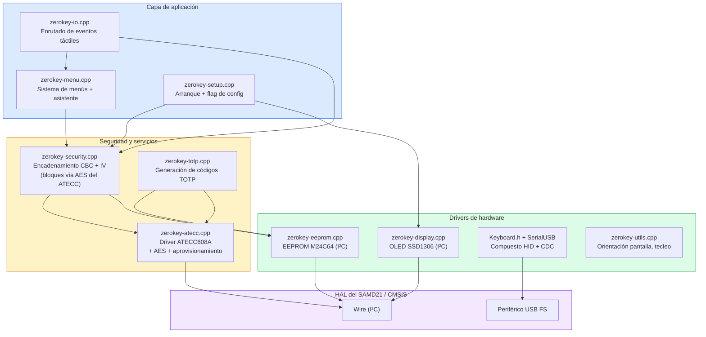
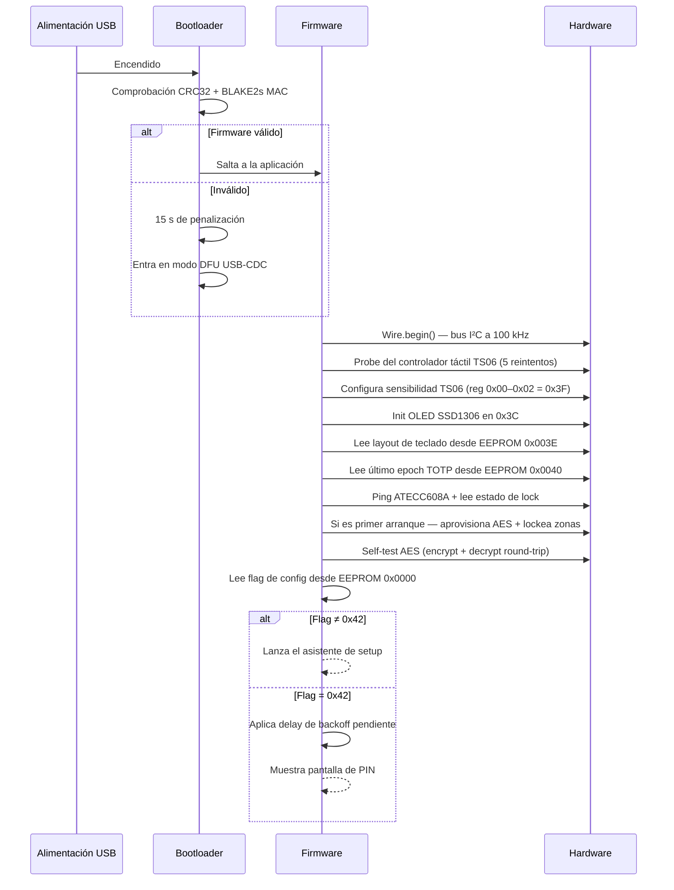
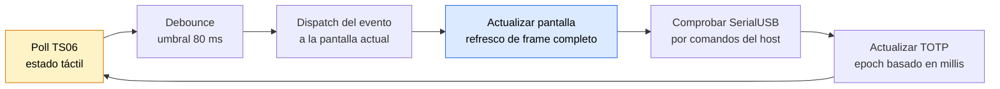
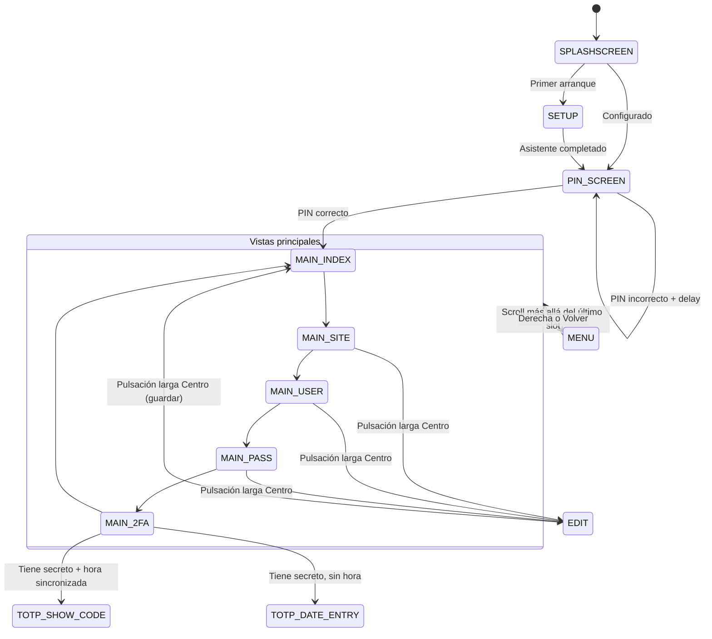
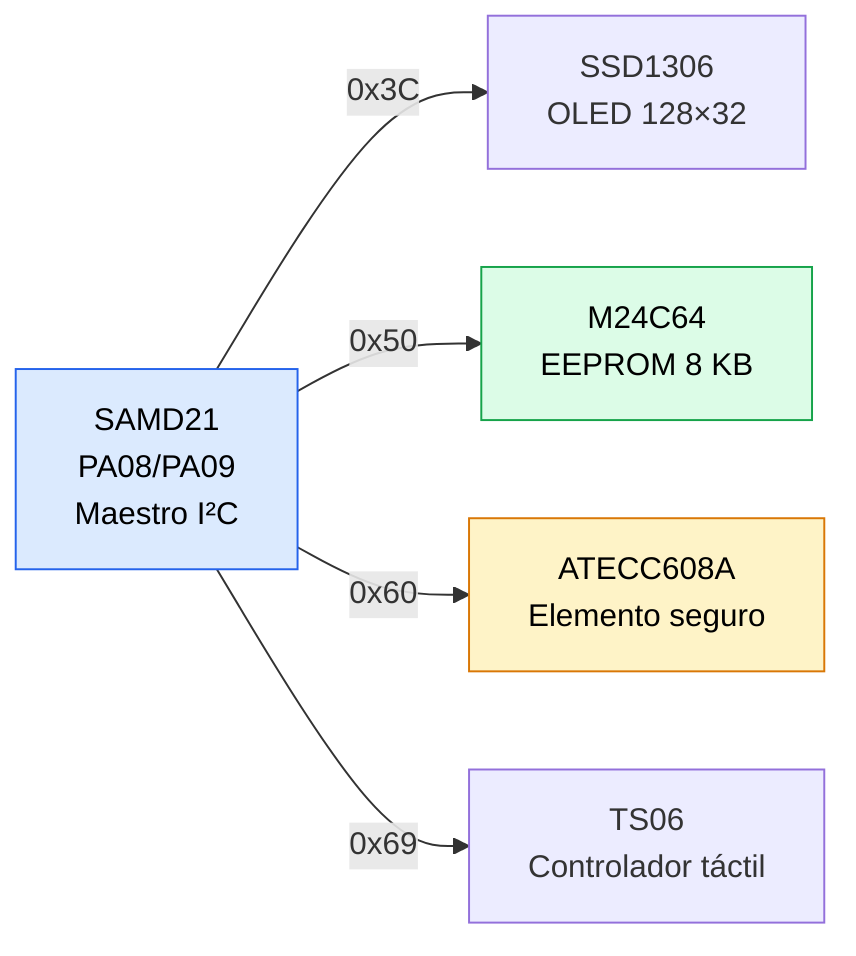

## Modular por diseño

El firmware de ZeroKeyUSB está escrito en C++ para el microcontrolador **Microchip SAMD21E18A** (ARM Cortex-M0+, 48 MHz, 256 KB flash, 32 KB SRAM).  
Sigue una arquitectura en capas que mantiene los drivers de hardware, las primitivas de seguridad y la interfaz de usuario claramente separadas.

Cada módulo puede evolucionar de forma independiente manteniendo las rutinas críticas de seguridad auditables y fáciles de revisar.

---

## Mapa de ficheros fuente

| Fichero | Líneas | Función |
|------|-------|------|
| `zerokey-security.cpp/.h` | ~750 | Encadenamiento AES-CBC alrededor del comando AES de bloque único del chip, verificación de PIN, borrado, backup/restore |
| `zerokey-atecc.cpp/.h` | ~640 | Driver I²C del ATECC608A: TRNG, Counter, ReadSerial, CheckMac, SHA-256, AES hardware, Lock y la rutina de aprovisionamiento AES de un disparo |
| `zerokey-io.cpp/.h` | ~1561 | Dispatch de eventos táctiles, entrada de fecha/hora TOTP, gestor de comandos serie |
| `zerokey-menu.cpp/.h` | ~1051 | Árbol de menús, asistente de setup (10 páginas), páginas de confirmación/info/actividad |
| `zerokey-display.cpp/.h` | ~750 | Renderizado SSD1306: pantalla principal, pantalla PIN, editor, progreso, scroll |
| `zerokey-eeprom.cpp/.h` | ~257 | Lectura/escritura de página, metadatos TOTP, layout de teclado, persistencia de epoch |
| `zerokey-totp.cpp/.h` | ~500 | HMAC-SHA1/SHA256/SHA512, decodificación Base32, generación de códigos TOTP |
| `zerokey-setup.cpp/.h` | ~159 | Secuencia de arranque, flag de config (`0x42`), init de TS06, probe de hardware |
| `zerokey-utils.cpp/.h` | ~500 | Motor de tecleo, orientación de pantalla, pantalla de error, número de serie |
| `zerokey-globals.h` | ~317 | Constantes, iconos (PROGMEM), externs de variables globales |
| `zerokey-memorymap.h` | ~38 | Cálculo de direcciones EEPROM, constantes del layout de credenciales |

---

## Secuencia de arranque

El flag de configuración en `0x0000` determina si el dispositivo muestra el asistente de setup (`flag ≠ 0x42`) o la pantalla de desbloqueo con PIN (`flag = 0x42`). El asistente escribe `0x42` tras la creación exitosa del PIN.

---

## Bucle principal

El firmware corre un **bucle principal cooperativo** — sin RTOS, sin interrupciones para lógica de aplicación, sin asignación dinámica de memoria:

Cada iteración es determinista. Las operaciones sensibles al tiempo (cuenta atrás TOTP, delays de lockout) usan `millis()` en lugar de delays bloqueantes.

---

## Máquina de estados de pantalla

Cada vista interactiva es un estado identificado por una constante `programPosition`. Los eventos táctiles se despachan en función de este valor:

---

## Topología del bus I²C

Todos los periféricos comparten un único bus I²C:

Velocidad del bus: **100 kHz** (configurado al arranque, coincide con el bootloader).  
La dirección del TS06 es `0xD2 >> 1 = 0x69`.

---

## Dispositivo USB compuesto

ZeroKeyUSB se enumera como un **dispositivo USB Full-Speed compuesto** con dos interfaces:

| Interfaz | Clase | Propósito |
|-----------|-------|---------|
| **Teclado HID** | 0x03 | Teclea credenciales al host — aparece como un teclado estándar |
| **Serie CDC** | 0x0A | Protocolo ASCII a 115200 bps para backup/restore, sincronización horaria y diagnósticos |

Ambas interfaces están activas simultáneamente tras el arranque. El canal CDC requiere desbloqueo con PIN antes de aceptar cualquier comando que modifique datos.

---

## Huella de memoria

| Región | Tamaño | Uso |
|--------|------|-------|
| **Flash** | 256 KB total, ~64 KB usados | Código de firmware, fuentes, iconos PROGMEM, mapas de teclado, datos constantes |
| **SRAM** | 32 KB total, ~16 KB usados | Buffers UI, `currentSite/User/Pass[16]`, `pinArray[16]`, workspace TOTP |
| **EEPROM** | 8 KB (M24C64) | Credenciales cifradas (61 slots × 128 B), IV, hash de PIN, config, metadatos TOTP |

No se usa asignación dinámica de memoria (`malloc`/`new`) en ningún sitio. Todos los buffers son asignados en pila o estáticos.

---

## Build y verificación

- Compilado con **ARM GCC** usando el core SAMD de Arduino.
- Proceso de build gestionado por `Makefile` — soporta compilación selectiva y flasheo J-Link vía `Dashboard.bat`.
- El binario del firmware se firma con un **MAC BLAKE2s** y se le añade un footer de seguridad de 28 bytes.
- El bootloader verifica esta firma en cada arranque usando CRC32 + BLAKE2s antes de saltar al código de aplicación.
- El firmware sin firmar o manipulado dispara un **delay de penalización de 15 segundos** y cae en modo DFU USB-CDC.

<Note>
ZeroKeyUSB corre sobre un stack de firmware mínimo: sin RTOS, sin asignación dinámica de memoria y sin puertas traseras de debug.  
Todas las tareas son cooperativas y deterministas en tiempo — la simplicidad se trata como una característica de seguridad.
</Note>
