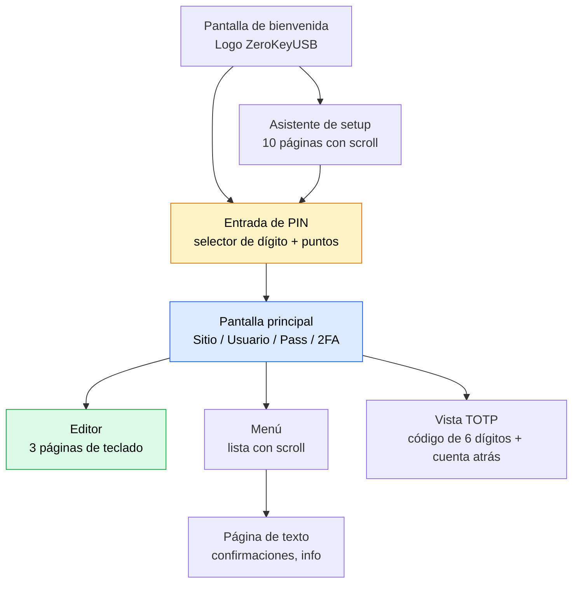
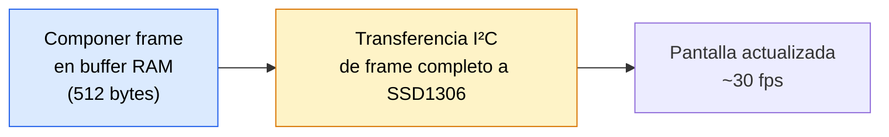

## 128×32 píxeles con propósito

ZeroKeyUSB usa un **panel OLED blanco** (controlador SSD1306, I²C en `0x3C`) con una resolución de 128×32 píxeles.  
El firmware mantiene la interfaz intencionadamente minimalista: tipografía grande, layout claro y transiciones suaves que siguen siendo legibles incluso con poca luz.

---

## Jerarquía de pantallas

---

## Pipeline de renderizado

1. **Construcción del frame buffer** — la aplicación compone toda la pantalla en un buffer RAM de 512 bytes usando funciones de dibujo de `Adafruit_SSD1306`: `setCursor()`, `print()`, `drawRect()`, `fillRect()`, `drawBitmap()`.
2. **Transferencia de frame completo** — `display.display()` envía los 512 bytes al OLED por I²C en una sola ráfaga.
3. **Cadencia de refresco** — el bucle principal cooperativo redibuja solo cuando cambia el estado de la pantalla, evitando tráfico I²C innecesario.

---

## Tipos de pantalla

### Pantalla de entrada de PIN
- Muestra el selector de dígito actual (0–9) con navegación Arriba/Abajo.
- Los dígitos introducidos se muestran como puntos rellenos (●) por seguridad.
- La longitud del PIN se muestra como indicador de cuenta.

### Pantalla principal de credenciales
- **Cuatro líneas** mostrando el slot actual:
  - Línea 0: Indicador de índice de slot
  - Línea 1: Nombre del sitio (scroll si > ~20 caracteres)
  - Línea 2: Usuario
  - Línea 3: Contraseña (oculta por defecto)
- Un indicador de contexto (`SITE`, `USER`, `PASS`, `2FA`) aparece arriba.

### Pantalla de editor
- **Tres páginas de teclado** seleccionables con Arriba/Abajo:
  - Página 1 (`EDIT_KB1`): `A-Z`, corchetes, símbolos
  - Página 2 (`EDIT_KB2`): `a-z`, puntuación
  - Página 3 (`EDIT_KB3`): `0-9`, espacio, caracteres especiales
- Controles Izquierda/Derecha: posición del cursor (◀ / ▶), carácter aleatorio, retroceso
- Carácter seleccionado resaltado con colores invertidos

### Pantalla de menú
- Lista con scroll y resaltado invertido sobre el ítem seleccionado.
- Cuando los ítems superan las 4 filas, aparece una **barra de scroll con thumb** en el borde derecho (3 px de ancho).
- La posición del thumb se actualiza proporcionalmente a la posición de scroll.

### Páginas del asistente de setup
- 10 páginas de texto con scroll y navegación Arriba/Abajo.
- Aparecen en pantalla un indicador de paso (`1/9`, `2/9`, etc.) y pistas en el footer.
- Las páginas con > 4 líneas muestran un thumb de scroll.

### Pantalla de código TOTP
- **Texto a doble tamaño** para el código de 6 dígitos.
- Cuenta atrás en segundos: `"Expires in: XXs"`.
- Se refresca automáticamente cada segundo.
- Tocar cualquier pad vuelve a las credenciales.

---

## Tipografía y assets

| Asset | Formato | Tamaño | Uso |
|-------|--------|------|-------|
| **Fuente por defecto** | Adafruit GFX incluida | 6×8 px | Menús, etiquetas, texto de info |
| **Tamaño de texto 2** | escalado 2× | 12×16 px | Códigos TOTP, prompts grandes |
| **Iconos** | bitmaps PROGMEM | 16×16 px | Ítems del menú (backup, settings, danger, info) |
| **SVGs del dispositivo** | Vector en `/images/` | Varios | Ilustraciones de pads táctiles en la documentación |

Todas las fuentes e iconos se almacenan en **Flash (PROGMEM)** — sin carga en runtime desde EEPROM.

---

## Scroll

Hay dos tipos de scroll implementados:

### Auto-scroll (nombres de credenciales)
- Los nombres más largos que el ancho de pantalla (~20 caracteres) hacen scroll **horizontal** a ritmo constante.
- Gestionado por `refreshMainScrollIfNeeded()` en el bucle principal.
- El scroll se pausa brevemente en cada extremo antes de invertirse.

### Scroll vertical (menús y asistente)
- Los ítems de menú y páginas del asistente hacen scroll vertical con Arriba/Abajo.
- `menuScrollTop` rastrea la primera fila visible.
- `ensureMenuSelectedVisible()` mantiene el ítem resaltado a la vista.
- Aparece un thumb de scroll relleno proporcional a la longitud del contenido en el borde derecho.

---

## Feedback visual

| Tipo de feedback | Implementación |
|--------------|----------------|
| **Resaltado de selección** | Colores invertidos (texto negro sobre fondo blanco) |
| **Progreso de pulsación larga** | Rectángulo que se llena vía `drawLongPressProgress()` |
| **Spinner de actividad** | Animación basada en frames vía `renderActivityScreen()` |
| **Barra de progreso** | `renderProgress()` con título, subtítulo, hecho/total |
| **Indicador de tecleo** | `renderTypingActivity()` muestra caracteres tecleados vs. total |
| **Indicador de contexto** | La barra superior muestra el contexto actual (`MENU`, `SITE`, `TOTP`, `SETUP`) |

---

## Seguridad del display

- Los campos sensibles (contraseñas, códigos TOTP) se **muestran brevemente y se borran** — el frame buffer se sobrescribe en la siguiente transición.
- El display **no se autobloquea por inactividad** — hay que quitar la alimentación (desconexión USB) para bloquear el dispositivo.
- Mientras se teclea al host, `renderTypingActivity()` muestra progreso sin mostrar el contenido de la credencial.
- Ninguna credencial descifrada se guarda en la GDDRAM del controlador OLED más allá del frame actual.

<Note>
El OLED queda detrás del encapsulado epoxy sellado, proporcionando excelente contraste y resistencia a arañazos, polvo y humedad.
</Note>
