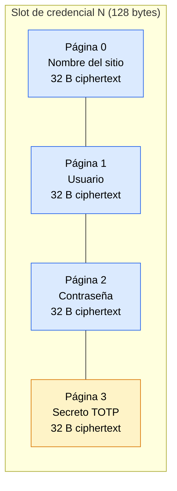

ZeroKeyUSB guarda todos los secretos dentro de una EEPROM externa **ST M24C64-WMN6TP** (64 Kbit = 8 KB). El firmware gestiona lecturas y escrituras con cuidado, respetando los límites de página y manteniendo todos los datos de credenciales cifrados en reposo.

---

## Mapa de memoria

La EEPROM está organizada en una **zona de configuración** (primeros ~220 bytes) y una **zona de credenciales** (resto):

```mermaid
block-beta
    columns 1
    block:config["Zona de configuración (0x0000–0x00FF)"]
        A["0x0000: Flag de config (1B)"]
        B["0x0001: Modo de pantalla (1B)"]
        C["0x0002: Intentos fallidos (1B)"]
        D["0x0010–0x001F: IV AES (16B)"]
        E["0x0020–0x0023: legacy / reservado (4B)"]
        F["0x0024: Flag de aprovisionamiento (1B)"]
        G["0x0028–0x0037: legacy / reservado (16B)"]
        I["0x003E: Layout de teclado (1B)"]
        J["0x0040–0x0047: Último epoch TOTP (8B)"]
        H["0x0048–0x0067: Hash de PIN (32B)"]
        K["0x0068–0x00E3: Meta TOTP (124B)"]
    end
    block:creds["Zona de credenciales (0x0100–0x1FFF)"]
        L["61 slots de credenciales × 128 bytes cada uno"]
    end

    style config fill:#dbeafe,stroke:#2563eb
    style creds fill:#dcfce7,stroke:#16a34a
```



| Dirección | Tamaño | Contenido | Fuente en código |
|---------|------|---------|---------------|
| `0x0000` | 1 B | Flag del asistente de config (`0x42` = hecho) | `zerokey-setup.cpp` |
| `0x0001` | 1 B | Orientación de pantalla (0 = normal, 1 = invertida) | `EEPROM_SCREEN_MODE_ADDR` |
| `0x0002` | 1 B | Contador de intentos fallidos (backoff persistente, reaplicado al arrancar) | `FAILED_ATTEMPTS_ADDR` |
| `0x0010–0x001F` | 16 B | Vector de inicialización AES-CBC | `EEPROM_IV_ADDR` |
| `0x0020–0x0023` | 4 B | *Reservado.* Umbral de intentos legacy del lockout por Counter0 ya eliminado; no se lee ni escribe. | — |
| `0x0024` | 1 B | Flag de aprovisionamiento (`0xA5` = aprovisionado) | `EEPROM_PROVISION_FLAG` |
| `0x0028–0x0037` | 16 B | *Reservado.* Contenía la clave maestra AES en firmware anteriores; la clave ahora vive en el slot 8 del ATECC y nunca toca la EEPROM. | — |
| `0x003E` | 1 B | Selector de layout de teclado (0–8) | `EEPROM_LAYOUT_ADDR` |
| `0x0040–0x0047` | 8 B | Último epoch TOTP (big-endian) | `EEPROM_LAST_TOTP_EPOCH_ADDR` |
| `0x0048–0x0067` | 32 B | Hash de PIN: SHA-256(PIN ∥ serial) | `EEPROM_PIN_HASH` |
| `0x0068–0x00E3` | 124 B | Metadatos TOTP: 2 B × 61 slots (algoritmo + secret_len) | `CONFIG_TOTP_META_START` |
| `0x0100–0x1F7F` | 7 808 B | 61 slots de credenciales (128 B cada uno = 4 páginas × 32 B) | `EEPROM_CREDENTIAL_BASE` |
| `0x1F80–0x1FFF` | 128 B | Wallet Bitcoin — página de semilla cifrada con AES ([auditoría](/es/firmware/bitcoin-signer)) | `BITCOIN_WALLET_ADDR` |

---

## Estructura del slot de credencial

Cada uno de los **61 slots de credenciales** ocupa **4 páginas consecutivas de 32 bytes en EEPROM** (128 bytes en total):



Cada página de 32 bytes contiene:
- **16 bytes de texto plano** (rellenados con `0xFF`) cifrados como **dos bloques AES-128 CBC**
- El cifrado usa el IV global del dispositivo más la clave maestra AES que vive dentro del slot 8 del ATECC — las rondas del cifrador corren en el chip, nunca en el MCU.

No hay un byte `status` o CRC separado por página. Los slots vacíos se escriben como blancos `0xFF` cifrados durante `silentEraseAll()`.

---

## Cálculo de dirección de página

```
credentialPageAddress(slotIndex, pageIndex) =
    (FIRST_CREDENTIAL_PAGE + slotIndex × 4 + pageIndex) × 32
```

Donde:
- `FIRST_CREDENTIAL_PAGE` se calcula a partir de `CONFIG_TOTP_META_END` redondeado al siguiente límite de 32 bytes.
- `slotIndex` va de 0 a 61.
- `pageIndex` va de 0 (sitio) a 3 (TOTP).

---

## Secuencia de escritura

La función `writeEepromPage()` escribe 32 bytes en una dirección alineada a página:

1. Comprueba la presencia de EEPROM vía `Wire.beginTransmission()` + test de ACK.
2. Envía la dirección de 2 bytes (MSB primero) seguida de 32 bytes de datos.
3. Espera 10 ms para el ciclo de escritura interno de la EEPROM.
4. Devuelve `true` si `Wire.endTransmission()` no reportó error.

Para escrituras relacionadas con seguridad que cruzan límites de página (p. ej. IV de 16 bytes, hash de PIN de 32 bytes), `eepromWriteRaw()` en `zerokey-security.cpp` divide los datos en los límites de 32 bytes para evitar el comportamiento de wrap-around de direcciones del M24C64.

---

## Secuencia de lectura

`readEepromPage()` lee exactamente 32 bytes:

1. Envía la dirección de 2 bytes vía escritura I²C.
2. Emite `Wire.requestFrom(eepromAddress, 32)`.
3. Lee todos los bytes disponibles al buffer de salida.
4. Rellena con ceros los bytes no recibidos (lectura parcial = error).

---

## Metadatos TOTP

Cada slot de credencial tiene una entrada de metadatos TOTP de 2 bytes en la zona de configuración:

| Byte | Contenido |
|------|---------|
| 0 | Código de algoritmo: `0` = ninguno, `1` = SHA-1, `2` = SHA-256, `3` = SHA-512 |
| 1 | Longitud del secreto en bytes crudos (antes de codificar en Base32) |

Los metadatos se leen/escriben independientemente de las páginas de credenciales para permitir detección rápida de TOTP sin descifrar el slot completo.

---

## Características de desgaste

- La M24C64-WMN6TP soporta **>1 millón de ciclos de escritura por página** (garantía del datasheet).
- Las páginas de credenciales solo se reescriben cuando el usuario edita un campo o importa datos.
- Las páginas de la zona de configuración (IV, hash de PIN, umbral) se escriben durante el aprovisionamiento y cambios de PIN — eventos infrecuentes.
- El epoch TOTP en `0x0040` se actualiza cada vez que el usuario sincroniza la hora o genera un código — es la ubicación más escrita.
- Como las credenciales suelen ser estáticas, la vida útil esperada de la EEPROM supera las décadas de uso normal.

---

## Resolución de problemas

| Síntoma | Causa | Solución |
|---------|-------|-----|
| `EEPROM not found` | Conexión I²C rota | Comprueba las soldaduras; verifica los pull-ups en SDA/SCL |
| `EEPROM write 0xNNN` | Escritura fallida en la dirección | Reintenta; si persiste, la EEPROM puede estar dañada |
| Credenciales corruptas | IV o clave AES cambió sin re-cifrar | Reset de fábrica + re-aprovisionar; restaurar desde backup |
| El slot aparece en blanco tras importar | Parsing del secreto TOTP falló | Verifica codificación Base32; verifica soporte del algoritmo |

<Note>
Ninguna credencial descifrada toca memoria persistente sin acción explícita del usuario. El texto plano solo existe en SRAM durante la sesión activa.
</Note>
