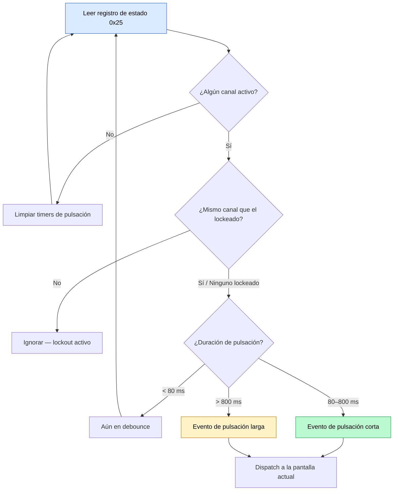

ZeroKeyUSB reemplaza los botones mecánicos con **cinco pads táctiles de cobre** conectados a un **controlador capacitivo TS06** dedicado. El firmware sondea este controlador por I²C y traduce los toques en eventos de navegación.

---

## Vista general del hardware

| Componente | Detalle |
|-----------|--------|
| **Controlador** | TS06 — IC táctil capacitivo de 6 canales |
| **Dirección I²C** | `0xD2 >> 1 = 0x69` |
| **Pads usados** | 5 de 6 canales: Izquierda, Derecha, Arriba, Abajo, Centro |
| **Registro de estado** | `0x25` — bitmask de canales actualmente tocados |
| **Sensibilidad** | Puesta a `0x3F` (mínima) en canales 0–2 al arranque para evitar disparos falsos |

El controlador gestiona la calibración de baseline internamente y reporta qué canales están activos vía el registro de estado.

---

## Inicialización táctil

Al arranque (`zerokey-setup.cpp`), el firmware:

1. Prueba el TS06 en `0x69` con hasta **5 reintentos** (separados 20 ms).
2. Si lo detecta, escribe la sensibilidad mínima (`0x3F`) en los registros `0x00–0x02`.
3. Configura el modo de operación vía registros `0x05–0x06`.
4. Pone `ts06_ok = true` — si no se encuentra el controlador, el táctil queda deshabilitado y el log serie muestra `"TS06 not found on I2C"`.

---

## Ciclo de polling

El método `handleButtonChecker()` corre en el bucle principal:

1. Lee `STATUS_REGISTER` (0x25) vía `readRegister()` por I²C.
2. Para cada bit de canal:
   - Registra `pressStartTime` cuando un canal se vuelve activo por primera vez.
   - Aplica un **debounce de 80 ms** (`DEBOUNCE_MS`) — las liberaciones más cortas que esto se ignoran.
   - Aplica un **lockout de canal de 150 ms** (`CHANNEL_LOCKOUT_MS`) — tocar un pad distinto mientras hay uno activo se ignora.
3. Al soltar:
   - Si se mantuvo > `LONG_PRESS_THRESHOLD` (800 ms) → dispatcha el handler de pulsación larga.
   - En otro caso → dispatcha el handler de pulsación corta.

---

## Mapeo de gestos

| Gesto | Disparador | Pantalla principal | Editor | Menú |
|---------|---------|-------------|--------|------|
| Tap Izquierda | < 800 ms | Slot anterior | Mover cursor izquierda | Volver / Salir de submenú |
| Tap Derecha | < 800 ms | Slot siguiente | Mover cursor derecha / Entrar al teclado | Entrar al submenú / Salir a credenciales |
| Tap Arriba | < 800 ms | Ciclar a vista Sitio | Cambiar carácter | Navegar arriba |
| Tap Abajo | < 800 ms | Ciclar a vista 2FA | Cambiar página de teclado | Navegar abajo |
| Tap Centro | < 800 ms | Tipear credencial al host | Insertar carácter | Seleccionar / Confirmar |
| Hold Izquierda | ≥ 800 ms | Saltar 10 slots atrás | — | — |
| Hold Derecha | ≥ 800 ms | Saltar 10 slots adelante | — | — |
| Hold Centro | ≥ 800 ms | Entrar en modo edición | Guardar y salir del editor | Autorizar import/export |

---

## Feedback visual de pulsación larga

Cuando una pulsación larga está en progreso, `drawLongPressProgress()` renderiza una barra de progreso que se va llenando en el OLED. Esto da al usuario confirmación visual de que debe seguir manteniendo. Soltar antes de los 800 ms cancela la acción.

---

## Controles en la pantalla de PIN

En la pantalla de entrada de PIN, los controles cambian:

| Pad | Acción |
|-----|--------|
| **Arriba / Abajo** | Cambia el dígito actual (0–9) |
| **Derecha** | Añade el dígito actual al PIN (hasta 16 dígitos) |
| **Izquierda** | Borra el último dígito introducido |
| **Centro** | Envía el PIN para verificación |
| **Pulsación larga Centro** | Teclea el número de serie del dispositivo |

---

## Manejo de errores

- Si el TS06 no se detecta al arranque, `ts06_ok` se pone a `false` y la lectura del registro de estado devuelve `0x00` — efectivamente deshabilitando la entrada táctil.
- El firmware no muestra una pantalla de error táctil; en su lugar, el log serie reporta el problema para debug.
- El táctil se deshabilita silenciosamente durante los delays de lockout (`waitFromEeprom()`) y durante operaciones largas como el borrado de credenciales.

<Note>
El TS06 opera independientemente de las operaciones de EEPROM o ATECC608A. Como todos comparten el mismo bus I²C a 100 kHz, el polling táctil se entrelaza con otro tráfico I²C en el bucle principal cooperativo.
</Note>
