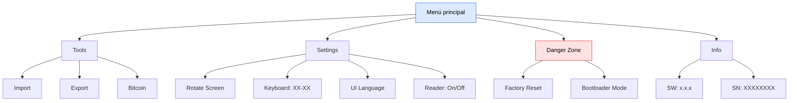
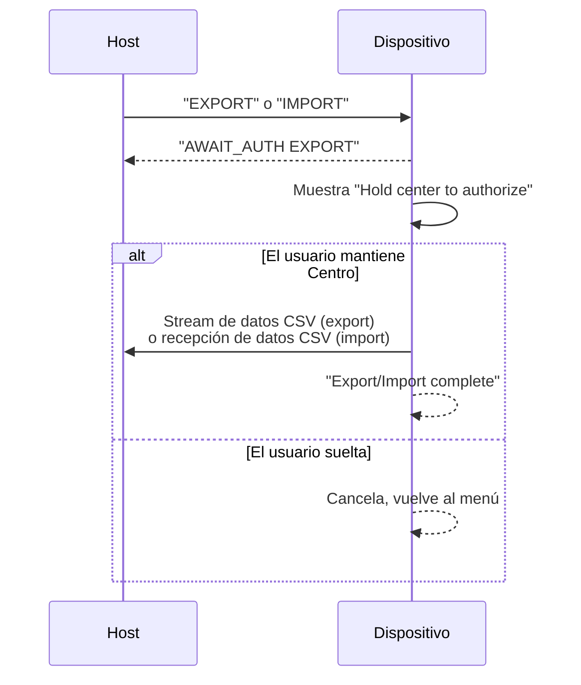

## Control simple, funciones potentes

ZeroKeyUSB no tiene botones, ni apps, ni menús ocultos — solo **cinco puntos táctiles dorados** que lo controlan todo.  
El menú es accesible **tras introducir tu PIN maestro** haciendo scroll más allá del último slot de credenciales.

---

## Estructura del menú

---

## Navegación del menú

| Gesto | Acción |
|---------|--------|
| **Arriba ↑** | Mueve la selección arriba (envuelve al final) |
| **Abajo ↓** | Mueve la selección abajo (envuelve al principio) |
| **Centro ●** | Selecciona / Ejecuta el ítem resaltado |
| **Izquierda ←** | Vuelve al menú padre o sale a credenciales |
| **Derecha →** | Sale del menú, salta al slot 0 de credenciales |

Cuando un menú tiene más ítems de los que caben en las 4 filas, aparece una **barra de scroll con thumb** en el borde derecho. La selección permanece visible al hacer scroll.

---

### 🧰 Tools

<Note>Este submenú se llamaba **Backup** en firmware anteriores; se renombró a **Tools** al añadir la cartera Bitcoin.</Note>

| Ítem | Acción |
|------|--------|
| **Import** | Recibe credenciales desde el host vía USB serie (CDC). El dispositivo muestra "Waiting for data from the web app". |
| **Export** | Envía los 61 slots de credenciales como CSV en texto plano por USB serie. Requiere autorización con pulsación larga Centro. |
| **Bitcoin** | Cartera Bitcoin airgapped: crear cartera, mostrar la semilla de 12 palabras (solo pantalla) y exportar un `zpub` watch-only. Ver [Firmante Bitcoin](/es/firmware/bitcoin-signer). |

El flujo de export/import muestra un prompt de autorización antes de transferir cualquier dato:

<Warning>
Export envía **credenciales en texto plano** por USB serie. Solo realiza esto en un ordenador de confianza.
</Warning>

---

### ⚙️ Settings

| Ítem | Acción |
|------|--------|
| **Rotate Screen** | Voltea la pantalla 180° para uso a izquierda/derecha. También invierte los controles táctiles. Guardado en EEPROM. |
| **Keyboard: XX-XX** | Cicla por los 9 layouts de teclado (EN-US → DA-DK → DE-DE → ES-ES → FR-FR → HU-HU → IT-IT → PT-PT → SV-SE → EN-US). Guardado en EEPROM. |
| **UI Language** | Cicla el idioma de la interfaz en pantalla (Inglés ↔ Español). Guardado en EEPROM. |
| **Reader: On/Off** | Alterna el [modo lector de pantalla](/es/firmware/screen-reader) HID persistente — teclea la pantalla por USB para que una unidad con el display muerto siga siendo usable. Guardado en EEPROM. |

---

### ⏱️ TOTP

El TOTP se accede desde la vista de credenciales, no desde el menú principal. Al ver una credencial, haz scroll **Abajo más allá de Password** hasta el campo **2FA**:

- Si no existe secreto TOTP para ese slot → muestra "No TOTP secret" durante 2 segundos.
- Si la hora no está sincronizada → muestra "Time not set — Request host time" y envía `REQTIME` por serie.
- Si está listo → muestra un **código de 6 dígitos** con cuenta atrás de 30 segundos. Se refresca automáticamente cada periodo. Toca cualquier pad para volver.

---

### ⚠️ Danger Zone

Toda acción en esta sección muestra una **página de confirmación** que requiere pulsar Centro para proceder o Izquierda para cancelar:

| Ítem | Efecto | ¿Reversible? |
|------|--------|-------------|
| **Factory Reset** | Ejecuta `eraseAll()` (cuenta atrás de 3 segundos, blancos cifrados en los 61 slots + limpia metadatos TOTP) y resetea el flag de aprovisionamiento a `0x00`, así el próximo arranque inicia el asistente de setup. | ❌ No |
| **Bootloader Mode** | Pone la palabra mágica de doble reset (`0xF01669EF` en `0x20007FFC`) y luego ejecuta `NVIC_SystemReset()`. El dispositivo se reinicia en el bootloader USB DFU para flashear firmware. | ✅ Sí (reflasheo) |

---

### ℹ️ Info

Submenú de solo lectura mostrando:
- **SW: x.x.x** — versión del firmware desde `zerokeyInfo::getSoftwareVersion()`
- **SN: XXXXXXXX** — serial hardware desde los registros de ID único del SAMD21

---

## Asistente de setup

El asistente de setup corre en el primer arranque (o tras reset de fábrica). Consta de **10 páginas internas** repartidas en **9 pasos visibles**:

Las páginas con más de 4 líneas de texto son **scrollables verticalmente** usando Arriba/Abajo. Aparece un thumb de scroll en el borde derecho.

Cada página del asistente soporta:
- **Derecha** → avanza a la siguiente página
- **Izquierda** → vuelve a la página anterior
- **Centro** → acción (alternar orientación, cambiar layout, iniciar entrada de PIN)
- **Arriba/Abajo** → scroll del contenido

---

## Filosofía de diseño

El sistema de menú es intencionadamente minimalista:
- Sin submenús profundos — cada opción está a **dos toques** del menú principal.
- Todas las acciones destructivas requieren confirmación explícita en una página dedicada.
- El layout y los gestos se mantienen consistentes entre versiones del firmware.
- Los ítems del menú actualizan dinámicamente sus etiquetas (p. ej., layout de teclado muestra la selección actual).

<Note>
ZeroKeyUSB no requiere drivers ni instalación de software.  
Se reconoce como un teclado USB estándar en cualquier sistema operativo.
</Note>
