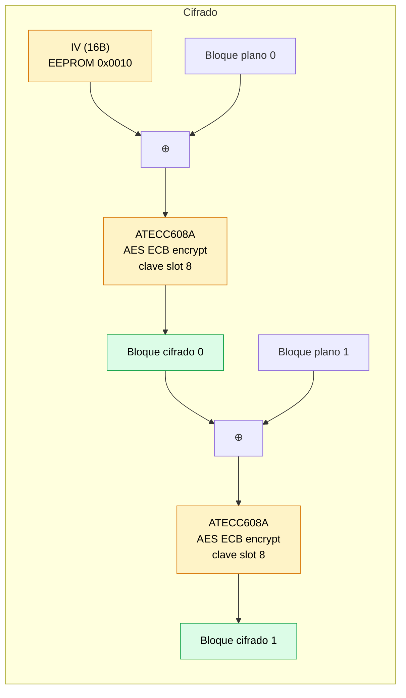

ZeroKeyUSB cifra cada bloque de credencial usando **AES-128 en modo CBC**. El ECB de bloque único se hace **en el ATECC608A** usando una clave que nunca sale del chip; el MCU SAMD21 envuelve las llamadas al chip con el encadenamiento CBC y gestiona la E/S a la EEPROM.

---

## Material de clave

La clave maestra AES es un **valor aleatorio de 16 bytes generado por el TRNG del ATECC608A** al primer arranque, escrito al **slot 8** del chip, y luego bloqueado por el lock de la zona de datos.

| Propiedad | Detalle |
|----------|--------|
| **Origen** | TRNG hardware del ATECC608A (comando `random()`, modo 0x00 — refresca la semilla DRBG antes de la salida) |
| **Tamaño** | 16 bytes (128 bits) |
| **Almacenamiento** | Slot 8 del ATECC608A (`IsSecret=1`, `KeyType=6`/AES, `WriteConfig=Never`) |
| **Visibilidad** | El chip nunca expone los contenidos del slot vía I²C una vez configurado así |
| **Momento de generación** | Único disparo, durante el primer arranque del firmware nuevo en un chip virgen, dentro de `provisionAesAndLock()` |
| **Mutabilidad** | Ninguna tras bloquear la zona de datos. La clave persiste durante la vida del dispositivo. |

Como `IsSecret=1` se aplica antes de bloquear la zona de datos, incluso un atacante con acceso físico I²C no puede leer la clave AES del chip — el comando `Read` se niega a devolverla.

---

## ¿Por qué el chip y no el MCU?

El firmware anterior corría AES software en el SAMD21 con la clave guardada en EEPROM, porque la variante `MAHDA-T` del ATECC608A se entrega con el comando AES hardware deshabilitado. Habilitarlo requiere:

1. Escribir el bit `AES_Enable` (byte 13, bit 0) de la Config Zone.
2. Configurar el slot 8 con `KeyType=6` (AES).
3. Bloquear la Config Zone para que esos ajustes tomen efecto.

El firmware ahora hace los tres pasos la primera vez que arranca. El compromiso: los bloques AES ahora cruzan el bus I²C, lo que es más lento (~10 ms por bloque frente a ~0,1 ms en software). Para una lectura de credencial que descifra 3×32 bytes son ≈60 ms — imperceptible para el usuario.

---

## Implementación del encadenamiento CBC

Las funciones `cbcEncrypt32` / `cbcDecrypt32` en `zerokey-security.cpp` procesan cada campo de credencial de 32 bytes como dos bloques de 16 bytes encadenados contra el IV del dispositivo:



### Cifrado

```
prev = IV
para cada bloque de 16 bytes b (0, 1):
    x = plain[b] XOR prev
    cipher[b] = ATECC608A.aesEncryptBlock(slot=8, mode=0x00, in=x)
    prev = cipher[b]
```

### Descifrado

```
prev = IV
para cada bloque de 16 bytes b (0, 1):
    dec = ATECC608A.aesDecryptBlock(slot=8, mode=0x01, in=cipher[b])
    plain[b] = dec XOR prev
    prev = cipher[b]
```

El MCU solo ve bloques de plaintext (entrada al cifrar, salida del descifrar) y bloques de ciphertext (salida del cifrar, entrada al descifrar). Nunca ve la clave AES.

---

## Formato wire de cada llamada AES

Para cada bloque de 16 bytes:

| Campo | Valor | Propósito |
|------|-------|---------|
| Token de wake | bajar SDA 60 µs | Sacar al chip de sleep |
| Opcode | `0x51` (`AES`) | Identificador de comando |
| Param1 (Mode) | `0x00` = encrypt block 0, `0x01` = decrypt block 0 | `bit 0` operación, bits 6–7 índice de sub-key |
| Param2 (KeyID) | `0x0008` | Slot 8 |
| Datos | 16 bytes | Plaintext (encrypt) o ciphertext (decrypt) |
| CRC | 2 bytes | CRC-16 personalizado (poli `0x8005`, init `0`) |
| Respuesta | 16 bytes + status | El bloque cifrado o descifrado |
| Token de sleep | `0x01` | Devolver el chip a estado de bajo consumo |

Cada llamada tarda ~10 ms incluyendo el overhead I²C.

---

## Padding

Cada campo de credencial (sitio, usuario, contraseña) son 16 bytes en RAM. Antes del cifrado:

1. Los **caracteres espacio (`0x20`)** finales se reemplazan con `0xFF` desde el final hacia dentro.
2. El campo de 16 bytes se coloca en un buffer de 32 bytes; los 16 bytes superiores se rellenan con `0xFF`.

Al descifrar, `bufferToString()` quita los bytes `0xFF` y lee hasta `\0` o `0xFF`.

---

## Flujo por operación

### `lock()` — cifrar y escribir credenciales

1. Reemplazar espacios finales en `currentSite`, `currentUser`, `currentPass` con `0xFF`.
2. Cargar el IV desde EEPROM (`loadIVfromEEPROM()`).
3. Para cada uno de los 3 campos:
   - Copiar 16 bytes a un buffer de 32 bytes, rellenar la mitad superior con `0xFF`.
   - Llamar a `cbcEncrypt32(iv, plain, encrypted)` — dos llamadas AES al ATECC por debajo.
   - Escribir el ciphertext de 32 bytes a la página correcta de EEPROM.

### `unlock()` — descifrar y cargar credenciales

1. Cargar el IV desde EEPROM.
2. Comprobación de auto-curación: si el slot 0 página 0 es `0xFF` crudo, llamar a `silentEraseAll()`.
3. Para cada uno de los 3 campos:
   - Leer el ciphertext de 32 bytes desde EEPROM.
   - Llamar a `cbcDecrypt32(iv, encrypted, decrypted)` — dos llamadas AES al ATECC.
   - Copiar los primeros 16 bytes a `currentSite` / `currentUser` / `currentPass`.

---

## Reporte de errores

Cuando un round-trip AES falla, el firmware preserva el código de respuesta del chip y lo muestra en el OLED en lugar de un error genérico. El formato es `AES E<n> RC<x> SS<XX>` más una segunda línea `LC=<x> LV=<x> KT=<n>` que muestra el estado de lock y key-type del chip en el momento del fallo:

| Código | Significado |
|------|---------|
| `AES E1` | `silentEraseAll()` no pudo cifrar un slot en blanco |
| `AES E2` | `eraseAll()` no pudo cifrar un slot en blanco |
| `AES E3` | `lock()` no pudo cifrar un campo de credencial (`f0`/`f1`/`f2` = sitio/usuario/contraseña) |
| `AES E4` | `unlock()` no pudo descifrar un campo de credencial |

`RC` es el código de nivel driver (`-1` wake, `-2` I²C, `-3` CRC, `-4` chip status error, `-5` timeout). `SS` es el byte de status crudo del chip (`0x0F` execution error, `0x03` parse, `0x07` self-test, …). La combinación te dice exactamente por qué el chip rechazó la llamada. Locked + `KT=1` (en lugar de `6`) significa que el chip está permanentemente mal configurado para AES; ese es el único modo de fallo que no se puede limpiar con un reinicio.

---

## Consideraciones de seguridad

| Consideración | Estado |
|--------------|--------|
| **Entropía de clave** | 128 bits del TRNG hardware del chip — no es susceptible a fuerza bruta |
| **PIN ≠ clave** | Cambiar u olvidar el PIN no afecta la clave AES ni el ciphertext existente |
| **Clave en reposo** | Vive dentro del slot 8 del ATECC608A con `IsSecret=1`. El slot no es legible vía comando `Read` tras bloquear la zona de datos. |
| **Clave en tránsito** | Nunca cruza el bus I²C. El MCU envía bloques de plaintext / ciphertext; el chip usa su copia interna de la clave. |
| **Ataque físico vía I²C** | Un atacante que exponga I²C puede repetir llamadas AES pero no puede extraer la clave. Aun así podría observar los bloques de plaintext que el MCU envía al chip — el encapsulado físico sigue siendo esencial. |
| **Reset de fábrica** | `eraseAll()` sobrescribe todas las páginas de credenciales con blancos cifrados. La propia clave AES es permanente (slot 8 con lock Never). |
| **Sin custodia de clave** | No hay copia de seguridad de la clave maestra AES en ningún sitio. Fallo del chip = pérdida permanente de todas las credenciales. Mantén una copia de seguridad exportada. |

<Warning>
La clave AES no se puede rotar ni recuperar una vez bloqueada la zona de datos. Si el elemento seguro falla, cada credencial cifrada bajo él se vuelve ilegible. Usa el comando de backup USB-CDC en un host de confianza antes de depender del dispositivo a largo plazo.
</Warning>
