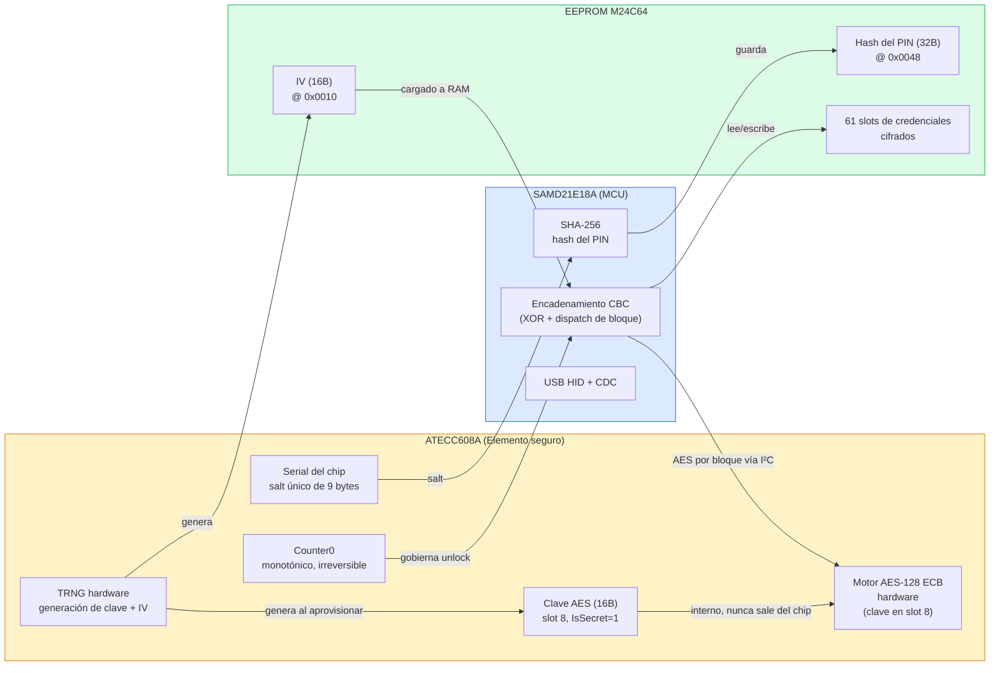
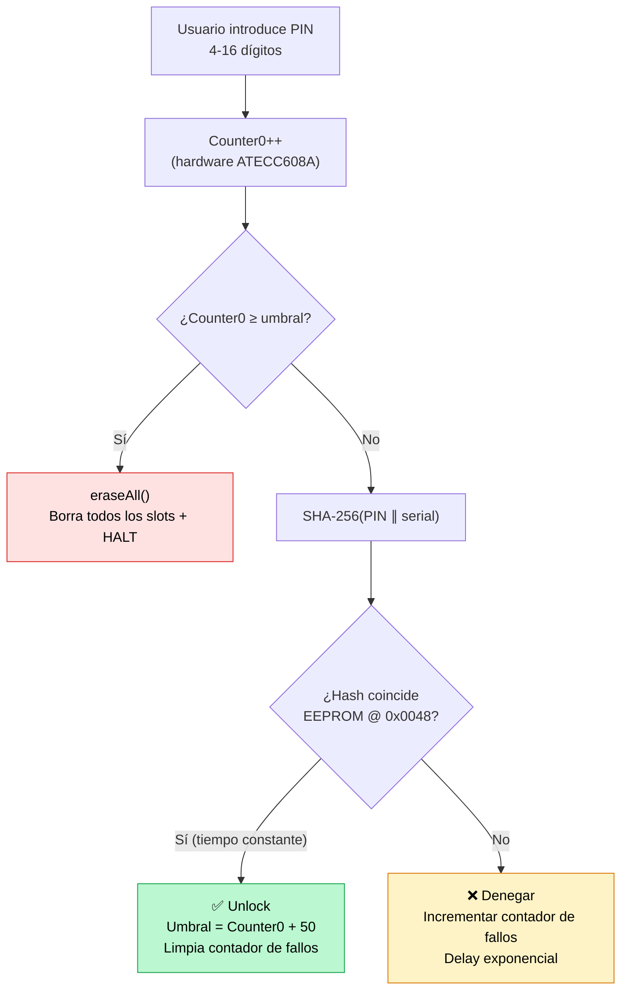

## Offline por diseño

ZeroKeyUSB no depende de Internet, almacenamiento en la nube ni apps acompañantes.
Todo — desde la generación de números aleatorios hasta la verificación del PIN — ocurre **dentro del dispositivo**, alimentado directamente por USB.

Tus contraseñas **nunca salen del hardware** y **no se pueden acceder remotamente**, ni siquiera por el fabricante.

---

## Dos chips cooperando

La seguridad está dividida entre dos piezas de silicio para que ninguna por sí sola pueda filtrar la bóveda:

| Chip | Función |
|------|------|
| **SAMD21E18A (MCU)** | Ejecuta el firmware de aplicación, gestiona la lógica de encadenamiento CBC, drivea el OLED, USB HID, táctil y el bus I²C. El AES de bloque único se delega al elemento seguro. |
| **ATECC608A-MAHDA-T (elemento seguro)** | Genera números aleatorios verdaderos (TRNG), guarda un serial único de 9 bytes usado como salt del PIN, proporciona un **contador monotónico hardware** (Counter0) resistente a manipulación, y — una vez aprovisionado — ejecuta cada bloque AES-128 ECB en hardware dedicado usando una clave guardada en el slot 8 que **nunca sale del chip**. |

El MCU y el ATECC608A comparten un bus I²C en la dirección `0x60`. El MCU no tiene una copia usable de la clave AES: envía bloques de plaintext de 16 bytes al chip y recibe 16 bytes de ciphertext de vuelta. El chip generó la clave por sí mismo al aprovisionarse usando su TRNG; la secuencia de bytes nunca cruzó el bus I²C.

> **Modelo criptográfico — Camino A (clave AES + motor AES en chip).**
> El firmware habilita el comando AES hardware, configura el slot 8 como contenedor de clave AES (`IsSecret=1`, `KeyType=6`), escribe una clave de 16 bytes generada por el TRNG, y bloquea tanto la zona Config como Data. A partir de ahí, el cifrado y descifrado son llamadas ECB de bloque único al chip, encadenadas en el MCU en CBC.

---

## Arquitectura de cifrado

Todos los datos sensibles se almacenan en la **EEPROM externa M24C64-WMN6TP**, cifrados con **AES-128 en modo CBC**. Cada bloque ECB lo computa el motor AES hardware del ATECC608A; el MCU solo gestiona el encadenamiento XOR del CBC.

| Elemento | Origen / ubicación |
|----------|-------------------|
| **Cifrador** | AES-128 CBC — ECB de bloque único delegado al comando `AES` del ATECC608A (opcode `0x51`). El encadenamiento XOR por bloque se hace en el MCU alrededor de las llamadas al chip para que la clave nunca tenga que cargarse en SRAM del MCU. |
| **Clave maestra AES** | 16 bytes aleatorios producidos por el TRNG del ATECC608A al primer arranque y escritos al **slot 8** del chip. `IsSecret=1` significa que nunca se puede leer vía el bus I²C. |
| **IV (Vector de Inicialización)** | 16 bytes aleatorios producidos por el TRNG del ATECC608A al aprovisionar. Guardados en EEPROM en `0x0010–0x001F`. |
| **Vinculación con el PIN** | La clave maestra AES **no** se deriva del PIN. El PIN se verifica por separado mediante un hash guardado en EEPROM que gobierna el acceso a la rutina de unlock. |
| **Layout de credenciales** | Cada slot contiene hasta cuatro páginas EEPROM cifradas de 32 bytes: sitio (p0), usuario (p1), contraseña (p2), secreto TOTP (p3). Cada página de 32 bytes cifra 16 bytes de plaintext rellenados a 32 bytes con `0xFF`. |

### Detalle del encadenamiento CBC

`cbcEncrypt32` / `cbcDecrypt32` procesan cada credencial de 32 bytes en dos bloques de 16 bytes. Para cada bloque:

1. El bloque de plaintext se XOR con el ciphertext anterior (o con el IV del dispositivo para el primer bloque).
2. El resultado del XOR se envía al ATECC608A vía el comando AES (`mode=0x00` para encrypt, `0x01` para decrypt, clave del slot 8, key block 0). El chip devuelve los 16 bytes de ciphertext.
3. El ciphertext resultante se convierte en `prev` para el siguiente bloque.

El descifrado es simétrico: el chip devuelve plaintext, el MCU lo XOR con el ciphertext anterior para recuperar el bloque original.

**¿Por qué dividir el trabajo así?** El comando `AES` del ATECC608A solo expone ECB de bloque único. CBC es la *política de encadenamiento* añadida encima — implementarlo en el MCU mantiene cada byte de la clave dentro del elemento seguro mientras nos da los beneficios de difusión de CBC en los datos de credenciales.

---

## Mapa de seguridad de la EEPROM

| Dirección | Tamaño | Contenido |
|---------|------|---------|
| `0x0000` | 1 B | Flag del asistente de configuración (`0x42` = hecho) |
| `0x0001` | 1 B | Modo de pantalla / orientación |
| `0x0002` | 1 B | Contador soft de intentos fallidos (backoff UX) |
| `0x0010–0x001F` | 16 B | Vector de inicialización AES-CBC (generado por TRNG) |
| `0x0020–0x0023` | 4 B | Umbral de intentos de PIN (LE uint32 = valor de Counter0 + 50 en el último éxito) |
| `0x0024` | 1 B | Flag de aprovisionamiento (`0xA5` = aprovisionado) |
| `0x0028–0x0037` | 16 B | *Reservado* — slot legacy de la clave maestra AES del build con AES software. No se usa desde que la clave se movió al slot 8 del ATECC. |
| `0x003E` | 1 B | Selector de layout de teclado |
| `0x0040–0x0047` | 8 B | Último epoch TOTP (persistente entre apagados) |
| `0x0048–0x0067` | 32 B | Hash del PIN = SHA-256(pinArray\[16\] ∥ chip_serial\[9\]) |
| `0x0068+` | 124 B | Metadatos TOTP (algoritmo + longitud del secreto, 2 B × 61 slots) |
| `0x0100+` | — | Páginas de credenciales (4 × 32 B × 61 slots = 7808 B máx.) |

> **Nota sobre `0x0028`.** Unidades antiguas (compiladas antes del cambio de AES) usaban esta región para guardar la clave maestra AES de 16 bytes en plaintext. Las unidades nuevas no la tocan; los bytes permanecen con lo que tuviera la EEPROM. Trata la dirección como reservada.

---

## El PIN maestro

El PIN autoriza un ciclo de unlock; **nunca se usa directamente como clave de cifrado**.

El flujo de verificación:

1. El usuario introduce hasta **16 dígitos** en los pads capacitivos.
2. El firmware incrementa **Counter0** en el ATECC608A. Este contador es monotónico y sobrevive a ciclos de alimentación — no se puede rebajar por software ni desoldando el MCU.
3. El firmware lee el **umbral de intentos** desde EEPROM (`0x0020`). Si `Counter0 ≥ umbral`, el dispositivo llama a `eraseAll()` (borra todos los slots de credenciales) y se para.
4. En caso contrario, el firmware llama a `derivePinKey()`: computa `SHA-256(pinArray[16] ∥ chip_serial[9])` para producir el hash de 32 bytes.
5. Lee el hash guardado de 32 bytes desde EEPROM (`0x0048`) y ejecuta una **comparación a tiempo constante** (`diff |= stored[i] ^ derived[i]`).
6. **En coincidencia:** el umbral se resetea a `Counter0 + 50`, el contador soft de fallos se limpia y el unlock procede.
7. **En no coincidencia:** el contador soft se incrementa y el dispositivo aplica un delay exponencial antes del siguiente intento.

Como el contador de rate-limit está en hardware, un atacante que volcara la EEPROM todavía no podría hacer fuerza bruta del PIN contra el dispositivo — Counter0 sigue avanzando con cada intento y el firmware borra la bóveda cuando se cruza el umbral.

### Bloqueo adaptativo — backoff soft (capa UX)

Guardado en EEPROM `0x0002`. Independiente del contador hard; se resetea con un PIN correcto.

| Intentos fallidos | Tiempo de espera |
|-----------------|-----------|
| 1 | 5 s |
| 2 | 10 s |
| 3 | 20 s |
| 4 | 40 s |
| 5 | 80 s |
| … | dobla hasta **2 560 s (≈ 43 min)** |

Fórmula: `wait = BASE_SECONDS (5) × 2^(min(intentos,10)−1)`, con tope en `MAX_WAIT_SECONDS` (2 560).

### Límite hard — contador hardware

- Umbral inicializado al aprovisionar: `cur_counter + 50` (donde `cur_counter` se lee del chip en ese momento).
- Cada intento de PIN — correcto o no — incrementa Counter0 en uno.
- El umbral se incrementa en 50 **solo en un PIN correcto**, así que una racha de intentos incorrectos eventualmente agota el presupuesto.
- El contador monotónico del chip **no se puede resetear** — no hay ruta software, ni ciclo de alimentación, ni reset físico que lo reinicie.
- El límite hard es `ATTEMPT_BUDGET = 50`. Tras 50 PINs incorrectos consecutivos sin uno correcto, la bóveda se borra.

---

## Mapa de slots del ATECC608A

Establecido por el propio dispositivo la primera vez que arranca, luego **bloqueado permanentemente** (las zonas Config y Data ambas cerradas irreversiblemente):

| Slot | Tamaño usado | Contenido | SlotConfig / KeyConfig |
|------|-----------|---------|------------------------|
| **8** | 16 B | Clave maestra AES-128 — generada en el chip por el TRNG al primer arranque, usada por cada encrypt/decrypt de credencial | `IsSecret=1` / `WriteConfig=Never` / `KeyType=6 (AES)`. La clave no se puede leer por I²C, ni reescribir una vez bloqueada la zona de datos. |
| **9** | 32 B | `SHA-256(PIN_padded ∥ device_serial)` — la clave del PIN | `IsSecret=0` / `WriteConfig=Always` para que la app pueda reescribir el slot cuando el usuario cambie su PIN. Legible por I²C. |
| **Counter 0** | 4 B monotónico | Contador de intentos de PIN | Solo incremento. Leído por la app antes de cada unlock. |

### Secuencia de aprovisionamiento (solo primer arranque)

`zerokeyAtecc.provisionAesAndLock()` corre una vez, antes del asistente de setup:

1. **Lee** los bloques 0, 1 y 3 de la Config Zone para conocer los valores de fábrica actuales del chip.
2. **Establece el bit AES_Enable** (byte 13, bit 0) usando una escritura de bloque de 32 bytes que preserva cada bit de fábrica que no pretendíamos cambiar. Re-lee y verifica que el bit tuvo efecto; aborta sin bloquear si no.
3. **Establece SlotConfig[8]** — `IsSecret=1` (bit 7 del byte 36) y `WriteConfig=Never` (nibble alto del byte 37 = `0x4`), preservando el resto del byte. Re-lee y verifica.
4. **Establece KeyConfig[8].KeyType = 6 (AES)** — bits 2..4 del byte 112, preservando cada otro bit. Re-lee y verifica.
5. **Bloquea la zona Config.** Irreversible.
6. **Genera** una clave aleatoria de 16 bytes vía el TRNG del chip y la escribe en el slot 8 en claro (aún permitido mientras la zona de datos esté abierta).
7. **Bloquea la zona Data.** Irreversible.

Cada escritura va seguida de una re-lectura. Si algún verify falla, la función devuelve un error numerado `PROV E<n>` con el byte de status crudo del chip adjunto y **no procede a bloquear la zona**, de modo que un chip que se porte mal no pueda brickearse silenciosamente.

> **¿Por qué escrituras a nivel de bit?** Los chips MAHDA-T se entregan con varios bits "reservados" en el byte 13 (`AES_Enable`) configurados de fábrica. Una escritura ingenua que los borra es rechazada por el chip con un parse error (`SS=0x03`). El código de aprovisionamiento lee cada byte primero, hace OR-mask solo de los bits que necesita cambiar, y escribe el bloque de 32 bytes entero de vuelta.

> **Trade-off conocido (Slot 9 legible):** El slot 9 no está bloqueado como secreto porque el SKU MAHDA-T rechaza escrituras en claro a slots IsSecret 0–7. El hash del PIN vive ahí con `IsSecret=0`, así que un atacante con acceso físico I²C puede leer el hash de 32 bytes e intentar fuerza bruta offline SHA-256(PIN∥serial). El lockout hardware de Counter0 limita intentos online pero no el cracking offline. Los PINs cortos son vulnerables a este ataque — usa los 16 dígitos máximos.

---

## Vector de inicialización

El IV se genera **una vez** durante el aprovisionamiento por el TRNG del ATECC608A y se guarda en EEPROM en `0x0010`. Dos comprobaciones lo protegen:

- Una lectura que devuelva todo `0x00` o todo `0xFF` se trata como sin inicializar y dispara regeneración desde el TRNG.
- Si la lectura de EEPROM falla en el momento del unlock, el firmware intenta regenerar desde el TRNG y re-guarda el IV.

**IV único por dispositivo:** todas las páginas de credenciales se encadenan contra el mismo IV. Esto mantiene el layout simple y auditable. El modelo de amenaza se apoya en la calidad del TRNG y Counter0, no en nonces por registro.

**Consecuencia de la regeneración:** si el IV se pierde o se regenera sin re-cifrar las credenciales, los slots existentes descifrarán a basura (el ciphertext se produjo bajo el IV antiguo). La rutina de auto-curación del firmware (`silentEraseAll`) se llama automáticamente en el primer unlock si el slot 0 página 0 sigue en `0xFF` (por defecto de EEPROM), y se puede llamar de nuevo manualmente vía `generateAndStoreIV()`.

---

## Inicialización con auto-curación

En el primer unlock tras el aprovisionamiento, `ZerokeySecurity::unlock()` comprueba si el slot 0 página 0 de credenciales sigue en el valor por defecto de fábrica de EEPROM (`0xFF` en los 32 bytes). Si es así, llama a `silentEraseAll()`:

1. Carga el IV del dispositivo desde EEPROM.
2. Para cada uno de los 61 slots × 4 páginas: cifra un blanco de 32 bytes `0xFF` bajo AES-128 CBC y lo escribe en EEPROM.
3. Limpia los metadatos TOTP de cada slot.

Esto garantiza que las unidades nuevas siempre tengan entradas en blanco consistentes y correctamente cifradas antes de que se escriba ninguna credencial.

---

## Segmentación de datos

Cada slot de credencial ocupa 4 páginas EEPROM consecutivas (128 bytes en total):

| Página | Contenido (plaintext, 16 B + 16 B padding) | Bytes EEPROM |
|------|----------------------------------------|--------------|
| 0 | Sitio / dominio | 32 B ciphertext |
| 1 | Usuario | 32 B ciphertext |
| 2 | Contraseña | 32 B ciphertext |
| 3 | Secreto TOTP | 32 B ciphertext |

Dividir los campos mantiene patrones reconocibles de plaintext fuera del stream de ciphertext y limita el radio de explosión de una página EEPROM corrupta. Los bytes de padding son `0xFF`; los espacios finales `0x20` se reemplazan con `0xFF` antes del cifrado para evitar fugas de patrones.

---

## Protección contra manipulación

- El PCB está **encapsulado en resina epoxy**; abrir el dispositivo destruye la placa y las conexiones de los chips.
- **Sin interfaces wireless** (sin Wi-Fi, sin Bluetooth, sin NFC).
- La **región del bootloader está BOOTPROT-locked** en fuses hardware (`BOOTPROT = 7`, protegiendo los primeros 16 KB) — el firmware de aplicación no puede reescribir ni reubicar el bootloader.
- El bootloader solo saltará a **firmware firmado con ECDSA P-256**; una imagen sin firmar o manipulada cae en modo de recuperación USB-CDC en vez de ejecutarse.
- Todas las credenciales descifradas viven en **buffers temporales de RAM** (`currentSite`, `currentUser`, `currentPass`) que se rellenan al unlock y se sobrescriben en el siguiente lock o ciclo de alimentación.
- El **pin de Write Protect** (`EEPROM_WP_PIN = PA01`) puede ponerse a alto por firmware para bloquear escrituras EEPROM por hardware.

---

## Backup y restore

Las credenciales se pueden exportar e importar por la interfaz serie USB CDC:

- **Export (`backupAllCredentials`):** descifra los 61 slots dentro del dispositivo y los envía como líneas plaintext separadas por comas por SerialUSB. El host recibe las credenciales en claro — **asegúrate de que la conexión USB es de confianza**.
- **Import (`loadAllbackupCredentials`):** recibe registros desde el host, los re-cifra bajo el IV/clave maestra actual del dispositivo y los escribe en EEPROM. Los secretos TOTP se parsean y guardan en la página 3 de cada slot.

> **Nota de seguridad:** el backup transmite credenciales descifradas en plaintext por USB. Solo realiza backup/restore en un host de confianza, air-gapped.

---

## Limitaciones conocidas y compromisos

| Limitación | Impacto | Mitigación |
|-----------|--------|------------|
| La clave AES no se puede regenerar tras el aprovisionamiento | Si el chip alguna vez falla, las credenciales cifradas con esa clave son irrecuperables | `WriteConfig=Never` es el precio de `IsSecret=1` más la zona de datos bloqueada; elige el compromiso de máxima seguridad y acéptalo. Mantén una copia de seguridad exportada. |
| Hash del PIN del slot 9 legible por I²C | Fuerza bruta offline SHA-256 si I²C es accesible | Los PINs cortos (< 6 dígitos) son vulnerables; usa PINs de máxima longitud |
| IV único por dispositivo | Mismo IV para todos los slots; sin nonces por registro | Entropía del IV desde el TRNG del ATECC; perder el IV requiere re-inicializar |
| Comparación de PIN en software (no CheckMac) | Timing side-channel (mitigado por comparación a tiempo constante) | Counter0 hardware sigue gobernando los intentos |
| El backup es plaintext por USB | Un host físico puede capturar credenciales | Documentado claramente; usar solo en máquinas de confianza |
| Cada bloque AES es un round-trip al chip por I²C | Más lento que AES software — las credenciales descifran en ~30 ms en vez de ~3 ms | Aceptable para un gestor de contraseñas de mano; el chip es el límite de seguridad |

---

## Transparencia, no dependencia

El firmware de ZeroKeyUSB es totalmente open source y está disponible para **auditoría y verificación** públicas. Cualquiera puede revisar:

- Cómo se drivea el ATECC608A, incluyendo la rutina de aprovisionamiento bit-level que habilita el motor AES del chip y bloquea ambas zonas (`zerokey-atecc.cpp`).
- Cómo el encadenamiento CBC envuelve el comando AES de bloque único del chip (`zerokey-security.cpp`).
- Cómo se genera, valida y refresca el IV (`zerokey-security.cpp::generateAndStoreIV`).
- Cómo el bootloader hashea y verifica la aplicación (`bootloader/src/main.c`).

**No hay mecanismos de actualización remota**: reflashear requiere acceso físico vía pogo pins SWD o el bootloader local USB-CDC, y cualquier nueva imagen debe estar firmada por la clave ECDSA offline.

---

## Profundizar

<CardGroup cols={3}>
  <Card title="Cifrado AES-128" icon="lock" href="/es/firmware/security/aes-128-encryption">
    Cómo el motor AES hardware del ATECC608A cifra cada bloque de credencial, con encadenamiento CBC envolviéndolo en el MCU.
  </Card>
  <Card title="Verificación del PIN" icon="shield" href="/es/firmware/security/pin-verification">
    Counter0, el hash SHA-256 guardado en EEPROM y la comparación a tiempo constante que gobierna el unlock.
  </Card>
  <Card title="Generación del IV" icon="dice" href="/es/firmware/security/iv-generation">
    Cómo el TRNG del ATECC608A siembra el IV global del dispositivo y cómo se gestiona la regeneración.
  </Card>
</CardGroup>

<Note>
ZeroKeyUSB combina un MCU con un elemento seguro endurecido. El chip proporciona la *entropía* (TRNG), la *identidad* (serial del chip usado como salt del PIN), el *rate limit* (Counter0), **y** el *cifrador* en sí — cada bloque AES se computa dentro del elemento seguro usando una clave que el MCU nunca ha visto. El papel del MCU es encadenar esos bloques en CBC, manejar la UI y transportar plaintext / ciphertext hacia y desde la EEPROM.
</Note>
