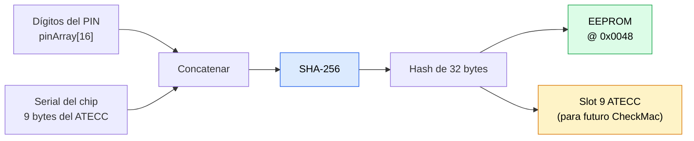

ZeroKeyUSB usa un PIN maestro (1–16 dígitos) para autenticar al usuario. El proceso de verificación combina una **comparación software de hash a tiempo constante** con un **contador monotónico hardware** en el ATECC608A para bloquear intentos de fuerza bruta tanto a nivel software como hardware.

---

## Cómo se guarda el PIN

El PIN **nunca se guarda en texto plano**. Al configurar el PIN (`storeSignature()`):



1. Los dígitos del PIN del usuario se leen desde `pinArray[16]` (cada byte contiene un valor de dígito 0–9).
2. `derivePinKey()` computa: `SHA-256(pinArray[16] ∥ chip_serial[9])`.
   - `chip_serial` es el serial único de 9 bytes leído desde la Config Zone del ATECC608A.
3. El hash resultante de 32 bytes se escribe en EEPROM en `0x0048–0x0067`.
4. El mismo hash de 32 bytes también se escribe en el **slot 9 del ATECC** (para uso potencial futuro con CheckMac).

El serial del chip actúa como salt hardware: el mismo PIN numérico en otro dispositivo produce un hash de 32 bytes completamente distinto.

---

## Secuencia de unlock

Cada intento de unlock ejecuta los siguientes pasos en `verifySignature()`:

```
1. zerokeyAtecc.counterIncrement(Counter0) → new_counter
2. Leer umbral desde EEPROM [0x0020]
3. Si new_counter >= umbral → eraseAll() + halt (lockout hard)
4. derivePinKey(pinArray, derived):
       serial = ATECC608A.readSerial()
       derived = SHA-256(pinArray[16] || serial[9])
5. Leer hash guardado desde EEPROM [0x0048] → stored[32]
6. diff = 0; for i in 0..31: diff |= stored[i] ^ derived[i]  // tiempo constante
7. Si diff == 0:
       writeThreshold(new_counter + 50)   // resetear presupuesto
       writeFailedAttemptsCounter(0)
       → ACCESO CONCEDIDO
8. Si no:
       incrementFailedAttemptsCounter()
       waitFromEeprom()                   // backoff exponencial
       → ACCESO DENEGADO
```

---

## Contador hardware — límite hard

**Counter0 en el ATECC608A** es un contador hardware monotónico. Sus propiedades clave:

- Incrementa en 1 con cada llamada a `counterIncrement()` — una vez por intento de PIN.
- **No se puede decrementar, resetear ni rebajar** por software, ciclo de alimentación ni reset hardware.
- Persiste a través de pérdidas de alimentación dentro de la memoria no volátil del chip.
- El umbral guardado en EEPROM `0x0020` es un uint32 (little-endian) que representa el valor del contador al que ocurre el siguiente borrado.

| Evento | Efecto en contador | Efecto en umbral |
|-------|---------------|-----------------|
| Intento de PIN incorrecto | +1 | sin cambios |
| PIN correcto | +1 | resetea a `Counter0 + 50` |
| Counter ≥ umbral | — | dispara `eraseAll()` |

Con una racha ininterrumpida de PINs incorrectos, el contador alcanza el umbral en exactamente **50 intentos** y dispara un borrado completo de credenciales.

---

## Delays adaptativos — backoff soft

Guardado en EEPROM `0x0002`. Este contador a nivel UX se resetea en un PIN correcto:

| Intentos fallidos | Tiempo de espera |
|-----------------|-----------|
| 0 | ninguno |
| 1 | 5 s |
| 2 | 10 s |
| 3 | 20 s |
| 4 | 40 s |
| 5 | 80 s |
| 6 | 160 s |
| 7 | 320 s |
| 8 | 640 s |
| 9 | 1 280 s |
| ≥ 10 | 2 560 s (≈ 43 min) |

Fórmula: `wait = 5 × 2^(min(intentos, 10) − 1)` segundos, con tope en 2 560 s.

Durante el delay, el OLED muestra una barra de progreso y cuenta atrás. El dispositivo no acepta entrada nueva hasta que expire el temporizador.

---

## Gestión segura de entrada

- Los dígitos se almacenan en `pinArray[16]` en SRAM y se limpian tras la verificación.
- Los eventos táctiles se ignoran durante la espera de lockout (`waitFromEeprom()`).
- SerialUSB **no puede** inyectar dígitos del PIN — solo se acepta entrada capacitiva táctil física.
- La comparación del PIN usa un acumulador XOR a tiempo constante (`diff |= stored[i] ^ derived[i]`) para evitar timing side-channels.

---

## Cambiar el PIN

Iniciado vía **Menú → Change PIN** → `storeSignature()`:

1. Cuenta atrás de 3 segundos en pantalla (permite aborto seguro).
2. `derivePinKey(pinArray, derived)` computa el nuevo hash.
3. El nuevo hash de 32 bytes se escribe en el slot 9 del ATECC.
4. El nuevo hash de 32 bytes se escribe en EEPROM `0x0048`.
5. Se lee Counter0 actual; el umbral se pone a `Counter0 + 50`.
6. El ping al ATECC confirma que el chip sigue vivo. La clave AES del slot 8 **no se toca** durante la configuración del PIN — se aprovisiona una vez al primer arranque y es irrevocable.
7. El IV se carga o se genera.
8. Se escribe el flag de config (`0x42`).
9. Todos los slots de credenciales se re-inicializan silenciosamente con blancos cifrados.

<Note>
Cambiar el PIN **no** cambia la clave maestra AES ni re-cifra las credenciales existentes. La clave AES vive dentro del slot 8 del ATECC y se genera una vez por dispositivo; no se puede rotar. El ciphertext existente es descifrable con el mismo chip mientras no se destruya.
</Note>

---

## PIN olvidado

ZeroKeyUSB no tiene mecanismo de recuperación de PIN. La única opción es un **reset de fábrica** (`eraseAll()`), que:

1. Muestra una cuenta atrás de 3 segundos.
2. Carga el IV del dispositivo.
3. Sobrescribe los 62 slots de credenciales × 4 páginas con blancos cifrados.
4. Limpia los metadatos TOTP.

Tras el reset el dispositivo se para con un error "LOCKED — reflash". Hay que usar el bootloader para flashear firmware nuevo y re-aprovisionar el dispositivo desde cero.

Las credenciales previamente almacenadas son irrecuperables a menos que tengas un backup en texto plano exportado antes del reset.

<Warning>
Elige un PIN que puedas recordar pero que otros no puedan adivinar. Un PIN de 4 dígitos o menos es vulnerable a ataques de diccionario SHA-256 offline si un adversario obtiene acceso I²C al dispositivo.
</Warning>
