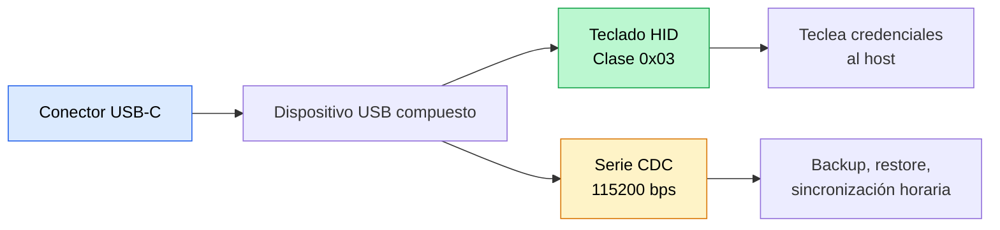
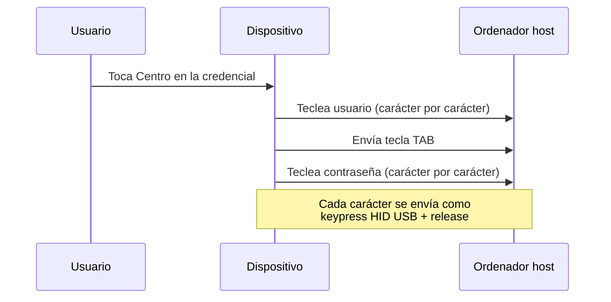
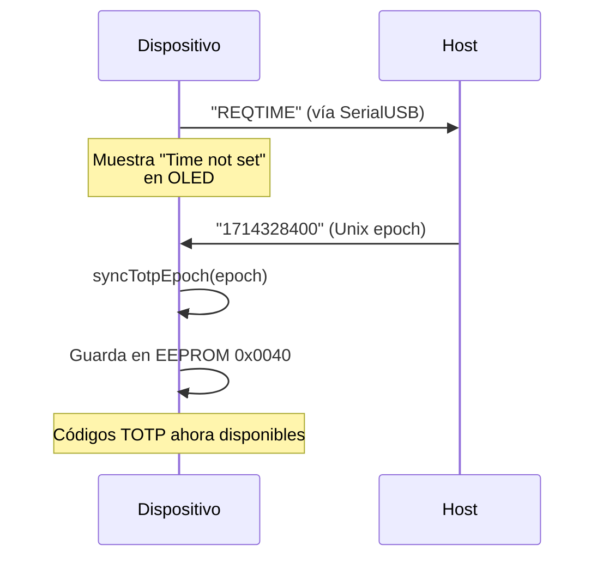

## Personalidad dual USB

ZeroKeyUSB opera como un **dispositivo USB Full-Speed compuesto** exponiendo dos interfaces simultáneamente:



Ambas interfaces permanecen activas tras el arranque, pero los comandos CDC que modifican datos requieren desbloqueo con PIN + autorización en el dispositivo.

---

## Motor de salida de teclado

El firmware soporta **9 layouts de teclado** almacenados como mapas de teclado compilados:

| Código | Layout |
|------|--------|
| `EN-US` | QWERTY de Estados Unidos (por defecto) |
| `DA-DK` | Danés |
| `DE-DE` | Alemán |
| `ES-ES` | Español |
| `FR-FR` | Francés |
| `HU-HU` | Húngaro |
| `IT-IT` | Italiano |
| `PT-PT` | Portugués |
| `SV-SE` | Sueco |

El layout activo se guarda en EEPROM en `0x003E` y se puede cambiar desde **Settings → Keyboard** o durante el asistente de setup.

### Secuencia de tecleo

Cuando tocas **Centro** en la pantalla principal de credenciales, ZeroKeyUSB teclea:



El motor de tecleo en `zerokey-utils.cpp` convierte cada carácter ASCII al keycode HID apropiado usando la librería del layout de teclado seleccionado.

---

## Protocolo de comandos serie

El canal CDC se comunica a **115200 bps** usando líneas ASCII simples. Los comandos se procesan por `handleIncomingHostRequests()` en `zerokey-io.cpp`.

| Comando | Dirección | Precondición | Descripción |
|---------|-----------|---------------|-------------|
| `EXPORT` o `R` | Host → Dispositivo | PIN desbloqueado | Inicia la exportación de credenciales. El dispositivo muestra prompt de autorización. |
| `IMPORT` | Host → Dispositivo | PIN desbloqueado | Inicia la importación de credenciales. El dispositivo muestra prompt de autorización. |
| `<epoch>` | Host → Dispositivo | Dispositivo mostrando `REQTIME` | Envía timestamp Unix epoch para sincronización TOTP. |
| `ZK PING` | Host → Dispositivo | — (siempre) | Sonda de identidad. Responde `ZK PONG ON` / `ZK PONG OFF`. La usa la [extensión de navegador](/es/getting-started/browser-extension) para detectar el dispositivo y leer el estado del link. |
| `FIND <letra>` | Host → Dispositivo | `Chrome: On`, desbloqueado, navegando | Salta la búsqueda alfabética a `<letra>`. Responde `OK FIND <letra>`, o `ERR OFF` / `ERR BUSY` / `ERR EMPTY`. Solo navega — nunca teclea ni revela una credencial. |

<Note>
`FIND` solo *navega* la búsqueda del dispositivo. Deliberadamente no hay ningún
comando serie que teclee o revele una credencial; teclear siempre requiere una
pulsación física. `FIND` se ignora salvo que **Herramientas → Chrome** esté en on
y la bóveda esté desbloqueada y en la lista de credenciales.
</Note>

### Formato de datos de exportación

Cada credencial se envía como línea CSV:

```
slotIndex,siteName,userName,password[,totpSecret]
```

- El campo TOTP es opcional y solo se incluye si el slot tiene secreto 2FA.
- La primera línea enviada es el número total de slots (`61`).
- Ejemplo: `0,github.com,alice,MyP@ss123,JBSWY3DPEHPK3PXP`

### Formato de datos de importación

Mismo formato CSV. El host envía:
1. El número total de registros (entero).
2. Una línea por registro: `slotIndex,site,user,pass[,totpSecret]`.

El dispositivo cifra cada campo con AES-128 CBC y lo escribe en el slot correspondiente de EEPROM.

---

## Sincronización horaria

Los códigos TOTP requieren hora precisa. Como ZeroKeyUSB **no tiene RTC hardware**, la hora se rastrea usando la deriva de `millis()` desde un epoch sincronizado.



- El valor de epoch debe estar entre `946684800` (2000-01-01) y `4102444800` (2099-12-31).
- El epoch guardado persiste entre apagados en EEPROM en `0x0040–0x0047`.
- En cada arranque, el último epoch guardado se carga y el seguimiento con `millis()` se reanuda desde ese punto.
- La deriva se acumula con el tiempo; sesiones largas o desenchufes frecuentes pueden requerir re-sincronización.

---

## Entrada al bootloader

Desde **Menú → Danger Zone → Bootloader Mode**, el firmware:

1. Escribe `0xF01669EF` en la dirección SRAM `0x20007FFC` (la palabra mágica de doble reset).
2. Llama a `NVIC_SystemReset()`.
3. El bootloader ve la palabra mágica y permanece en modo DFU USB-CDC para flashear firmware.

Esto permite actualizaciones de firmware sin acceso físico a los pogo pins SWD.

---

## Modelo de seguridad serie

- **Antes del desbloqueo con PIN:** los comandos `EXPORT` e `IMPORT` se rechazan con `ERR LOCKED`.
- **Tras el desbloqueo con PIN:** los comandos se aceptan pero requieren **autorización en el dispositivo** (pulsación larga Centro) antes de que comience cualquier transferencia de datos.
- **Durante la transferencia:** el dispositivo muestra una pantalla de progreso y rechaza nuevos comandos con `ERR BUSY`.
- **Sin comandos ocultos:** el protocolo serie no tiene comandos de debug, dump ni diagnóstico en el firmware de producción.

<Note>
Toda la comunicación serie es texto plano. No hay capa de cifrado en el canal CDC. Trata la conexión USB como un cable directo a las tripas del dispositivo.
</Note>
