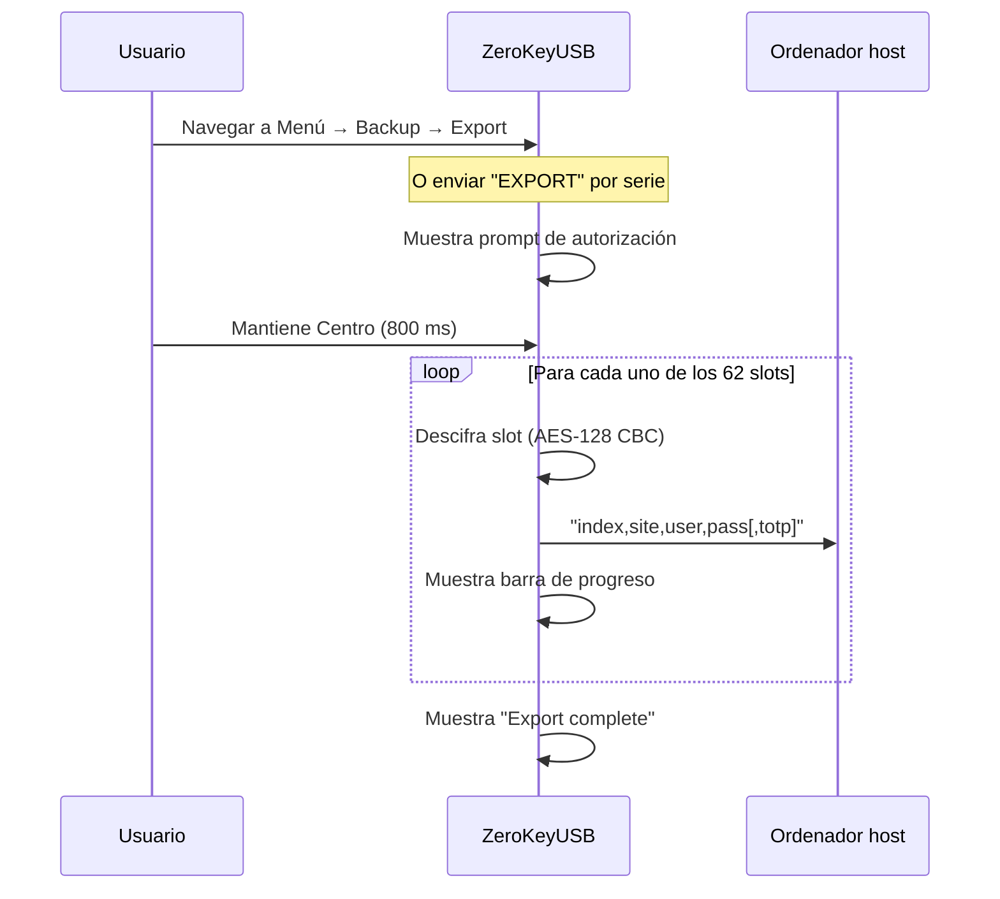
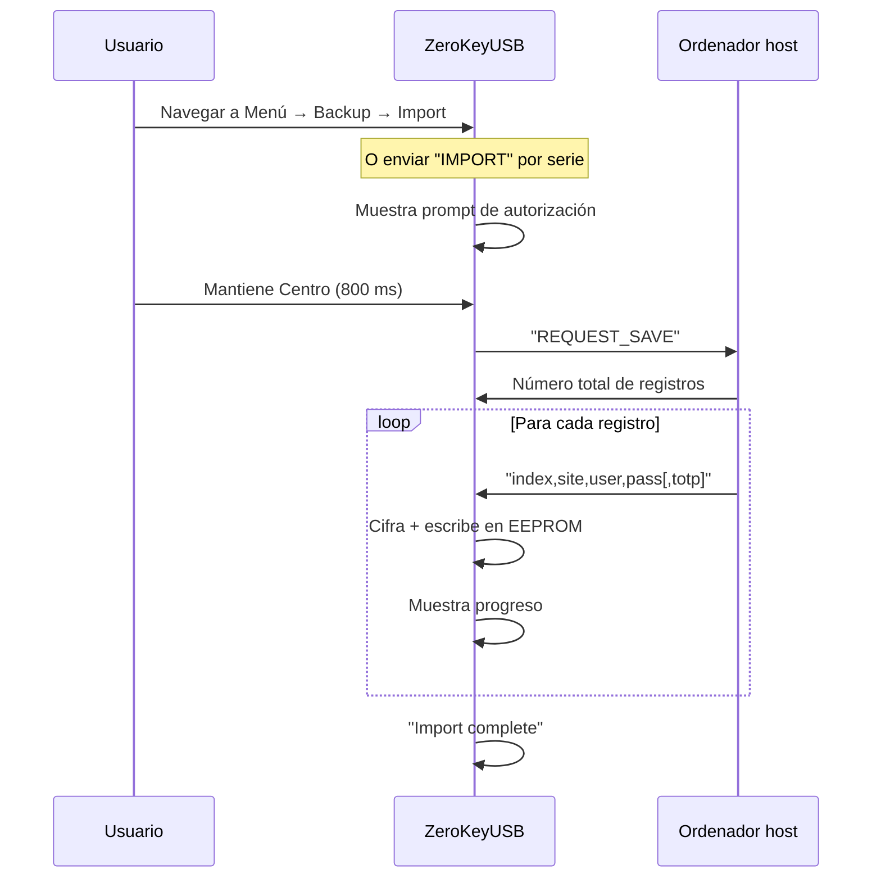

Mantener un backup offline garantiza que puedas recuperar tus contraseñas si el dispositivo se pierde o se daña. ZeroKeyUSB hace el proceso deliberado — ninguna credencial sale del dispositivo sin autorización explícita.

---

## Cuándo hacer backup

- Tras importar o añadir varias credenciales
- Antes de realizar un reset de fábrica o una actualización de firmware
- Antes de entrar en Danger Zone para cualquier acción destructiva
- Periódicamente como parte de tu rutina de seguridad

---

## Formato del backup

Los backups se transmiten como **CSV en texto plano** por el canal serie USB (CDC).

Cada línea sigue el formato:
```
slotIndex,siteName,userName,password[,totpSecret]
```

La primera línea es el número total de slots (`62`).

<Warning>
Los backups contienen todas las credenciales en **texto plano**. Trátalos con sumo cuidado — cifra inmediatamente tras guardarlos y guárdalos offline.
</Warning>

---

## Exportar desde el dispositivo



### Pasos

1. **Desbloquea** el dispositivo con tu PIN maestro.
2. Navega a **Menú → Backup → Export**, o envía `EXPORT` por USB serie.
3. **Mantén Centro** para autorizar la exportación.
4. Conecta una terminal serie o el web manager para capturar la salida (115200 bps).
5. El dispositivo descifra los 62 slots y los hace stream como líneas CSV.
6. Guarda la salida en un fichero.

---

## Guardar el backup de forma segura

Tras exportar:

1. **Cifra inmediatamente** usando una herramienta de confianza:
   ```bash
   gpg -c --cipher-algo AES256 backup.csv
   # o
   age -p backup.csv > backup.csv.age
   ```
2. **Borra el fichero sin cifrar** de tu carpeta de descargas.
3. Guarda el fichero cifrado en **al menos dos ubicaciones separadas** (p. ej., USB cifrado + almacenamiento en la nube seguro).
4. Considera imprimir una copia y sellarla en una ubicación segura para recuperación ante desastres.
5. Nombra el fichero con la fecha: `2026-04-zerokeyusb.csv.gpg`.

---

## Restaurar un backup



### Pasos

1. Descifra tu fichero de backup si está cifrado.
2. **Desbloquea** el dispositivo y navega a **Menú → Backup → Import**, o envía `IMPORT` por serie.
3. **Mantén Centro** para autorizar.
4. Cuando veas `REQUEST_SAVE`, envía el total de registros y luego cada línea CSV.
5. Espera a que el dispositivo confirme cada registro: `"Record N stored correctly."`.

---

## Verificar la restauración

Tras restaurar:

- Navega unas pocas credenciales para confirmar que coinciden con el backup.
- Prueba códigos TOTP si aplica — el tiempo puede necesitar re-sincronización.
- Realiza un test rápido de login en una cuenta no crítica.
- Crea un backup fresco del estado restaurado.

---

## Buenas prácticas

| Práctica | Por qué |
|----------|-----|
| Hacer backup antes de cualquier acción de Danger Zone | El reset de fábrica es irreversible |
| Cifrar los backups inmediatamente | El CSV es texto plano — cualquiera que lo encuentre tiene todas tus contraseñas |
| Guardar en ≥ 2 ubicaciones | Protege contra punto único de fallo |
| Probar restauraciones periódicamente | Garantiza que tu backup es usable cuando lo necesitas |
| Borrar backups antiguos al reemplazarlos | Reduce la ventana de exposición |
