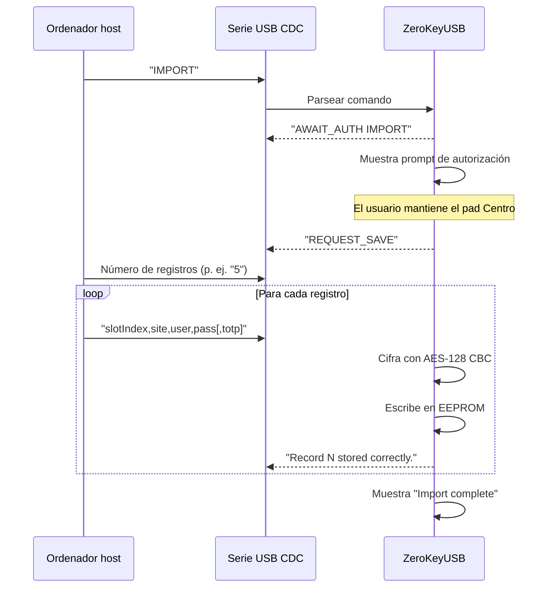

ZeroKeyUSB mantiene las credenciales offline dentro de la EEPROM cifrada, así que las importaciones ocurren **tras desbloquear el dispositivo** y requieren **autorización física** vía los controles táctiles.

<Alert>
Solo importa secretos desde fuentes en las que confíes. Los registros importados sobrescriben el slot de destino inmediatamente.
</Alert>

---

## Qué puedes importar

| Tipo de dato | Límite | Notas |
|-----------|-------|-------|
| Nombre de sitio / servicio | 16 caracteres | Los nombres largos hacen scroll automáticamente en el OLED. |
| Usuario | 16 caracteres | Guardado tal cual; rellenado con `0xFF`. |
| Contraseña | 16 caracteres | Se acepta cualquier ASCII imprimible; se cifra antes de guardar. |
| Secreto TOTP | Hasta 32 bytes crudos | Codificado en Base32, opcionalmente con `;algo=SHA256` o URI `otpauth://` completa. |

Cada credencial ocupa **4 páginas EEPROM cifradas** (128 bytes). El dispositivo guarda hasta **62 credenciales**.

---

## Flujo de importación



### Pasos

1. **Desbloquea** el dispositivo con tu PIN maestro.
2. Envía `IMPORT` por el puerto serie USB (115200 bps).
3. El dispositivo muestra "Save credentials — Hold down the center button to authorize".
4. **Mantén Centro** durante 800 ms para confirmar.
5. El dispositivo envía `REQUEST_SAVE` y espera.
6. Envía el número de registros en la primera línea.
7. Envía cada registro como: `slotIndex,site,username,password[,totpSecret]`.
8. El dispositivo cifra y guarda cada registro, mostrando progreso en pantalla.

---

## Formato CSV

```csv
0,github.com,alice,MyP@ss123,JBSWY3DPEHPK3PXP
1,gmail.com,bob@gmail.com,correct horse
2,bank.com,myuser,s3cur3P@ss,JBSWY3DPEHPK3PXP;algo=SHA256
```

| Campo | Descripción |
|-------|-------------|
| `slotIndex` | 0–61 (62 slots en total) |
| `site` | Nombre del sitio o servicio (máx. 16 caracteres) |
| `username` | Usuario o email |
| `password` | Contraseña (puede contener comas si se gestionan correctamente) |
| `totpSecret` | Opcional. Secreto Base32, opcionalmente con `;algo=SHA1|SHA256|SHA512`, o URI `otpauth://` completa |

---

## Formatos del secreto TOTP

El parser de importación (`parseTotpProvisioningString`) acepta múltiples formatos:

| Formato | Ejemplo |
|--------|---------|
| **Base32 simple** | `JBSWY3DPEHPK3PXP` |
| **Base32 + algoritmo** | `JBSWY3DPEHPK3PXP;algo=SHA256` |
| **URI otpauth completa** | `otpauth://totp/GitHub:alice?secret=JBSWY3DPEHPK3PXP&algorithm=SHA256` |

El algoritmo por defecto es **SHA-1** si no se especifica.

---

## Validación

- Los índices de slot fuera de 0–61 se rechazan y se registran: `"Index out of range"`.
- Los secretos Base32 inválidos se rechazan: error `"TOTP invalid"` en pantalla.
- Las líneas vacías terminan la importación antes de tiempo.
- Las líneas con menos de 3 campos separados por coma se saltan con un log de error.

---

## Tras importar

1. Navega la lista de credenciales en el dispositivo para verificar las entradas.
2. Opcionalmente exporta un backup vía **Menú → Backup → Export** para capturar el nuevo estado.
3. Prueba un login con una cuenta no crítica.

<Alert type="warning">
Las importaciones sobrescriben los slots existentes sin preguntar. Siempre exporta un backup antes de ejecutar una importación masiva.
</Alert>
