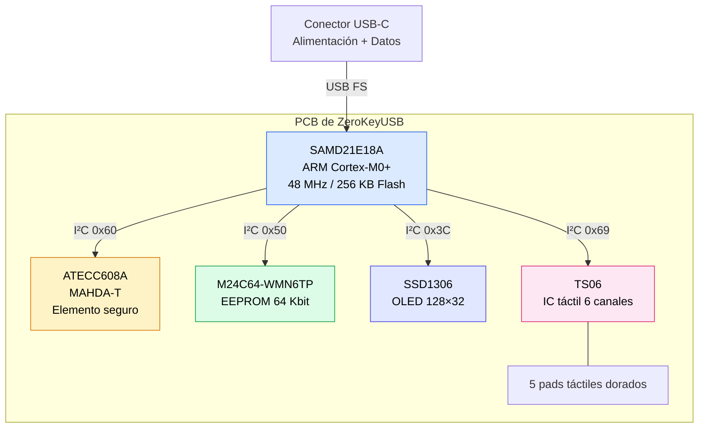

## Construido para la confianza

ZeroKeyUSB es un gestor de contraseñas autocontenido y basado en hardware.  
Diseñado con un único objetivo: **proteger tus credenciales sin conectarse jamás a Internet**.

Cada unidad se ensambla, se prueba y se encapsula en **resina epoxy de grado industrial** para evitar manipulación externa, haciéndolo resistente al agua, al polvo y libre de mantenimiento.

---

## Arquitectura del sistema

---

## Lista de componentes

| Componente | Modelo | Dir I²C | Función |
|-----------|-------|----------|---------|
| **MCU** | Microchip SAMD21E18A | — | ARM Cortex-M0+ a 48 MHz. Ejecuta el firmware, el cifrado AES-128 CBC, el teclado HID USB y la serie CDC. |
| **Elemento seguro** | Microchip ATECC608A (MAHDA-T) | `0x60` | TRNG hardware para generación de clave/IV, Counter0 monotónico para rate-limiting del PIN, serial del chip de 9 bytes como salt del PIN. |
| **EEPROM** | ST M24C64-WMN6TP | `0x50` | Almacenamiento no volátil de 64 Kbit (8 KB). Contiene credenciales cifradas, hash del PIN, IV y metadatos TOTP. >1M ciclos de escritura. |
| **Pantalla** | OLED SSD1306 | `0x3C` | OLED blanco monocromo de 128×32 píxeles. Muestra credenciales, menús, entrada de PIN, códigos TOTP y barras de progreso. |
| **Controlador táctil** | TS06 | `0x69` | IC táctil capacitivo de 6 canales (5 usados). Pads dorados en el PCB para Arriba/Abajo/Izquierda/Derecha/Centro. |
| **USB** | Conector USB-C | — | USB Full-Speed. Alimenta el dispositivo (~20 mA) y proporciona interfaces de teclado HID y serie CDC. |
| **Write Protect** | GPIO PA01 | — | Pin de protección contra escritura del EEPROM. Se puede poner a alto para bloquear escrituras por hardware. |

---

## Por qué estos componentes

### 🧠 Microcontrolador SAMD21E18A

El procesador ARM Cortex-M0+ equilibra rendimiento, tamaño y eficiencia energética:
- **256 KB Flash** — espacio para firmware, fuentes, 9 layouts de teclado y bitmaps de iconos en PROGMEM.
- **32 KB SRAM** — suficiente para el buffer del display, caché de credenciales y workspace TOTP sin asignación dinámica.
- **USB nativo** — el periférico USB Full-Speed por hardware elimina la necesidad de chips puente USB externos.
- **DSU hardware** — la Data Scrambling Unit ofrece CRC32 hardware para comprobaciones rápidas de integridad del firmware al arranque.
- **Fuse BOOTPROT** — `BOOTPROT=7` bloquea los primeros 16 KB de Flash, evitando que el código de aplicación modifique el bootloader.

### 🔐 Elemento seguro ATECC608A

El ATECC608A proporciona cuatro capacidades que el software por sí solo no puede garantizar:

| Capacidad | Por qué importa |
|-----------|---------------|
| **TRNG hardware** | Genera la clave maestra AES (16 B, dentro del chip) y el IV (16 B) con entropía hardware verdadera — no pseudo-aleatoria. |
| **Motor AES-128** | Cada bloque de credencial se cifra y descifra con el AES hardware del chip. La clave vive en el slot 8 con `IsSecret=1` y nunca cruza el bus I²C. |
| **Counter0 monotónico** | Contador hardware irreversible para intentos de PIN. No se puede reiniciar por software, ni por ciclos de alimentación, ni por borrado del chip. Tras 50 PINs incorrectos consecutivos, las credenciales se borran. |
| **Serial del chip (9 B)** | Identificador único programado de fábrica usado como salt en el hashing del PIN: `SHA-256(PIN ∥ serial)`. El mismo PIN en otro dispositivo produce un hash completamente distinto. |

> El SKU MAHDA-T se entrega con el comando AES hardware deshabilitado. La rutina de aprovisionamiento del primer arranque lo habilita, configura el slot 8 como contenedor de clave AES, genera la clave con el TRNG del chip y bloquea irreversiblemente las zonas Config y Data.

### 💾 EEPROM M24C64-WMN6TP

- **8 KB** de almacenamiento no volátil organizados en páginas de 32 bytes.
- **>1 millón de ciclos de escritura por página** — décadas de uso normal.
- Todos los datos de credenciales se **cifran con AES-128 CBC antes de escribirse** — el bus I²C solo ve ciphertext.
- Consciente de límites de página: el firmware divide las escrituras que cruzan límites de 32 bytes para evitar el wrap-around de direcciones del M24C64.

### 🖐️ Controlador táctil TS06

- **IC táctil capacitivo sellado de seis canales** (cinco activamente usados).
- Calibración interna de baseline — no requiere ajuste analógico.
- Sensibilidad mínima (`0x3F`) puesta al arranque para evitar disparos falsos a través del encapsulado epoxy.
- Debounce 80 ms, umbral de pulsación larga 800 ms, lockout de canal 150 ms — todo gestionado en firmware.

### 💡 OLED SSD1306

- **128×32 píxeles**, blanco sobre negro, alto contraste.
- Conectado vía I²C en la dirección `0x3C`.
- Refresco de frame completo (~512 bytes por frame) vía librería `Adafruit_SSD1306`.
- Excelente visibilidad tanto a la luz del día como en la oscuridad.
- Protegido tras la ventana sellada de epoxy.

### ⚡ Conexión USB-C

- Consumo aproximado de **20 mA** — similar a un ratón inalámbrico.
- **Sin batería** — totalmente alimentado desde el puerto USB del host.
- **Sin wireless** — no hay hardware Wi-Fi, Bluetooth ni NFC en el PCB.
- Funciona con Windows, macOS, Linux, Android e iPadOS.

---

## Bus I²C

Todos los periféricos comparten un único bus I²C a **100 kHz**:

| Dispositivo | Dirección | Función |
|--------|---------|------|
| OLED SSD1306 | `0x3C` | Pantalla |
| EEPROM M24C64 | `0x50` | Almacenamiento de credenciales |
| ATECC608A | `0x60` | Elemento seguro |
| TS06 | `0x69` | Controlador táctil |

SDA y SCL están en **PA08** y **PA09** respectivamente. Hay resistencias pull-up externas en el PCB.

---

## Diseño físico

- **Encapsulado en resina epoxy** — previene corrosión, polvo, humedad y manipulación física.
- **Sin interfaces wireless** — elimina por completo las superficies de ataque remoto.
- **Sin tornillos ni juntas externas** — el dispositivo no se puede abrir de forma no destructiva.
- **Pads táctiles dorados** — duraderos, resistentes a la corrosión y visibles a través de la resina.

---

## Transparencia, no exposición

ZeroKeyUSB es **totalmente open source**. El firmware y los esquemas de hardware están públicamente disponibles en  
[GitHub → Depbit-lab/zerokeyusb](https://github.com/Depbit-lab/zerokeyusb).  
Cualquiera puede verificar exactamente qué código corre en su dispositivo.

Las actualizaciones de firmware requieren **acceso físico** — vía pogo pins SWD o el bootloader USB con firmware firmado. No existe ningún mecanismo de actualización remota.

<Note>
ZeroKeyUSB es un producto sellado — abrir o reprogramar el dispositivo invalida la garantía y destruye el encapsulado epoxy.
</Note>
