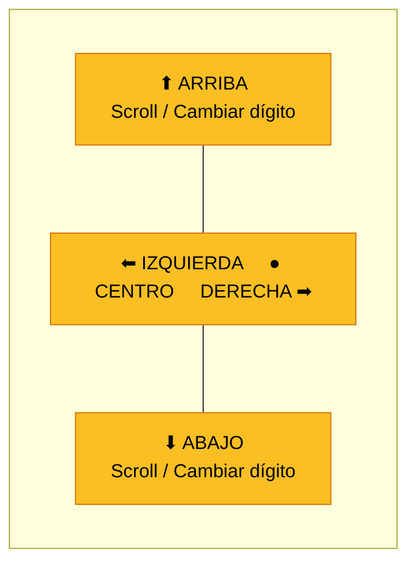
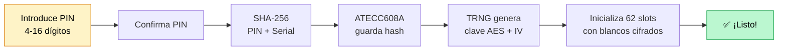
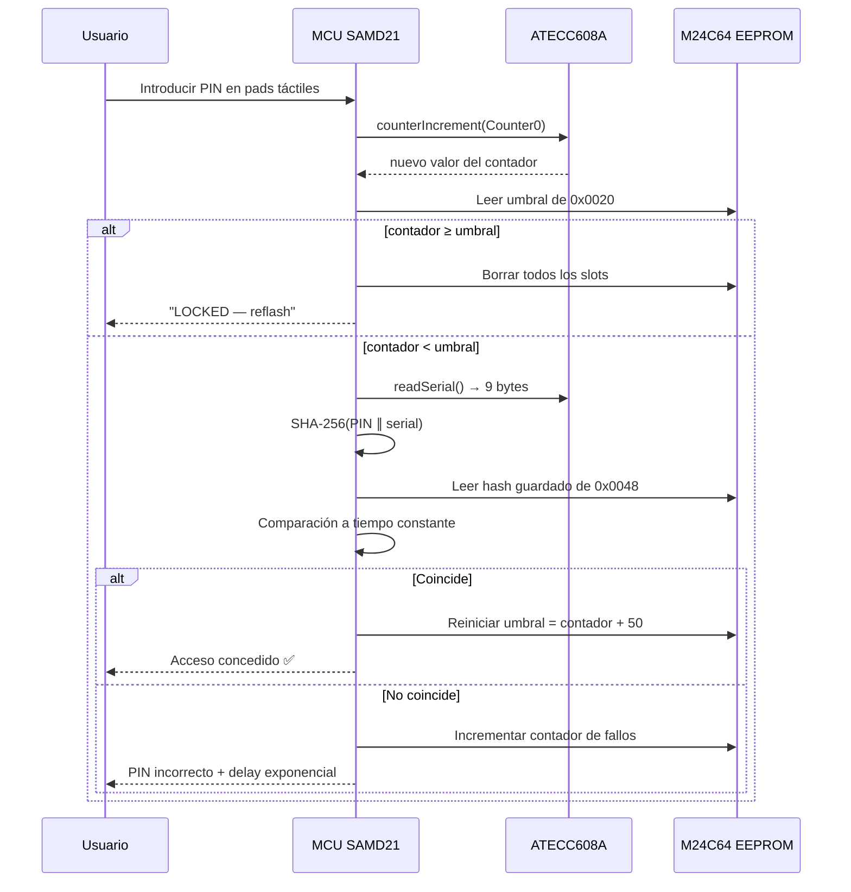

## Bienvenido a ZeroKeyUSB

Enhorabuena por tu nuevo **ZeroKeyUSB** — un gestor de contraseñas completamente offline y con cifrado por hardware.  
Sin apps que instalar, sin cuentas que crear, sin nube en la que confiar. Solo conéctalo.


---

## Contenido de la caja

| Artículo | Descripción |
|------|-------------|
| **Dispositivo ZeroKeyUSB** | Llave hardware sellada con resina epoxy, pantalla OLED y 5 pads capacitivos |
| **Cable USB-C** | Para conectarlo al ordenador, tablet o móvil |

Eso es todo. Sin disco de software, sin tarjeta de activación — porque ZeroKeyUSB no necesita nada de eso.

---

## Conoce tu dispositivo

ZeroKeyUSB tiene **cinco pads dorados** dispuestos en cruz. Son tus únicos controles:



| Pad | Toque corto | Pulsación larga |
|-----|-----------|------------|
| **⬆ Arriba** | Cambiar dígito / Scroll arriba | — |
| **⬇ Abajo** | Cambiar dígito / Scroll abajo | — |
| **⬅ Izquierda** | Volver / Borrar dígito | Saltar 10 slots atrás |
| **➡ Derecha** | Avanzar / Añadir dígito | Saltar 10 slots adelante |
| **● Centro** | Confirmar / Seleccionar | Editar campo / Tipear al host |

---

## Paso 1 — Conectar y encender

<Steps>
  <Step title="Conecta el cable USB-C">
    Enchufa ZeroKeyUSB en cualquier puerto USB-C de tu ordenador, tablet o móvil.  
    El dispositivo consume unos **20 mA** — menos que un ratón inalámbrico — y no necesita batería.
  </Step>
  <Step title="Espera a la pantalla de bienvenida">
    La pantalla OLED se enciende mostrando:
    ```
    ZeroKeyUSB
    ```
    Esto confirma que todo el hardware funciona: la pantalla, el controlador táctil (TS06), la memoria EEPROM y el elemento seguro ATECC608A.
  </Step>
  <Step title="Asistente de configuración inicial">
    En un dispositivo nuevo, el **asistente de configuración** arranca automáticamente.  
    Te guía por la orientación de pantalla, el layout de teclado y la creación del PIN — paso a paso.  
    Usa **Derecha** para avanzar e **Izquierda** para retroceder.
  </Step>
</Steps>

---

## Paso 2 — Elige la orientación de pantalla

El asistente te pregunta si la pantalla y los controles te quedan bien orientados.

- Pulsa **Centro** para girar la pantalla 180°.
- Pulsa **Derecha** cuando esté correctamente orientada.

Esta opción se guarda en EEPROM y persiste entre apagados.

---

## Paso 3 — Selecciona tu layout de teclado

ZeroKeyUSB emula un teclado USB. Para teclear caracteres especiales correctamente (`@`, `!`, `#`, etc.), tiene que coincidir con **el layout de teclado de tu ordenador**.

Layouts disponibles:

| Código | Idioma |
|------|----------|
| `EN-US` | Inglés (Estados Unidos) — **por defecto** |
| `ES-ES` | Español |
| `FR-FR` | Francés |
| `DE-DE` | Alemán |
| `IT-IT` | Italiano |
| `PT-PT` | Portugués |
| `DA-DK` | Danés |
| `SV-SE` | Sueco |
| `HU-HU` | Húngaro |

Pulsa **Centro** para ciclar los layouts y **Derecha** para confirmar.

<Tip>Puedes cambiar el layout más adelante desde **Menú → Settings → Keyboard**.</Tip>

---

## Paso 4 — Crea tu PIN maestro

Este es el paso más importante. Tu PIN protege todo lo que hay en el dispositivo.

<Steps>
  <Step title="Elige 4–16 dígitos">
    Usa **Arriba/Abajo** para cambiar el dígito actual (0–9).  
    Pulsa **Derecha** para añadir un dígito.  
    Pulsa **Izquierda** para borrar el último dígito.
  </Step>
  <Step title="Confirma tu PIN">
    Teclea el mismo PIN otra vez para confirmarlo.  
    Si no coinciden, te pedirá que empieces de nuevo.
  </Step>
  <Step title="Espera la configuración de seguridad">
    El dispositivo muestra una barra de progreso mientras:

    1. Deriva tu hash de PIN: `SHA-256(PIN ∥ chip_serial)`
    2. Guarda el hash en el elemento seguro ATECC608A (slot 9) y en EEPROM
    3. Lee la **clave maestra AES de 128 bits** ya aprovisionada en el slot 8 del ATECC — la clave fue generada por el TRNG del chip la primera vez que se encendió el dispositivo y no se toca durante la configuración del PIN
    4. Genera un **IV (vector de inicialización) de 128 bits** desde el TRNG
    5. Configura el contador hardware de intentos de PIN (Counter0)
    6. Inicializa los 62 slots de credenciales con blancos cifrados

    Esto tarda unos 30–60 segundos.
  </Step>
</Steps>



<Warning>
**No hay recuperación de PIN.** Si olvidas tu PIN, la única opción es un reset de fábrica que **borra permanentemente todas las credenciales almacenadas**. Elige un PIN que vayas a recordar.
</Warning>

---

## Paso 5 — Cómo funciona la seguridad

Esto es lo que pasa entre bambalinas cuando introduces tu PIN:



**Características clave de seguridad:**

- **Contador hardware (Counter0):** Cada intento de PIN — correcto o no — incrementa un contador hardware irreversible en el ATECC608A. Tras **50 intentos consecutivos incorrectos**, el dispositivo borra permanentemente todos los datos.
- **Delay exponencial:** ¿PIN incorrecto? Espera 5 segundos. ¿Otro fallo? 10 segundos. Luego 20, 40, 80… hasta **43 minutos** entre intentos.
- **Comparación a tiempo constante:** La comparación del hash del PIN usa un algoritmo timing-safe que no revela nada sobre qué dígitos eran correctos.

---

## Paso 6 — Guarda tu primera credencial

Tras desbloquear, ves la pantalla principal mostrando el slot 0:

```
🌐 ________________
👤 ________________
🔒 ________________
```

<Steps>
  <Step title="Navega a un campo">
    Usa **Arriba/Abajo** para alternar entre las vistas de Sitio, Usuario y Contraseña.
  </Step>
  <Step title="Entra en modo edición">
    **Pulsación larga en Centro** sobre cualquier campo para empezar a editar.
  </Step>
  <Step title="Teclea caracteres">
    El editor muestra tres páginas de teclado:
    - **Página 1:** `A-Z` y corchetes
    - **Página 2:** `a-z` y símbolos
    - **Página 3:** `0-9`, espacio y caracteres especiales

    Usa **Izquierda/Derecha** para mover el cursor, **Arriba/Abajo** para cambiar de página de teclado, y **Centro** para insertar un carácter.
  </Step>
  <Step title="Guarda y vuelve">
    **Pulsación larga en Centro** otra vez para guardar y volver a la pantalla principal.  
    Tu credencial se cifra inmediatamente con AES-128 CBC y se escribe en EEPROM.
  </Step>
</Steps>

<Tip>Usa **Izquierda/Derecha** en la pantalla principal para moverte entre slots (0–61). **Pulsación larga en Izquierda/Derecha** para saltar 10 slots de una vez.</Tip>

---

## Paso 7 — Teclea credenciales en tu ordenador

Aquí es donde sucede la magia:

1. Navega al slot de credencial que quieras.
2. Pulsa **Centro** en el campo **Sitio** → ZeroKeyUSB teclea el usuario + Tab + contraseña como teclado USB.

El ordenador anfitrión ve ZeroKeyUSB como un teclado normal — sin drivers ni software.  
Funciona en Windows, macOS, Linux, Android e iPadOS.

---

## Paso 8 — (Opcional) Añade 2FA / TOTP

ZeroKeyUSB puede generar **contraseñas de un solo uso basadas en tiempo (TOTP)** — los mismos códigos que te darían Google Authenticator, pero completamente offline.

<Steps>
  <Step title="Importa tu secreto TOTP">
    Usa el **web manager** o la CLI serie para enviar el secreto codificado en Base32 (del código QR `otpauth://` que te da el servicio). El secreto se cifra y se guarda en la página 3 del slot de credencial.
  </Step>
  <Step title="Sincroniza el reloj">
    Como ZeroKeyUSB no tiene reloj de tiempo real, necesita la hora actual una vez.  
    Cuando veas `REQTIME` en pantalla, el web manager o una terminal envía el epoch Unix por USB serie.  
    La hora se guarda en EEPROM y se rastrea usando el contador `millis()` del SAMD21.
  </Step>
  <Step title="Ve tu código 2FA">
    Navega a una credencial que tenga un secreto TOTP y haz scroll hasta la vista **2FA**.  
    Aparece un código de 6 dígitos con cuenta atrás de 30 segundos. Se refresca automáticamente.
  </Step>
</Steps>

---

## Paso 9 — Haz copia de seguridad

<Warning>
Las copias de seguridad se transmiten en **texto plano** por USB serie. Solo hazlo en un ordenador de confianza.
</Warning>

1. Navega a **Menú → Backup → Export**.
2. Mantén **Centro** para autorizar la exportación.
3. ZeroKeyUSB envía los 62 slots de credenciales como líneas CSV por el puerto USB serie.
4. Guarda el fichero de salida de forma segura — cífralo con GPG, age, o un ZIP protegido con contraseña.

Para restaurar más tarde: **Menú → Backup → Import** → envía el CSV de vuelta vía el web manager o la CLI serie.

---

## Tarjeta de referencia rápida

| Acción | Cómo |
|--------|-----|
| **Desbloquear** | Introduce PIN en pads táctiles |
| **Navegar credenciales** | Izquierda / Derecha (pulsación corta) |
| **Saltar 10 slots** | Izquierda / Derecha (pulsación larga) |
| **Cambiar campo** | Arriba / Abajo en pantalla principal |
| **Tipear al ordenador** | Centro en campo Sitio |
| **Editar un campo** | Pulsación larga en Centro |
| **Abrir menú** | Scroll más allá del último slot |
| **Ver código 2FA** | Abajo desde Contraseña a 2FA |
| **Exportar backup** | Menú → Backup → Export |
| **Reset de fábrica** | Menú → Danger Zone → Factory Reset |

---

## Próximos pasos

<CardGroup cols={2}>
  <Card title="Vista general del hardware" icon="microchip" href="/es/hardware/overview">
    Entiende los componentes principales: MCU SAMD21, elemento seguro ATECC608A, EEPROM y controlador táctil.
  </Card>
  <Card title="Arquitectura de seguridad" icon="shield" href="/es/firmware/security">
    Aprende cómo AES-128 CBC, el TRNG del ATECC608A y Counter0 trabajan juntos para proteger tus datos.
  </Card>
  <Card title="Sistema de menús" icon="list" href="/es/firmware/menu">
    Explora cada opción del menú: Backup, Settings, Danger Zone e información del dispositivo.
  </Card>
  <Card title="Módulo TOTP" icon="clock" href="/es/firmware/totp">
    Configura códigos 2FA offline con sincronización horaria y refresco automático.
  </Card>
</CardGroup>

<Note>
ZeroKeyUSB funciona en cualquier sistema operativo que soporte teclados USB.  
No se requieren drivers, extensiones de navegador ni instalaciones de software — nunca.
</Note>
