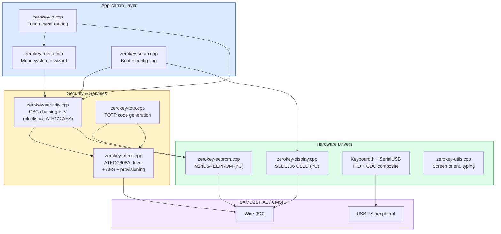
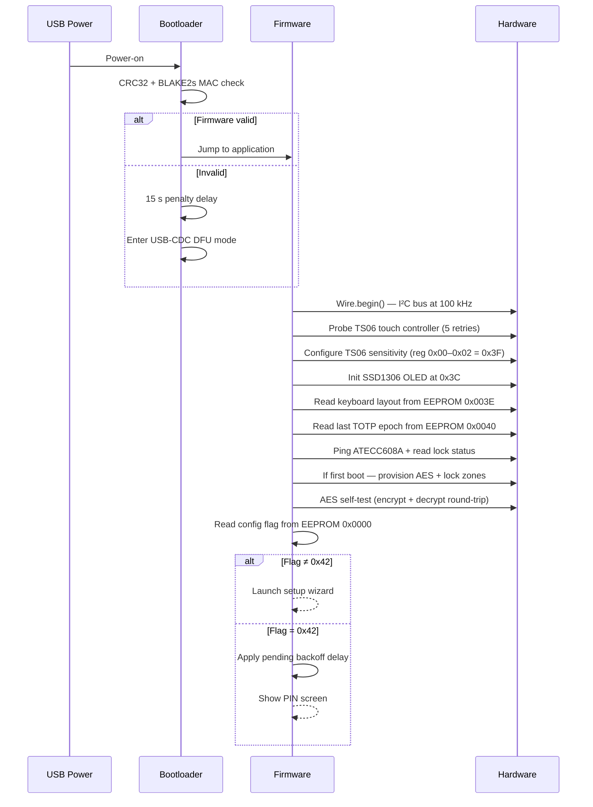
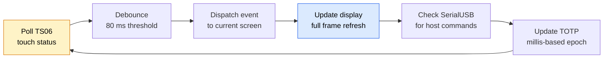
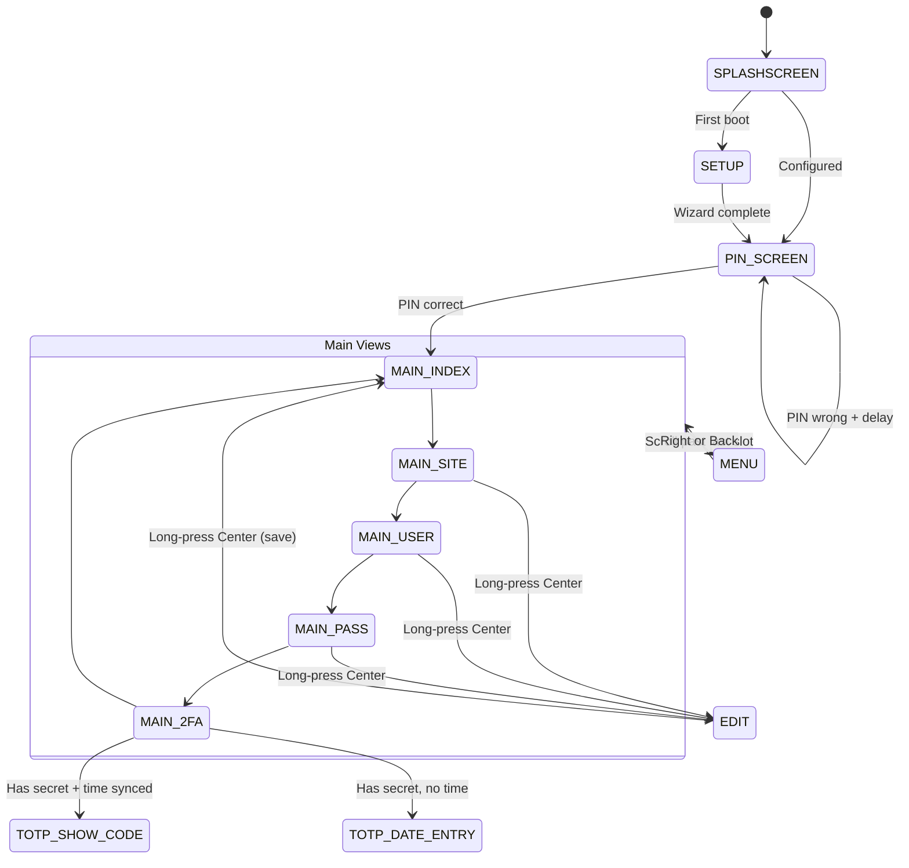
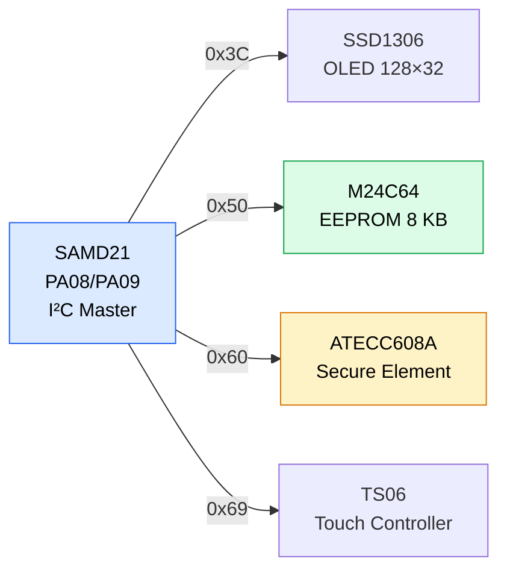

## Modular by design

ZeroKeyUSB firmware is written in C++ for the **Microchip SAMD21E18A** microcontroller (ARM Cortex-M0+, 48 MHz, 256 KB flash, 32 KB SRAM).  
It follows a layered architecture that keeps hardware drivers, security primitives, and the user interface cleanly separated.

Each module can evolve independently while keeping critical security routines auditable and easy to review.

---

## Source file map

| File | Lines | Role |
|------|-------|------|
| `zerokey-security.cpp/.h` | ~750 | AES-CBC chaining around the chip's single-block AES command, PIN verification, erase, backup/restore |
| `zerokey-atecc.cpp/.h` | ~640 | ATECC608A I²C driver: TRNG, Counter, ReadSerial, CheckMac, SHA-256, hardware AES, Lock, and the one-shot AES provisioning routine |
| `zerokey-io.cpp/.h` | ~1561 | Touch event dispatch, TOTP date/time input, serial command handler |
| `zerokey-menu.cpp/.h` | ~1051 | Menu tree, setup wizard (10 pages), confirm/info/activity pages |
| `zerokey-display.cpp/.h` | ~750 | SSD1306 rendering: main screen, PIN screen, editor, progress, scrolling |
| `zerokey-eeprom.cpp/.h` | ~257 | Page read/write, TOTP metadata, keyboard layout, epoch persistence |
| `zerokey-totp.cpp/.h` | ~500 | HMAC-SHA1/SHA256/SHA512, Base32 decode, TOTP code generation |
| `zerokey-setup.cpp/.h` | ~159 | Boot sequence, config flag (`0x42`), TS06 init, hardware probe |
| `zerokey-utils.cpp/.h` | ~500 | Typing engine, screen orientation, error screen, serial number |
| `zerokey-globals.h` | ~317 | Constants, icons (PROGMEM), global variable externs |
| `zerokey-memorymap.h` | ~38 | EEPROM address calculations, credential layout constants |

---

## Boot sequence

The configuration flag at `0x0000` determines whether the device shows the setup wizard (`flag ≠ 0x42`) or the PIN unlock screen (`flag = 0x42`). The wizard writes `0x42` after successful PIN creation.

---

## Main loop

The firmware runs a **cooperative main loop** — no RTOS, no interrupts for application logic, no dynamic memory allocation:

Each iteration is deterministic. Timing-sensitive operations (TOTP countdown, lockout delays) use `millis()` instead of blocking delays.

---

## Screen state machine

Every interactive view is a state identified by a `programPosition` constant. Touch events are dispatched based on this value:

---

## I²C bus topology

All peripherals share a single I²C bus:

Bus speed: **100 kHz** (set at boot, matches bootloader).  
The TS06 address is `0xD2 >> 1 = 0x69`.

---

## USB composite device

ZeroKeyUSB enumerates as a **composite USB Full-Speed device** with two interfaces:

| Interface | Class | Purpose |
|-----------|-------|---------|
| **HID Keyboard** | 0x03 | Types credentials to the host — appears as a standard keyboard |
| **CDC Serial** | 0x0A | 115200 bps ASCII protocol for backup/restore, time sync, and diagnostics |

Both interfaces are active simultaneously after boot. The CDC channel requires PIN unlock before accepting any data-modifying commands.

---

## Memory footprint

| Region | Size | Usage |
|--------|------|-------|
| **Flash** | 256 KB total, ~64 KB used | Firmware code, fonts, PROGMEM icons, keyboard maps, constant data |
| **SRAM** | 32 KB total, ~16 KB used | UI buffers, `currentSite/User/Pass[16]`, `pinArray[16]`, TOTP workspace |
| **EEPROM** | 8 KB (M24C64) | Encrypted credentials (62 slots × 128 B), IV, PIN hash, config, TOTP metadata |

No dynamic memory allocation (`malloc`/`new`) is used anywhere. All buffers are stack-allocated or static.

---

## Build & verification

- Compiled with **ARM GCC** using the Arduino SAMD core.
- Build process managed by `Makefile` — supports selective compilation and J-Link flashing via `Dashboard.bat`.
- Firmware binary is signed with a **BLAKE2s MAC** and appended with a 28-byte security footer.
- The bootloader verifies this signature at every boot using CRC32 + BLAKE2s before jumping to application code.
- Unsigned or tampered firmware triggers a **15-second penalty delay** and falls into USB-CDC DFU mode.

<Note>
ZeroKeyUSB runs on a minimal firmware stack: no RTOS, no dynamic memory allocation, and no hidden debug backdoors.  
All tasks are cooperative and time-deterministic — simplicity is treated as a security feature.
</Note>
