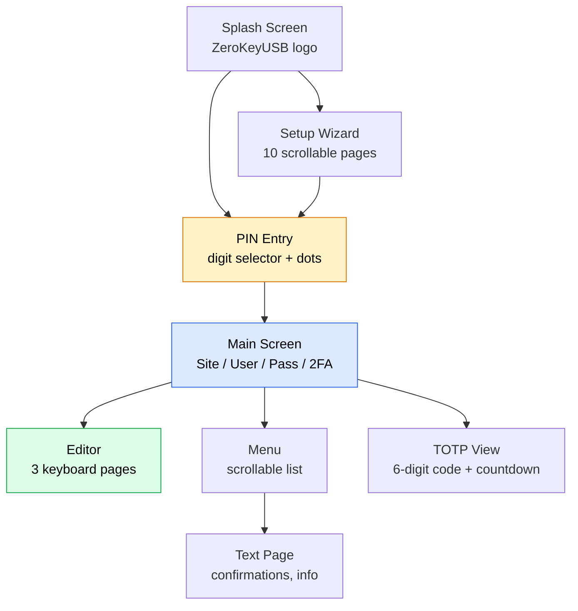
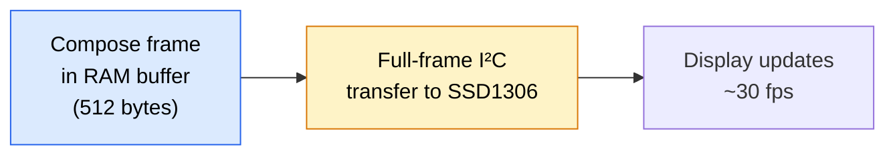

## 128×32 pixels with purpose

ZeroKeyUSB uses a **white OLED panel** (SSD1306 controller, I²C at `0x3C`) with a 128×32 pixel resolution.  
The firmware keeps the interface intentionally minimal: large typography, clear layout, and smooth transitions that remain legible even in low light.

---

## Screen hierarchy

---

## Rendering pipeline

1. **Frame buffer build** — the application composes the entire screen in a 512-byte RAM buffer using `Adafruit_SSD1306` drawing functions: `setCursor()`, `print()`, `drawRect()`, `fillRect()`, `drawBitmap()`.
2. **Full-frame transfer** — `display.display()` sends all 512 bytes to the OLED via I²C in a single burst.
3. **Refresh pacing** — the cooperative main loop redraws only when screen state changes, avoiding unnecessary I²C traffic.

---

## Screen types

### PIN entry screen
- Shows the current digit selector (0–9) with Up/Down navigation.
- Entered digits are shown as filled dots (●) for security.
- PIN length is displayed as a count indicator.

### Main credential screen
- **Four lines** showing the current slot:
  - Line 0: Slot index indicator
  - Line 1: Site name (scrolls if > ~20 chars)
  - Line 2: Username
  - Line 3: Password (masked by default)
- A context indicator (`SITE`, `USER`, `PASS`, `2FA`) appears at the top.

### Editor screen
- **Three keyboard pages** selectable with Up/Down:
  - Page 1 (`EDIT_KB1`): `A-Z`, brackets, symbols
  - Page 2 (`EDIT_KB2`): `a-z`, punctuation
  - Page 3 (`EDIT_KB3`): `0-9`, space, special characters
- Left/Right controls: cursor position (◀ / ▶), random character, backspace
- Selected character highlighted with inverted colors

### Menu screen
- Scrollable list with inverted highlight on selected item.
- When items exceed 4 rows, a **scrollbar with thumb** appears on the right edge (3 px wide).
- Thumb position updates proportionally to scroll position.

### Setup wizard pages
- 10 pages of scrollable text with Up/Down navigation.
- A step indicator (`1/9`, `2/9`, etc.) and footer hints appear on screen.
- Pages with > 4 lines show a scrollbar thumb.

### TOTP code screen
- Large **2× text size** for the 6-digit code.
- Countdown in seconds: `"Expires in: XXs"`.
- Refreshes automatically every second.
- Touch any pad to return to credentials.

---

## Typography & assets

| Asset | Format | Size | Usage |
|-------|--------|------|-------|
| **Default font** | Adafruit GFX built-in | 6×8 px | Menus, labels, info text |
| **Text size 2** | 2× scaled | 12×16 px | TOTP codes, large prompts |
| **Icons** | PROGMEM bitmaps | 16×16 px | Menu items (backup, settings, danger, info) |
| **Device SVGs** | Vector in `/images/` | Various | Documentation touch pad illustrations |

All fonts and icons are stored in **Flash (PROGMEM)** — no runtime loading from EEPROM.

---

## Scrolling

Two types of scrolling are implemented:

### Auto-scroll (credential names)
- Names longer than the display width (~20 chars) scroll **horizontally** at a steady pace.
- Managed by `refreshMainScrollIfNeeded()` in the main loop.
- Scrolling pauses briefly at each end before reversing.

### Vertical scroll (menus and wizard)
- Menu items and wizard pages scroll vertically with Up/Down.
- `menuScrollTop` tracks the first visible row.
- `ensureMenuSelectedVisible()` keeps the highlighted item in view.
- A filled scrollbar thumb proportional to content length appears at the right edge.

---

## Visual feedback

| Feedback type | Implementation |
|--------------|----------------|
| **Selection highlight** | Inverted colors (black text on white background) |
| **Long-press progress** | Filling rectangle via `drawLongPressProgress()` |
| **Activity spinner** | Frame-based animation via `renderActivityScreen()` |
| **Progress bar** | `renderProgress()` with title, subtitle, done/total |
| **Typing indicator** | `renderTypingActivity()` shows characters typed vs. total |
| **Context indicator** | Top bar shows current context (`MENU`, `SITE`, `TOTP`, `SETUP`) |

---

## Display security

- Sensitive fields (passwords, TOTP codes) are **displayed briefly and cleared** — the frame buffer is overwritten on the next screen transition.
- The display does **not auto-lock on inactivity** — power must be removed (USB disconnection) to lock the device.
- While typing to host, `renderTypingActivity()` shows progress without displaying the credential content.
- No decrypted credential is ever stored in the OLED controller's GDDRAM beyond the current frame.

<Note>
The OLED sits behind the sealed epoxy encapsulation, providing excellent contrast and resistance to scratches, dust, and moisture.
</Note>
