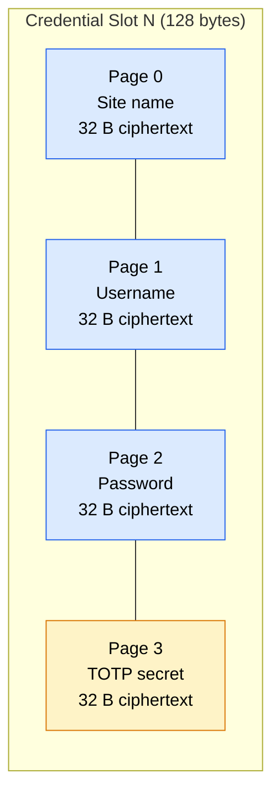

ZeroKeyUSB stores every secret inside an external **ST M24C64-WMN6TP** EEPROM (64 Kbit = 8 KB). The firmware manages reads and writes carefully, respecting page boundaries and keeping all credential data encrypted at rest.

---

## Memory map

The EEPROM is organized into a **configuration zone** (first ~220 bytes) and a **credential zone** (remainder):

```mermaid
block-beta
    columns 1
    block:config["Configuration Zone (0x0000–0x00FF)"]
        A["0x0000: Config flag (1B)"]
        B["0x0001: Screen mode (1B)"]
        C["0x0002: Failed attempts (1B)"]
        D["0x0010–0x001F: AES IV (16B)"]
        E["0x0020–0x0023: PIN threshold (4B)"]
        F["0x0024: Provision flag (1B)"]
        G["0x0028–0x0037: legacy / reserved (16B)"]
        I["0x003E: Keyboard layout (1B)"]
        J["0x0040–0x0047: Last TOTP epoch (8B)"]
        H["0x0048–0x0067: PIN hash (32B)"]
        K["0x0068–0x00E3: TOTP meta (124B)"]
    end
    block:creds["Credential Zone (0x0100–0x1FFF)"]
        L["61 credential slots × 128 bytes each"]
    end

    style config fill:#dbeafe,stroke:#2563eb
    style creds fill:#dcfce7,stroke:#16a34a
```



| Address | Size | Content | Source in code |
|---------|------|---------|---------------|
| `0x0000` | 1 B | Config wizard flag (`0x42` = done) | `zerokey-setup.cpp` |
| `0x0001` | 1 B | Screen orientation (0 = normal, 1 = inverted) | `EEPROM_SCREEN_MODE_ADDR` |
| `0x0002` | 1 B | Soft failed-attempts counter (UX backoff) | `FAILED_ATTEMPTS_ADDR` |
| `0x0010–0x001F` | 16 B | AES-CBC Initialization Vector | `EEPROM_IV_ADDR` |
| `0x0020–0x0023` | 4 B | PIN attempt threshold (LE uint32) | `EEPROM_THRESHOLD_ADDR` |
| `0x0024` | 1 B | Provisioning flag (`0xA5` = provisioned) | `EEPROM_PROVISION_FLAG` |
| `0x0028–0x0037` | 16 B | *Reserved.* Held the AES master key in older firmware; the key now lives in ATECC slot 8 and never touches EEPROM. | — |
| `0x003E` | 1 B | Keyboard layout selector (0–8) | `EEPROM_LAYOUT_ADDR` |
| `0x0040–0x0047` | 8 B | Last TOTP epoch (big-endian) | `EEPROM_LAST_TOTP_EPOCH_ADDR` |
| `0x0048–0x0067` | 32 B | PIN hash: SHA-256(PIN ∥ serial) | `EEPROM_PIN_HASH` |
| `0x0068–0x00E3` | 124 B | TOTP metadata: 2 B × 61 slots (algorithm + secret_len) | `CONFIG_TOTP_META_START` |
| `0x0100–0x1F7F` | 7 808 B | 61 credential slots (128 B each = 4 pages × 32 B) | `EEPROM_CREDENTIAL_BASE` |
| `0x1F80–0x1FFF` | 128 B | Bitcoin wallet — AES-encrypted seed page ([audit](/firmware/bitcoin-signer)) | `BITCOIN_WALLET_ADDR` |

---

## Credential slot structure

Each of the **61 credential slots** occupies **4 consecutive 32-byte EEPROM pages** (128 bytes total):



Each 32-byte page contains:
- **16 bytes of plaintext** (padded with `0xFF`) encrypted as **two AES-128 CBC blocks**
- The encryption uses the device-wide IV plus the AES master key that lives inside ATECC slot 8 — the cipher rounds run on the chip, never on the MCU.

There is no separate `status` byte or CRC per page. Empty slots are written as encrypted `0xFF` blanks during `silentEraseAll()`.

---

## Page address calculation

```
credentialPageAddress(slotIndex, pageIndex) =
    (FIRST_CREDENTIAL_PAGE + slotIndex × 4 + pageIndex) × 32
```

Where:
- `FIRST_CREDENTIAL_PAGE` is computed from `CONFIG_TOTP_META_END` rounded up to the next 32-byte boundary.
- `slotIndex` ranges from 0 to 61.
- `pageIndex` ranges from 0 (site) to 3 (TOTP).

---

## Write sequence

The `writeEepromPage()` function writes 32 bytes at a page-aligned address:

1. Check EEPROM presence via `Wire.beginTransmission()` + ACK test.
2. Send 2-byte address (MSB first) followed by 32 data bytes.
3. Wait 10 ms for the EEPROM internal write cycle.
4. Return `true` if `Wire.endTransmission()` reported no error.

For security-related writes that cross page boundaries (e.g., 16-byte IV, 32-byte PIN hash), `eepromWriteRaw()` in `zerokey-security.cpp` splits the data at 32-byte page boundaries to avoid the M24C64's address wrap-around behavior.

---

## Read sequence

`readEepromPage()` reads exactly 32 bytes:

1. Send 2-byte address via I²C write.
2. Issue `Wire.requestFrom(eepromAddress, 32)`.
3. Read all available bytes into the output buffer.
4. Zero-fill any bytes not received (partial read = error).

---

## TOTP metadata

Each credential slot has a 2-byte TOTP metadata entry in the config zone:

| Byte | Content |
|------|---------|
| 0 | Algorithm code: `0` = none, `1` = SHA-1, `2` = SHA-256, `3` = SHA-512 |
| 1 | Secret length in raw bytes (before Base32 encoding) |

Metadata is read/written independently of credential pages to allow quick TOTP detection without decrypting the entire slot.

---

## Wear characteristics

- The M24C64-WMN6TP supports **>1 million write cycles per page** (datasheet guarantee).
- Credential pages are only rewritten when the user edits a field or imports data.
- Config zone pages (IV, PIN hash, threshold) are written during provisioning and PIN changes — infrequent events.
- The TOTP epoch at `0x0040` is updated each time the user syncs time or generates a code — this is the most-written location.
- Because credentials are typically static, expected EEPROM lifespan exceeds decades of normal use.

---

## Troubleshooting

| Symptom | Cause | Fix |
|---------|-------|-----|
| `EEPROM not found` | I²C connection broken | Check solder joints; verify pull-ups on SDA/SCL |
| `EEPROM write 0xNNN` | Write failed at address | Re-try; if persistent, EEPROM may be damaged |
| Garbled credentials | IV or AES key changed without re-encryption | Factory reset + re-provision; restore from backup |
| Slot shows blank after import | TOTP secret parsing failed | Check Base32 encoding; verify algorithm support |

<Note>
No decrypted credential ever touches persistent memory without explicit user action. Plaintext exists only in SRAM during the active session.
</Note>
