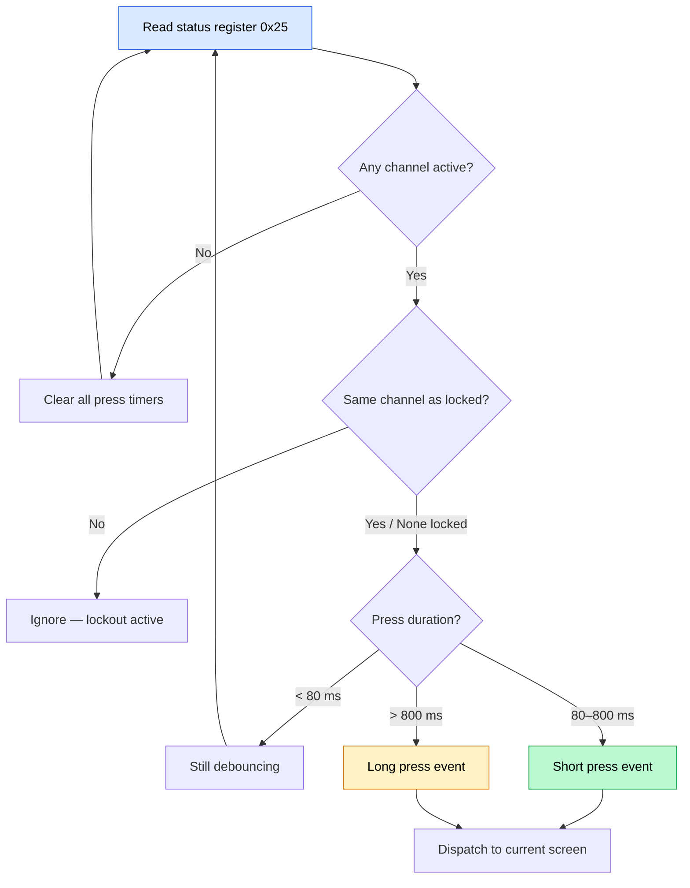

ZeroKeyUSB replaces mechanical buttons with **five copper touch pads** connected to a dedicated **TS06 capacitive controller**. The firmware polls this controller over I²C and translates touches into navigation events.

---

## Hardware overview

| Component | Detail |
|-----------|--------|
| **Controller** | TS06 — 6-channel capacitive touch IC |
| **I²C address** | `0xD2 >> 1 = 0x69` |
| **Pads used** | 5 of 6 channels: Left, Right, Up, Down, Center |
| **Status register** | `0x25` — bitmask of currently touched channels |
| **Sensitivity** | Set to `0x3F` (minimum) on channels 0–2 at boot to avoid false triggers |

The controller handles baseline calibration internally and reports which channels are active via the status register.

---

## Touch initialization

At startup (`zerokey-setup.cpp`), the firmware:

1. Probes the TS06 at `0x69` with up to **5 retries** (20 ms apart).
2. If detected, writes minimum sensitivity (`0x3F`) to registers `0x00–0x02`.
3. Configures operation mode via registers `0x05–0x06`.
4. Sets `ts06_ok = true` — if the controller isn't found, touch is disabled and the serial log shows `"TS06 not found on I2C"`.

---

## Polling cycle

The `handleButtonChecker()` method runs in the main loop:

1. Reads `STATUS_REGISTER` (0x25) via `readRegister()` over I²C.
2. For each channel bit:
   - Records `pressStartTime` when a channel first becomes active.
   - Applies a **80 ms debounce** (`DEBOUNCE_MS`) — releases shorter than this are ignored.
   - Enforces a **150 ms channel lockout** (`CHANNEL_LOCKOUT_MS`) — touching a different pad while one is active is ignored.
3. On release:
   - If held > `LONG_PRESS_THRESHOLD` (800 ms) → dispatches long-press handler.
   - Otherwise → dispatches short-press handler.

---

## Gesture mapping

| Gesture | Trigger | Main screen | Editor | Menu |
|---------|---------|-------------|--------|------|
| Tap Left | < 800 ms | Previous slot | Move cursor left | Go back / Exit submenu |
| Tap Right | < 800 ms | Next slot | Move cursor right / Enter keyboard | Enter submenu / Exit to credentials |
| Tap Up | < 800 ms | Cycle to Site view | Change character | Navigate up |
| Tap Down | < 800 ms | Cycle to 2FA view | Switch keyboard page | Navigate down |
| Tap Center | < 800 ms | Type credential to host | Insert character | Select / Confirm |
| Hold Left | ≥ 800 ms | Jump 10 slots back | — | — |
| Hold Right | ≥ 800 ms | Jump 10 slots forward | — | — |
| Hold Center | ≥ 800 ms | Enter edit mode | Save and exit editor | Authorize import/export |

---

## Long-press visual feedback

When a long press is in progress, `drawLongPressProgress()` renders a filling progress bar on the OLED screen. This gives the user visual confirmation that they should keep holding. Releasing before 800 ms cancels the action.

---

## PIN screen controls

On the PIN entry screen, the controls change:

| Pad | Action |
|-----|--------|
| **Up / Down** | Change the current digit (0–9) |
| **Right** | Add the current digit to the PIN (up to 16 digits) |
| **Left** | Delete the last entered digit |
| **Center** | Submit the PIN for verification |
| **Long-press Center** | Type the device serial number |

---

## Error handling

- If the TS06 is not detected at boot, `ts06_ok` is set to `false` and the status register read returns `0x00` — effectively disabling touch input.
- The firmware does not show a touch error screen; instead, the serial log reports the issue for debugging.
- Touch is silently disabled during lockout delays (`waitFromEeprom()`) and during long-running operations like credential erasure.

<Note>
The TS06 operates independently of EEPROM or ATECC608A operations. Since all share the same I²C bus at 100 kHz, touch polling is interleaved with other I²C traffic in the cooperative main loop.
</Note>
