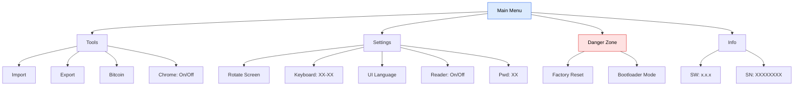
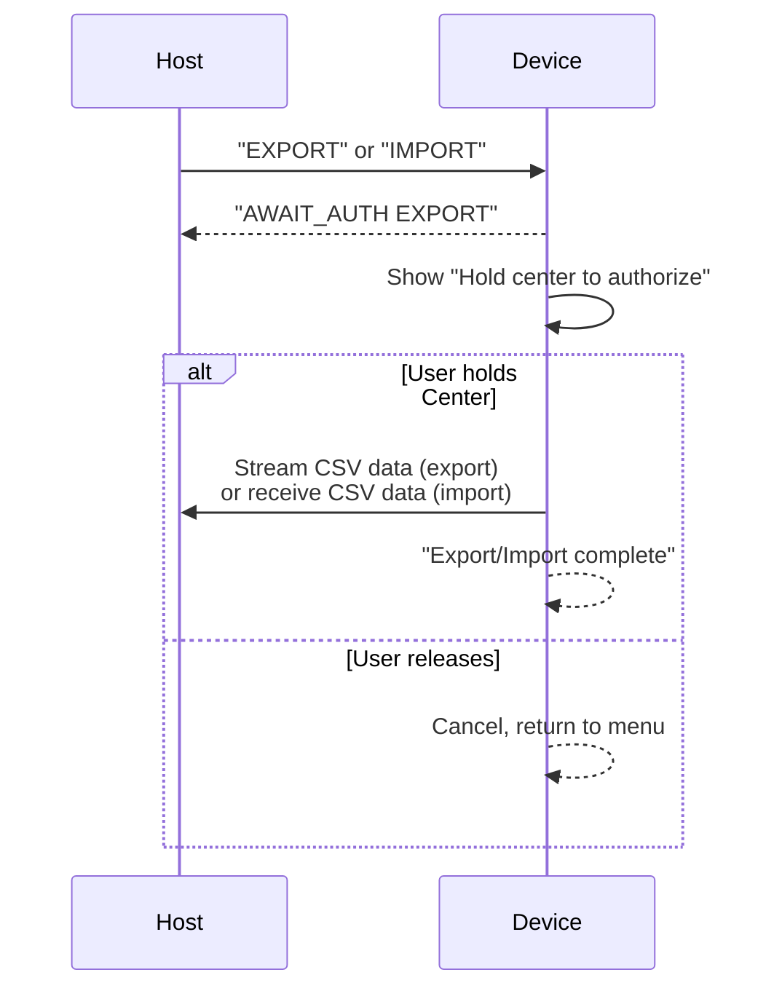

## Simple control, powerful features

ZeroKeyUSB has no buttons, no apps, and no hidden menus — only **five golden touch points** that control everything.  
The menu becomes accessible **after entering your Master PIN** by scrolling past the last credential slot.

---

## Menu structure

---

## Navigating the menu

| Gesture | Action |
|---------|--------|
| **Up ↑** | Move selection up (wraps to bottom) |
| **Down ↓** | Move selection down (wraps to top) |
| **Center ●** | Select / Execute the highlighted item |
| **Left ←** | Go back to parent menu or exit to credentials |
| **Right →** | Exit menu, jump to credential slot 0 |

When a menu has more items than fit on the 4-row display, a **scrollbar with thumb** appears on the right edge. The selection stays visible as you scroll.

---

### 🧰 Tools

<Note>This submenu was called **Backup** in older firmware; it was renamed **Tools** when the Bitcoin wallet was added.</Note>

| Item | Action |
|------|--------|
| **Import** | Receives credentials from the host via USB serial (CDC). Device shows "Waiting for data from the web app." |
| **Export** | Sends all 61 credential slots as plaintext CSV over USB serial. Requires long-press Center authorization. |
| **Bitcoin** | Airgapped Bitcoin wallet: create wallet, show the 12-word seed (screen-only) and export a watch-only `zpub`. See [Bitcoin signer](/firmware/bitcoin-signer). |
| **Chrome: On/Off** | Enables the host `FIND` command used by the [browser extension](/getting-started/browser-extension) to jump the on-device search. Default **On**; when Off the firmware ignores the command. Saved in EEPROM (`0x000D`). |

The export/import flow shows an authorization prompt before transferring any data:

<Warning>
Export sends **plaintext credentials** over USB serial. Only perform this on a trusted computer.
</Warning>

---

### ⚙️ Settings

| Item | Action |
|------|--------|
| **Rotate Screen** | Flips the display 180° for left/right-handed use. Also inverts touch controls. Saved in EEPROM. |
| **Keyboard: XX-XX** | Cycles through 9 keyboard layouts (EN-US → DA-DK → DE-DE → ES-ES → FR-FR → HU-HU → IT-IT → PT-PT → SV-SE → EN-US). Saved in EEPROM. |
| **UI Language** | Cycles the on-screen interface language (English ↔ Spanish). Saved in EEPROM. |
| **Reader: On/Off** | Toggles the persistent HID [screen-reader mode](/firmware/screen-reader) — types the screen over USB so a unit with a dead display is still usable. Saved in EEPROM. |
| **Pwd: XX** | Cycles the format used by `Rand` when generating a password: `Symbols` → `Numeric` → `a-z 0-9` → `Aa-z 0-9` → `Words` → `Words+Num`. All formats draw from the ATECC608A TRNG and cap at 16 characters. Saved in EEPROM (`0x0004`). See [Edit a credential](/getting-started/edit-credential). |

---

### ⏱️ TOTP

TOTP is accessed from the credential view, not the main menu. When viewing a credential, scroll **Down past Password** to the **2FA** field:

- If no TOTP secret exists for that slot → shows "No TOTP secret" for 2 seconds.
- If time is not synced → shows "Time not set — Request host time" and sends `REQTIME` over serial.
- If ready → displays a **6-digit code** with a 30-second countdown timer. Refreshes automatically each period. Touch any pad to return.

---

### ⚠️ Danger Zone

Every action in this section shows a **confirmation page** that requires pressing Center to proceed or Left to cancel:

| Item | Effect | Reversible? |
|------|--------|-------------|
| **Factory Reset** | Runs `eraseAll()` (3-second countdown, encrypted blanks over all 61 slots + clears TOTP metadata) and resets the provisioning flag to `0x00`, so the next boot starts the setup wizard. | ❌ No |
| **Bootloader Mode** | Sets double-reset magic word (`0xF01669EF` at `0x20007FFC`), then issues `NVIC_SystemReset()`. Device reboots into USB DFU bootloader for firmware flashing. | ✅ Yes (reflash) |

---

### ℹ️ Info

Read-only submenu showing:
- **SW: x.x.x** — firmware version from `zerokeyInfo::getSoftwareVersion()`
- **SN: XXXXXXXX** — hardware serial from the SAMD21 unique ID registers

---

## Setup wizard

The setup wizard runs on first boot (or after factory reset). It consists of **10 internal pages** across **9 visible steps**:

Pages with more than 4 lines of text are **vertically scrollable** using Up/Down. A scrollbar with thumb appears on the right edge.

Each wizard page supports:
- **Right** → advance to next page
- **Left** → go back to previous page
- **Center** → action (toggle orientation, change layout, start PIN entry)
- **Up/Down** → scroll content

---

## Design philosophy

The menu system is intentionally minimalist:
- No deep submenus — every option is **two taps away** from the main menu.
- All destructive actions require explicit Center confirmation on a dedicated page.
- Layout and gestures remain consistent across firmware versions.
- Menu items dynamically update their labels (e.g., keyboard layout shows current selection).

<Note>
ZeroKeyUSB requires no drivers or software installation.  
It's recognized as a standard USB keyboard on any operating system.
</Note>
