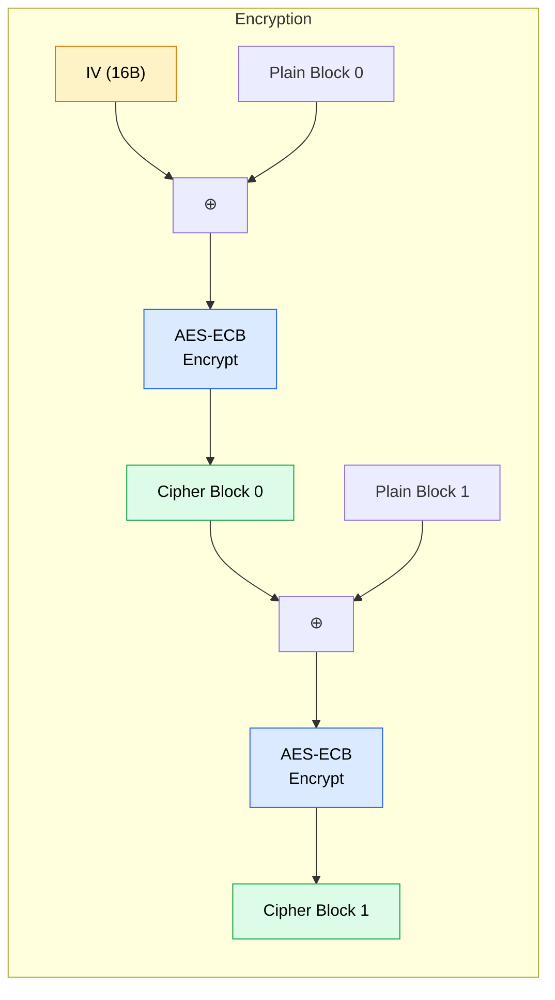

ZeroKeyUSB encrypts each credential block using **AES-128 in CBC mode**, implemented in software on the SAMD21 Cortex-M0+ MCU using the **AESLib** library.

---

## Key material

The AES master key is a **16-byte random value generated by the ATECC608A TRNG** at provisioning time. It is **not** derived from the PIN.

| Property | Detail |
|----------|--------|
| **Source** | ATECC608A hardware TRNG (`random()` command, mode 0x00 — updates seed before generating) |
| **Size** | 16 bytes (128 bits) |
| **EEPROM location** | `0x0028 – 0x0037` |
| **RAM cache** | Loaded into a `static byte aes_master[16]` on first use; flag `aes_master_loaded` prevents redundant EEPROM reads |
| **Validity check** | Rejected if all-`0x00` or all-`0xFF` (indicates uninitialised EEPROM) |

The key **never leaves SRAM during normal operation** and is not transmitted over any interface. Changing the PIN does not change the master key; the key is generated once at provisioning and persists for the device's lifetime.

---

## Why software AES?

The ATECC608A variant used (`MAHDA-T`) ships with the hardware AES command **disabled at factory**. As a result, AES encryption/decryption runs entirely on the MCU via the AESLib library. The ATECC is still used for:

- Generating the random AES key and IV (TRNG).
- Hardware PIN attempt rate-limiting (Counter0).
- PIN key derivation salt (chip serial).

---

## CBC chaining implementation

The `cbcEncrypt32` / `cbcDecrypt32` functions in `zerokey-security.cpp` process each 32-byte credential field (two 16-byte blocks) as follows:




### Encryption

```
for each 16-byte block b (0, 1):
    x[i] = plain[b*16 + i] XOR prev[i]    // XOR with previous ciphertext (or IV)
    cipher[b*16 .. b*16+15] = AES_ECB_Encrypt(x, key=aes_master, iv=zero)
    prev = cipher[b*16 .. b*16+15]         // update chaining value
```

### Decryption

```
for each 16-byte block b (0, 1):
    dec = AES_ECB_Decrypt(cipher[b*16 .. b*16+15], key=aes_master, iv=zero)
    plain[b*16 + i] = dec[i] XOR prev[i]  // XOR with previous ciphertext (or IV)
    prev = cipher[b*16 .. b*16+15]         // update chaining value
```

**Why `zero_iv` to AESLib?** AESLib's CBC API writes back to the IV argument at runtime. If the IV were stored in flash (a `static const`), the write would trigger a HardFault on SAMD21's Cortex-M0+. By manually applying the XOR before calling AESLib, the library call reduces to a single ECB block with a zero IV — functionally identical to CBC with correct chaining.

---

## Padding

Each credential field (site, username, password) is 16 bytes in RAM. Before encryption:

1. Trailing **space characters (`0x20`)** are replaced with `0xFF` from the end inward.
2. The 16-byte field is placed in a 32-byte buffer; the upper 16 bytes are filled with `0xFF`.

On decryption, `bufferToString()` strips `0xFF` bytes and reads until `\0` or `0xFF`.

---

## Per-operation flow

### `lock()` — encrypt and write credentials

1. Replace trailing spaces in `currentSite`, `currentUser`, `currentPass` with `0xFF`.
2. Load IV from EEPROM (`loadIVfromEEPROM()`).
3. For each of the 3 fields:
   - Copy 16 bytes into a 32-byte buffer, pad upper half with `0xFF`.
   - Call `cbcEncrypt32(iv, plain, encrypted)`.
   - Write 32-byte ciphertext to the correct EEPROM page.

### `unlock()` — decrypt and load credentials

1. Load IV from EEPROM.
2. Self-heal check: if slot 0 page 0 is raw `0xFF`, call `silentEraseAll()`.
3. For each of the 3 fields:
   - Read 32-byte ciphertext from EEPROM.
   - Call `cbcDecrypt32(iv, encrypted, decrypted)`.
   - Copy first 16 bytes into `currentSite` / `currentUser` / `currentPass`.

---

## Security considerations

| Consideration | Status |
|--------------|--------|
| **Key entropy** | 16 bytes = 128 bits from hardware TRNG — not brute-forceable |
| **PIN ≠ key** | Changing or forgetting the PIN does not affect the AES key or existing ciphertext |
| **Key at rest** | AES master stored in plaintext EEPROM at `0x0028` — readable by an attacker with I²C access |
| **Physical protection** | PCB is epoxy-encapsulated; accessing I²C requires destroying the device |
| **Factory reset** | `eraseAll()` overwrites all credential pages with encrypted blanks; the AES key and IV remain in EEPROM until a full re-provisioning |
| **No key escrow** | There is no backup copy of the AES master key; EEPROM destruction = permanent data loss |

<Warning>
If an attacker gains I²C access without destroying the PCB (e.g., before encapsulation), they can read the AES master key from `0x0028` and decrypt all credential pages offline. Physical security of the device is the primary defence.
</Warning>
