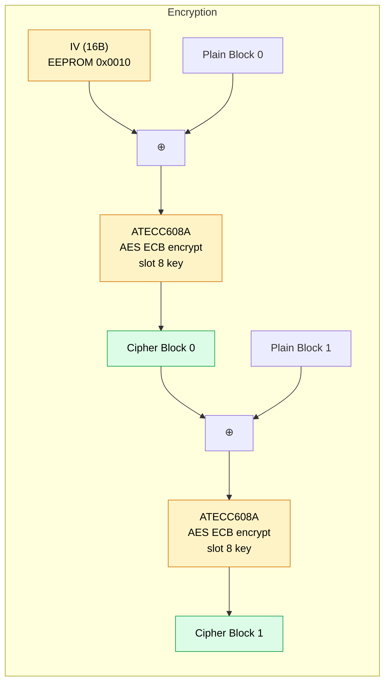

ZeroKeyUSB encrypts each credential block using **AES-128 in CBC mode**. Single-block ECB is done **on the ATECC608A** using a key that never leaves the chip; the SAMD21 MCU wraps the chip calls in CBC chaining and handles I/O to the EEPROM.

---

## Key material

The AES master key is a **16-byte random value generated by the ATECC608A TRNG** at first boot, written to **slot 8** of the chip, and then locked in by the data-zone lock.

| Property | Detail |
|----------|--------|
| **Source** | ATECC608A hardware TRNG (`random()` command, mode 0x00 — refreshes the DRBG seed before output) |
| **Size** | 16 bytes (128 bits) |
| **Storage** | ATECC608A slot 8 (`IsSecret=1`, `KeyType=6`/AES, `WriteConfig=Never`) |
| **Visibility** | The chip never exposes the slot contents over I²C once configured this way |
| **Generation moment** | Single shot, during the first boot of new firmware on a virgin chip, inside `provisionAesAndLock()` |
| **Mutability** | None after the data zone is locked. The key persists for the device's lifetime. |

Because `IsSecret=1` is enforced before the data zone is locked, even an attacker with physical I²C access cannot read the AES key back from the chip — the `Read` command refuses to return it.

---

## Why the chip and not the MCU?

The earlier firmware ran software AES on the SAMD21 with the key stored in EEPROM, because the `MAHDA-T` variant of the ATECC608A ships with the hardware AES command disabled. Enabling it requires:

1. Writing the `AES_Enable` bit (byte 13, bit 0) of the Config Zone.
2. Configuring slot 8 with `KeyType=6` (AES).
3. Locking the Config Zone so those settings take effect.

The firmware now does all three the first time it boots. The trade-off: AES blocks now cross the I²C bus, which is slower (~10 ms per block vs ~0.1 ms in software). For a credential read that decrypts 3×32 bytes that's ≈60 ms — imperceptible to the user.

---

## CBC chaining implementation

The `cbcEncrypt32` / `cbcDecrypt32` functions in `zerokey-security.cpp` process each 32-byte credential field as two 16-byte blocks chained against the device IV:



### Encryption

```
prev = IV
for each 16-byte block b (0, 1):
    x = plain[b] XOR prev
    cipher[b] = ATECC608A.aesEncryptBlock(slot=8, mode=0x00, in=x)
    prev = cipher[b]
```

### Decryption

```
prev = IV
for each 16-byte block b (0, 1):
    dec = ATECC608A.aesDecryptBlock(slot=8, mode=0x01, in=cipher[b])
    plain[b] = dec XOR prev
    prev = cipher[b]
```

The MCU only sees plaintext blocks (input to encrypt, output of decrypt) and ciphertext blocks (output of encrypt, input to decrypt). It never sees the AES key.

---

## Wire format of each AES call

For every 16-byte block:

| Field | Value | Purpose |
|------|-------|---------|
| Wake token | drive SDA low 60 µs | Pull the chip out of sleep |
| Opcode | `0x51` (`AES`) | Command identifier |
| Param1 (Mode) | `0x00` = encrypt block 0, `0x01` = decrypt block 0 | `bit 0` operation, bits 6–7 sub-key index |
| Param2 (KeyID) | `0x0008` | Slot 8 |
| Data | 16 bytes | Plaintext (encrypt) or ciphertext (decrypt) |
| CRC | 2 bytes | Custom CRC-16 (poly `0x8005`, init `0`) |
| Response | 16 bytes + status | The encrypted or decrypted block |
| Sleep token | `0x01` | Return chip to low-power state |

Each call takes ~10 ms including I²C overhead.

---

## Padding

Each credential field (site, username, password) is 16 bytes in RAM. Before encryption:

1. Trailing **space characters (`0x20`)** are replaced with `0xFF` from the end inward.
2. The 16-byte field is placed in a 32-byte buffer; the upper 16 bytes are filled with `0xFF`.

On decryption, `bufferToString()` strips `0xFF` bytes and reads until `\0` or `0xFF`.

---

## Per-operation flow

### `lock()` — encrypt and write credentials

1. Replace trailing spaces in `currentSite`, `currentUser`, `currentPass` with `0xFF`.
2. Load IV from EEPROM (`loadIVfromEEPROM()`).
3. For each of the 3 fields:
   - Copy 16 bytes into a 32-byte buffer, pad upper half with `0xFF`.
   - Call `cbcEncrypt32(iv, plain, encrypted)` — two ATECC AES calls under the hood.
   - Write the 32-byte ciphertext to the correct EEPROM page.

### `unlock()` — decrypt and load credentials

1. Load IV from EEPROM.
2. Self-heal check: if slot 0 page 0 is raw `0xFF`, call `silentEraseAll()`.
3. For each of the 3 fields:
   - Read the 32-byte ciphertext from EEPROM.
   - Call `cbcDecrypt32(iv, encrypted, decrypted)` — two ATECC AES calls.
   - Copy the first 16 bytes into `currentSite` / `currentUser` / `currentPass`.

---

## Error reporting

When an AES round-trip fails, the firmware preserves the chip's response code and displays it on the OLED instead of a generic error. The format is `AES E<n> RC<x> SS<XX>` plus a second line `LC=<x> LV=<x> KT=<n>` showing the chip's lock and key-type state at the moment of failure:

| Code | Meaning |
|------|---------|
| `AES E1` | `silentEraseAll()` could not encrypt a blank slot |
| `AES E2` | `eraseAll()` could not encrypt a blank slot |
| `AES E3` | `lock()` could not encrypt a credential field (`f0`/`f1`/`f2` = site/user/pass) |
| `AES E4` | `unlock()` could not decrypt a credential field |

`RC` is the driver-level code (`-1` wake, `-2` I²C, `-3` CRC, `-4` chip status error, `-5` timeout). `SS` is the raw status byte from the chip (`0x0F` execution error, `0x03` parse, `0x07` self-test, …). The combination tells you exactly why the chip rejected the call. Locked + `KT=1` (instead of `6`) means the chip is permanently misconfigured for AES; that's the only failure mode that can't be cleared by a reboot.

---

## Security considerations

| Consideration | Status |
|--------------|--------|
| **Key entropy** | 128 bits from the chip's hardware TRNG — not brute-forceable |
| **PIN ≠ key** | Changing or forgetting the PIN does not affect the AES key or existing ciphertext |
| **Key at rest** | Lives inside ATECC608A slot 8 with `IsSecret=1`. The slot is not readable via the `Read` command after the data zone is locked. |
| **Key in transit** | Never crosses the I²C bus. The MCU sends plaintext / ciphertext blocks; the chip uses its internal copy of the key. |
| **Physical attack via I²C** | An attacker who exposes I²C can replay AES calls but cannot extract the key. They could still observe plaintext blocks the MCU is feeding the chip — physical encapsulation remains essential. |
| **Factory reset** | `eraseAll()` overwrites all credential pages with encrypted blanks. The AES key itself is permanent (slot 8 is locked-Never). |
| **No key escrow** | There is no backup copy of the AES master key anywhere. Chip failure = permanent loss of all credentials. Keep an exported backup. |

<Warning>
The AES key cannot be rotated or recovered once the data zone is locked. If the secure element fails, every credential encrypted under it becomes unreadable. Use the USB-CDC backup command on a trusted host before relying on the device long-term.
</Warning>
