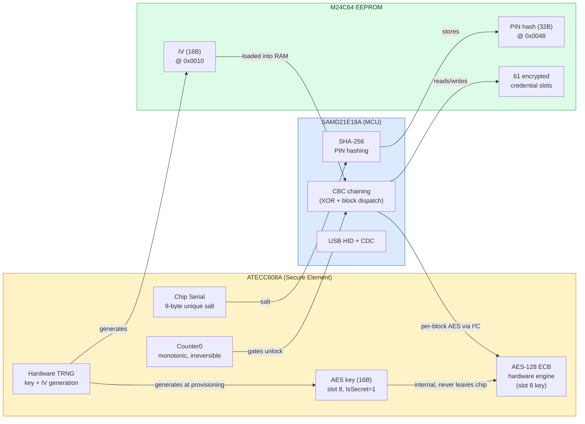
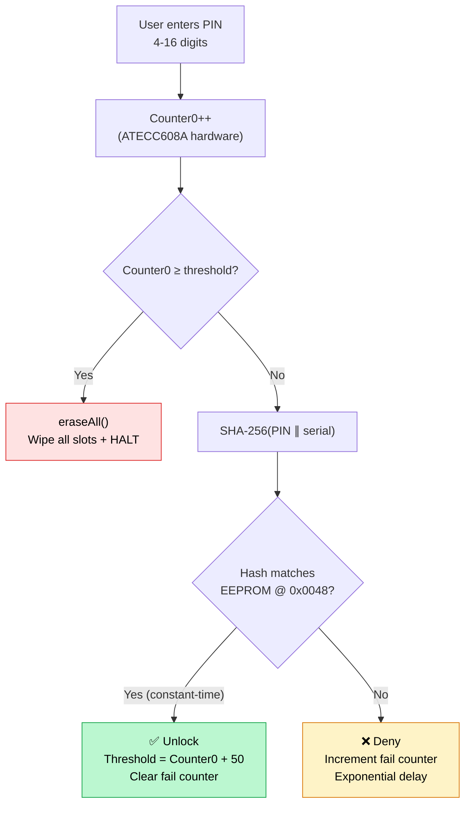

## Offline by design

ZeroKeyUSB does not rely on the Internet, cloud storage, or companion apps.
Everything — from random number generation to PIN verification — happens **inside the device**, powered directly through USB.

Your passwords **never leave the hardware** and **cannot be accessed remotely**, even by the manufacturer.

---

## Two cooperating chips

Security is split across two pieces of silicon so neither one alone can leak the vault:

| Chip | Role |
|------|------|
| **SAMD21E18A (MCU)** | Runs the application firmware, manages the CBC chaining logic, drives the OLED, USB HID, touch, and I²C bus. Single-block AES is delegated to the secure element. |
| **ATECC608A-MAHDA-T (secure element)** | Generates true random numbers (TRNG), holds a unique 9-byte chip serial used as PIN salt, provides a tamper-resistant **monotonic hardware counter** (Counter0), and — once provisioned — performs every AES-128 ECB block in dedicated hardware using a key stored in slot 8 that **never leaves the chip**. |

The MCU and ATECC608A share an I²C bus at address `0x60`. The MCU does not have a usable copy of the AES key: it sends 16-byte plaintext blocks to the chip and receives 16-byte ciphertext back. The chip generated the key itself at provisioning time using its TRNG; the byte sequence never crossed the I²C bus.

> **Crypto model — Camino A (AES key + AES engine on chip).**
> The firmware enables the hardware AES command, configures slot 8 as an AES key holder (`IsSecret=1`, `KeyType=6`), writes a 16-byte TRNG-generated key to it, and locks both Config and Data zones. From that point on, encryption and decryption are single-block ECB calls to the chip, chained on the MCU into CBC.

---

## Encryption architecture

All sensitive data is stored in the external **EEPROM M24C64-WMN6TP**, encrypted using **AES-128 in CBC mode**. Each ECB block is computed by the ATECC608A hardware AES engine; the MCU handles only the CBC XOR chaining.

| Element | Source / Location |
|----------|-------------------|
| **Cipher** | AES-128 CBC — single-block ECB delegated to the ATECC608A `AES` command (opcode `0x51`). Per-block XOR chaining is done on the MCU around the chip calls so the key never has to be loaded into MCU SRAM. |
| **AES master key** | 16 random bytes produced by the ATECC608A TRNG at first boot and written to **slot 8** of the chip. `IsSecret=1` means it can never be read out via the I²C bus. |
| **IV (Initialization Vector)** | 16 random bytes produced by the ATECC608A TRNG at provisioning. Stored in EEPROM at `0x0010–0x001F`. |
| **PIN binding** | The AES master key is **not** derived from the PIN. The PIN is verified separately via an EEPROM-stored hash and gates access to the unlock routine. |
| **Credential layout** | Each slot holds up to four 32-byte encrypted EEPROM pages: site (p0), username (p1), password (p2), TOTP secret (p3). Each 32-byte page encrypts 16 bytes of plaintext padded to 32 bytes with `0xFF`. |

### CBC chaining detail

`cbcEncrypt32` / `cbcDecrypt32` process each 32-byte credential in two 16-byte blocks. For each block:

1. The plaintext block is XORed with the previous ciphertext (or with the device IV for the first block).
2. The XOR result is sent to the ATECC608A via the AES command (`mode=0x00` for encrypt, `0x01` for decrypt, key from slot 8, key block 0). The chip returns the 16-byte ciphertext.
3. The resulting ciphertext becomes `prev` for the next block.

Decryption is symmetric: the chip returns plaintext, the MCU XORs it with the previous ciphertext to recover the original block.

**Why split the work this way?** The ATECC608A's `AES` command exposes only single-block ECB. CBC is the *chaining policy* layered on top — implementing it on the MCU keeps every byte of the key inside the secure element while giving us the diffusion benefits of CBC on the credential data.

---

## EEPROM security map

| Address | Size | Content |
|---------|------|---------|
| `0x0000` | 1 B | Configuration wizard flag (`0x42` = done) |
| `0x0001` | 1 B | Screen mode / orientation |
| `0x0002` | 1 B | Soft failed-attempts counter (UX backoff) |
| `0x0010–0x001F` | 16 B | AES-CBC Initialization Vector (TRNG-generated) |
| `0x0020–0x0023` | 4 B | PIN attempt threshold (LE uint32 = Counter0 value + 50 on last success) |
| `0x0024` | 1 B | Provisioning flag (`0xA5` = provisioned) |
| `0x0028–0x0037` | 16 B | *Reserved* — legacy AES master slot from the software-AES build. Not used since the key was moved into ATECC slot 8. |
| `0x003E` | 1 B | Keyboard layout selector |
| `0x0040–0x0047` | 8 B | Last TOTP epoch (persisted across power cycles) |
| `0x0048–0x0067` | 32 B | PIN hash = SHA-256(pinArray\[16\] ∥ chip_serial\[9\]) |
| `0x0068+` | 124 B | TOTP metadata (algorithm + secret length, 2 B × 61 slots) |
| `0x0100+` | — | Credential pages (4 × 32 B × 61 slots = 7808 B max) |

> **Note on `0x0028`.** Older units (compiled before the AES move) used this region to hold the 16-byte AES master in plaintext. New units do not touch it; the bytes remain at whatever the EEPROM had previously. Treat the address as reserved.

---

## The Master PIN

The PIN authorises an unlock cycle; it is **never used directly as an encryption key**.

The verification flow:

1. The user enters up to **16 digits** on the capacitive pads.
2. The firmware increments **Counter0** in the ATECC608A. This counter is monotonic and survives power cycles — it cannot be rolled back by software or by desoldering the MCU.
3. The firmware reads the **attempt threshold** from EEPROM (`0x0020`). If `Counter0 ≥ threshold`, the device calls `eraseAll()` (wipes all credential slots) and halts.
4. Otherwise, the firmware calls `derivePinKey()`: computes `SHA-256(pinArray[16] ∥ chip_serial[9])` to produce the 32-byte PIN hash.
5. It reads the stored 32-byte hash from EEPROM (`0x0048`) and runs a **constant-time compare** (`diff |= stored[i] ^ derived[i]`).
6. **On match:** the threshold is reset to `Counter0 + 50`, the soft failed-attempt counter is cleared, and the unlock proceeds.
7. **On mismatch:** the soft counter increments and the device enforces an exponential backoff delay before the next attempt.

Because the rate-limit counter is in hardware, an attacker who dumps EEPROM still cannot brute-force the PIN against the device — Counter0 keeps marching forward with each attempt and the firmware wipes the vault once the threshold is crossed.

### Adaptive lockout — soft backoff (UX layer)

Stored at EEPROM `0x0002`. Independent of the hard counter; reset on correct PIN.

| Failed attempts | Wait time |
|-----------------|-----------|
| 1 | 5 s |
| 2 | 10 s |
| 3 | 20 s |
| 4 | 40 s |
| 5 | 80 s |
| … | doubles up to **2 560 s (≈ 43 min)** |

Formula: `wait = BASE_SECONDS (5) × 2^(min(attempts,10)−1)`, capped at `MAX_WAIT_SECONDS` (2 560).

### Hard limit — hardware counter

- Threshold initialised at provisioning: `cur_counter + 50` (where `cur_counter` is read from the chip at that moment).
- Each PIN attempt — right or wrong — increments Counter0 by one.
- The threshold is bumped by 50 **only on a correct PIN**, so a stream of wrong attempts will eventually exhaust the budget.
- The chip's monotonic counter **cannot be reset** — no software path, no power cycle, no physical reset resets it.
- The hard limit is `ATTEMPT_BUDGET = 50`. After 50 consecutive wrong PINs without a correct one, the vault is wiped.

---

## ATECC608A slot map

Established by the device itself the first time it boots, then **locked permanently** (Config and Data zones both irreversibly closed):

| Slot | Size used | Content | SlotConfig / KeyConfig |
|------|-----------|---------|------------------------|
| **8** | 16 B | AES-128 master key — generated on chip by the TRNG at first boot, used by every credential encrypt/decrypt | `IsSecret=1` / `WriteConfig=Never` / `KeyType=6 (AES)`. The key cannot be read out over I²C, nor rewritten once the data zone is locked. |
| **9** | 32 B | `SHA-256(PIN_padded ∥ device_serial)` — the PIN key | `IsSecret=0` / `WriteConfig=Always` so the app can rewrite the slot when the user changes their PIN. Readable over I²C. |
| **Counter 0** | 4 B monotonic | PIN attempt counter | Increment-only. Read by app before each unlock. |

### Provisioning sequence (first boot only)

`zerokeyAtecc.provisionAesAndLock()` runs once, before the setup wizard:

1. **Read** Config Zone blocks 0, 1 and 3 to learn the chip's current factory values.
2. **Set the AES_Enable bit** (byte 13, bit 0) using a 32-byte block write that preserves every factory bit we didn't intend to change. Re-read and verify the bit took effect; abort without locking if not.
3. **Set SlotConfig[8]** — `IsSecret=1` (bit 7 of byte 36) and `WriteConfig=Never` (high nibble of byte 37 = `0x4`), preserving the rest of the byte. Re-read and verify.
4. **Set KeyConfig[8].KeyType = 6 (AES)** — bits 2..4 of byte 112, preserving every other bit. Re-read and verify.
5. **Lock the Config zone.** Irreversible.
6. **Generate** a 16-byte random key via the chip's TRNG and write it to slot 8 in the clear (still allowed while the data zone is open).
7. **Lock the Data zone.** Irreversible.

Every write is followed by a read-back. If any verify fails, the function returns a numbered `PROV E<n>` error with the chip's raw status byte attached and **does not proceed to lock the zone**, so a misbehaving chip cannot brick itself silently.

> **Why bit-level writes?** The MAHDA-T parts ship with several "reserved" bits in byte 13 (`AES_Enable`) factory-set. A naive write that clears them is rejected by the chip with a parse error (`SS=0x03`). The provisioning code reads each byte first, OR-masks only the bits it actually needs to flip, and writes the whole 32-byte block back.

> **Known trade-off (Slot 9 readable):** Slot 9 is not locked as secret because the MAHDA-T SKU rejects clear writes to IsSecret slots 0–7. The PIN hash lives there with `IsSecret=0`, so an attacker with physical I²C access can read the 32-byte hash and attempt an offline SHA-256(PIN∥serial) brute force. Counter0 hardware lockout limits online attempts but not offline cracking. Short PINs are vulnerable to this attack — use the maximum 16 digits.

---

## Initialization Vector

The IV is generated **once** during provisioning by the ATECC608A's TRNG and stored in EEPROM at `0x0010`. Two sanity guards protect it:

- A read returning all-`0x00` or all-`0xFF` is treated as uninitialised and triggers regeneration from the TRNG.
- If EEPROM read fails at unlock time, the firmware attempts TRNG regeneration and re-stores the IV.

**Single device-wide IV:** all credential pages are chained against the same IV. This keeps the layout simple and auditable. The threat model leans on TRNG quality and Counter0, not on per-record nonces.

**Regeneration consequence:** if the IV is lost or regenerated without re-encrypting credentials, existing slots will decrypt to garbage (the ciphertext was produced under the old IV). The firmware's self-healing routine (`silentEraseAll`) is called automatically on first unlock if slot 0 page 0 is still raw `0xFF` (EEPROM default), and can be called again manually via `generateAndStoreIV()`.

---

## Self-healing initialisation

On the first unlock after provisioning, `ZerokeySecurity::unlock()` checks whether credential slot 0, page 0 is still at the EEPROM factory default (`0xFF` across all 32 bytes). If so, it calls `silentEraseAll()`:

1. Loads the device IV from EEPROM.
2. For each of the 61 credential slots × 4 pages: encrypts a 32-byte `0xFF` blank under AES-128 CBC and writes it to EEPROM.
3. Clears TOTP metadata for every slot.

This ensures fresh units always have consistent, properly encrypted blank entries before any credential is written.

---

## Data segmentation

Each credential slot occupies 4 consecutive EEPROM pages (128 bytes total):

| Page | Content (plaintext, 16 B + 16 B padding) | EEPROM bytes |
|------|----------------------------------------|--------------|
| 0 | Site / domain | 32 B ciphertext |
| 1 | Username | 32 B ciphertext |
| 2 | Password | 32 B ciphertext |
| 3 | TOTP secret | 32 B ciphertext |

Splitting fields keeps recognisable plaintext patterns out of the ciphertext stream and limits the blast radius of a corrupt EEPROM page. Padding bytes are `0xFF`; trailing `0x20` (space) chars are replaced with `0xFF` before encryption to avoid pattern leakage.

---

## Tamper protection

- The PCB is **encapsulated in epoxy resin**; opening the device destroys the board and the chip connections.
- **No wireless interfaces** (no Wi-Fi, no Bluetooth, no NFC).
- The **bootloader region is BOOTPROT-locked** in hardware fuses (`BOOTPROT = 7`, protecting the first 16 KB) — application firmware cannot rewrite or relocate the bootloader.
- The bootloader will only jump to **ECDSA P-256-signed firmware**; an unsigned or tampered image falls into USB-CDC recovery mode instead of executing.
- All decrypted credentials live in **temporary RAM buffers** (`currentSite`, `currentUser`, `currentPass`) that are populated at unlock and overwritten at the next lock or power cycle.
- **Write-protect pin** (`EEPROM_WP_PIN = PA01`) can be driven high by firmware to hardware-lock EEPROM writes.

---

## Backup and restore

Credentials can be exported and imported over the USB CDC serial interface:

- **Export (`backupAllCredentials`):** decrypts all 61 slots in-device and sends them as comma-delimited plaintext lines over SerialUSB. The host receives credentials in clear — **ensure the USB connection is trusted**.
- **Import (`loadAllbackupCredentials`):** receives records from the host, re-encrypts them under the current device IV/master, and writes them to EEPROM. TOTP secrets are parsed and stored in page 3 of each slot.

> **Security note:** backup transmits decrypted credentials in plaintext over USB. Only perform backup/restore on a trusted, air-gapped host.

---

## Known limitations and trade-offs

| Limitation | Impact | Mitigation |
|-----------|--------|------------|
| AES key cannot be regenerated after provisioning | If the chip ever fails, the credentials encrypted under that key are unrecoverable | `WriteConfig=Never` is the cost of `IsSecret=1` plus locked data zone; pick the maximum-security trade-off and accept it. Keep an exported backup. |
| Slot 9 PIN hash readable over I²C | Offline SHA-256 brute-force if I²C accessible | Short PINs (< 6 digits) are vulnerable; use max-length PINs |
| Single device-wide IV | Same IV for all slots; no per-record nonces | IV entropy from ATECC TRNG; IV loss requires re-initialisation |
| PIN comparison in software (not CheckMac) | Side-channel timing (mitigated by constant-time compare) | Hardware Counter0 still gates attempts |
| Backup is plaintext over USB | Physical host can capture credentials | Document clearly; use only on trusted machines |
| Each AES block is a chip round-trip over I²C | Slower than software AES — credentials decrypt in ~30 ms instead of ~3 ms | Acceptable for a hand-held password manager; the chip is the security boundary |

---

## Transparency, not dependence

ZeroKeyUSB's firmware is fully open-source and available for public **audit and verification**. Anyone can review:

- How the ATECC608A is driven, including the bit-level provisioning routine that enables the chip's AES engine and locks both zones (`zerokey-atecc.cpp`).
- How CBC chaining wraps the chip's single-block AES command (`zerokey-security.cpp`).
- How the IV is generated, validated, and refreshed (`zerokey-security.cpp::generateAndStoreIV`).
- How the bootloader hashes and verifies the application (`bootloader/src/main.c`).

There are **no remote update mechanisms**: re-flashing requires physical access via SWD pogo pins or the local USB-CDC bootloader, and any new image must be signed by the offline ECDSA key.

---

## Dive deeper

<CardGroup cols={3}>
  <Card title="AES-128 Encryption" icon="lock" href="/firmware/security/aes-128-encryption">
    How the ATECC608A's hardware AES engine encrypts every credential block, with CBC chaining wrapped around it on the MCU.
  </Card>
  <Card title="PIN Verification" icon="shield" href="/firmware/security/pin-verification">
    Counter0, the EEPROM-stored SHA-256 hash, and the constant-time compare that gates unlock.
  </Card>
  <Card title="IV Generation" icon="dice" href="/firmware/security/iv-generation">
    How the ATECC608A TRNG seeds the device-wide IV and how regeneration is handled.
  </Card>
</CardGroup>

<Note>
ZeroKeyUSB pairs an MCU with a hardened secure element. The chip provides the *entropy* (TRNG), the *identity* (chip serial used as PIN salt), the *rate limit* (Counter0), **and** the *cipher* itself — every AES block is computed inside the secure element using a key the MCU has never seen. The MCU's role is to chain those blocks into CBC, drive the UI, and shuttle plaintext / ciphertext to and from the EEPROM.
</Note>
