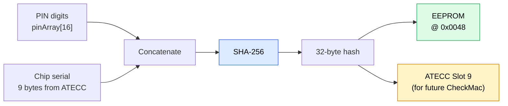

ZeroKeyUSB uses a Master PIN (1–16 digits) to authenticate the user. The verification process pairs a **software constant-time hash comparison** with a **persistent exponential backoff** that is re-applied on every boot, making brute-force attempts impractical without ever destroying stored data.

---

## How the PIN is stored

The PIN is **never stored in plaintext**. At PIN setup time (`storeSignature()`):



1. The user's PIN digits are read from `pinArray[16]` (each byte holds a digit value 0–9).
2. `derivePinKey()` computes: `SHA-256(pinArray[16] ∥ chip_serial[9])`.
   - `chip_serial` is the 9-byte unique serial read from the ATECC608A Config Zone.
3. The resulting 32-byte hash is written to EEPROM at `0x0048–0x0067`.
4. The same 32-byte hash is also written to **ATECC slot 9** (for potential future CheckMac use).

The chip serial acts as a hardware salt: the same numeric PIN on a different device produces a completely different 32-byte hash.

---

## Unlock sequence

Each unlock attempt executes the following steps in `verifySignature()`:

```
On boot, before the PIN screen accepts any input:
    waitFromEeprom()   // replay the accumulated backoff for the stored fail count

Then each unlock attempt runs verifySignature():
1. derivePinKey(pinArray, derived):
       serial = ATECC608A.readSerial()
       derived = SHA-256(pinArray[16] || serial[9])
2. Read stored hash from EEPROM [0x0048] → stored[32]
3. diff = 0; for i in 0..31: diff |= stored[i] ^ derived[i]  // constant-time
4. If diff == 0:
       writeFailedAttemptsCounter(0)      // clear the backoff
       → ACCESS GRANTED
5. Else:
       incrementFailedAttemptsCounter()
       waitFromEeprom()                   // exponential backoff
       → ACCESS DENIED
```

There is **no `Counter0` increment, threshold read, or automatic wipe** in this path. An earlier design used the ATECC608A's monotonic Counter0 to wipe the vault after 50 wrong PINs; that was removed. The live defence is the persistent backoff described below.

---

## Persistent rate-limiting — the real brute-force defence

There is **no automatic wipe** after a number of failed attempts; the vault is never destroyed by wrong PINs. Instead, every guess is slowed by an exponential backoff whose counter lives in EEPROM (`0x0002`) and therefore survives power loss.

The load-bearing detail is *when* the delay is applied. On every boot, `readConfigurationFlag()` calls `waitFromEeprom()` **before the PIN screen accepts any input**. So an attacker cannot skip the penalty by cutting power mid-countdown: after each failed guess the accumulated delay is re-imposed at the next power-up. Once the counter passes ~10 failures every further attempt costs ≈ 43 minutes, so online brute force is impractical (a 4-digit PIN would take on the order of a year) — all without ever destroying the user's data.

| Event | Failed-attempt counter (EEPROM `0x0002`) |
|-------|------------------------------------------|
| Wrong PIN | +1, then enforce the backoff delay |
| Correct PIN | reset to 0 |
| Power cycle | the delay for the stored count is re-applied at boot |

`eraseAll()` still exists, but it is only ever triggered **manually** by the user (factory reset / forgotten PIN) — never automatically by wrong PINs.

> **Offline caveat.** The rate limit only applies to guesses made through the device. The PIN hash is readable over I²C (EEPROM `0x0048` and ATECC slot 9 with `IsSecret=0`), so an attacker who physically reaches the I²C bus can copy the hash and the chip serial and crack the PIN offline with no delay. What stops that is the **epoxy encapsulation** blocking bus access — plus using a long PIN. It is not the backoff.

---

## Exponential backoff — delay schedule

Stored at EEPROM `0x0002` and re-applied at boot; reset only on a correct PIN:

| Failed attempts | Wait time |
|-----------------|-----------|
| 0 | none |
| 1 | 5 s |
| 2 | 10 s |
| 3 | 20 s |
| 4 | 40 s |
| 5 | 80 s |
| 6 | 160 s |
| 7 | 320 s |
| 8 | 640 s |
| 9 | 1 280 s |
| ≥ 10 | 2 560 s (≈ 43 min) |

Formula: `wait = 5 × 2^(min(attempts, 10) − 1)` seconds, capped at 2 560 s.

During the delay the OLED shows a progress bar and countdown. The device does not accept new input until the timer expires.

---

## Secure input handling

- Digits are buffered in `pinArray[16]` in SRAM and cleared after verification.
- Touch events are ignored during the lockout wait (`waitFromEeprom()`).
- SerialUSB **cannot** inject PIN digits — only physical capacitive-touch input is accepted.
- The PIN comparison uses a constant-time XOR accumulator (`diff |= stored[i] ^ derived[i]`) to avoid timing side-channels.

---

## Changing the PIN

Initiated via **Menu → Change PIN** → `storeSignature()`:

1. 3-second on-screen countdown (allows safe abort).
2. `derivePinKey(pinArray, derived)` computes the new hash.
3. New 32-byte hash written to ATECC slot 9.
4. New 32-byte hash written to EEPROM `0x0048`.
5. The failed-attempts counter (EEPROM `0x0002`) is cleared.
6. ATECC ping confirms the chip is still alive. The AES key in slot 8 is **not touched** by PIN setup — it is provisioned once at first boot and is irrevocable.
7. IV is loaded or generated.
8. Setup config flag is written (`0x42`).
9. All credential slots are silently re-initialised with encrypted blanks.

<Note>
Changing the PIN does **not** change the AES master key or re-encrypt existing credentials. The AES key lives inside ATECC slot 8 and is generated once per device; it cannot be rotated. Existing ciphertext is decryptable with the same chip as long as it is not destroyed.
</Note>

---

## Forgotten PIN

ZeroKeyUSB has no PIN recovery mechanism. The only option is a **factory reset** (`eraseAll()`), which:

1. Shows a 3-second countdown.
2. Loads the device IV.
3. Overwrites all 61 credential slots × 4 pages with encrypted blanks.
4. Clears TOTP metadata.

After reset the device halts with a "LOCKED — reflash" error. The bootloader must be used to flash new firmware and re-provision the device from scratch.

Previously stored credentials are unrecoverable unless you have a plaintext backup exported before the reset.

<Warning>
Choose a PIN you can remember but others cannot guess. A PIN of 4 digits or fewer is vulnerable to offline SHA-256 dictionary attacks if an adversary gains I²C access to the device.
</Warning>
