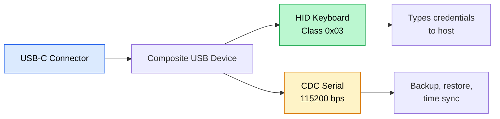
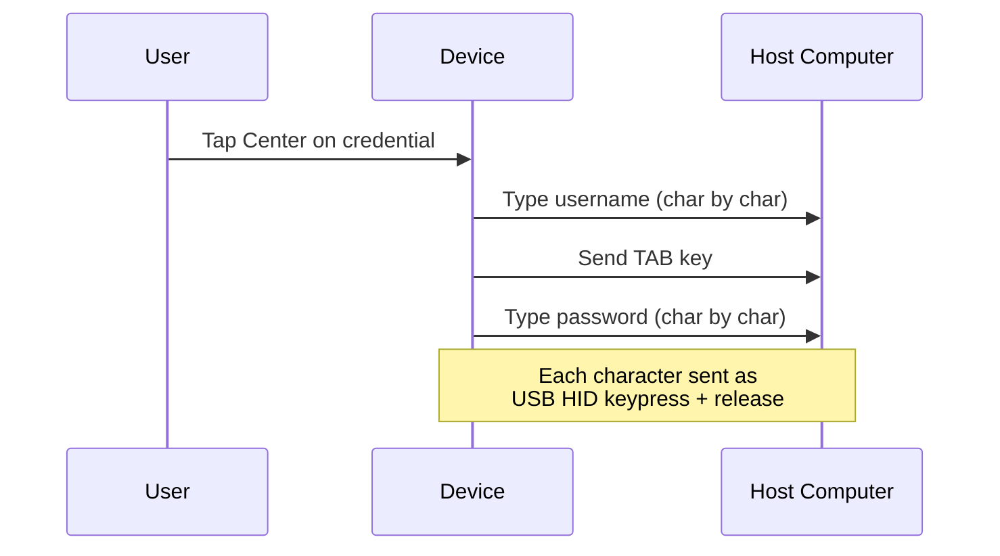
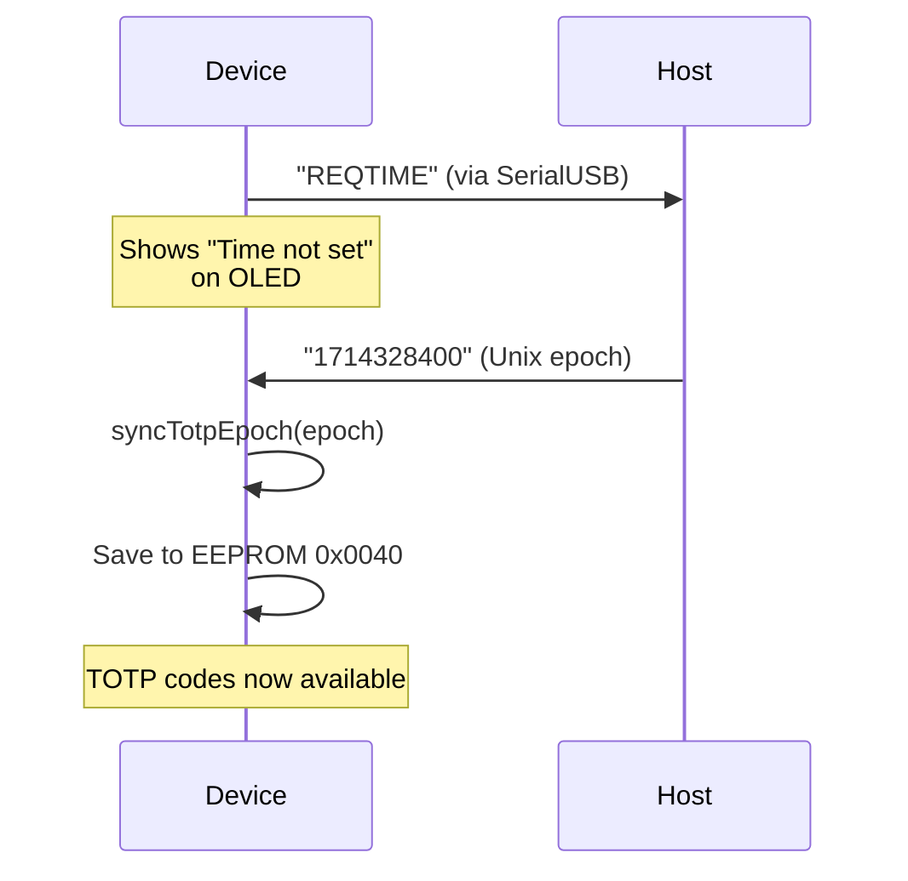

## Dual USB personality

ZeroKeyUSB operates as a **composite USB Full-Speed device** exposing two interfaces simultaneously:



Both interfaces remain active after boot, but CDC commands that modify data require PIN unlock + on-device authorization.

---

## Keyboard output engine

The firmware supports **9 keyboard layouts** stored as compiled keyboard maps:

| Code | Layout |
|------|--------|
| `EN-US` | United States QWERTY (default) |
| `DA-DK` | Danish |
| `DE-DE` | German |
| `ES-ES` | Spanish |
| `FR-FR` | French |
| `HU-HU` | Hungarian |
| `IT-IT` | Italian |
| `PT-PT` | Portuguese |
| `SV-SE` | Swedish |

The active layout is stored in EEPROM at `0x003E` and can be changed from **Settings → Keyboard** or during the setup wizard.

### Typing sequence

When you tap **Center** on the credential main screen, ZeroKeyUSB types:



The typing engine in `zerokey-utils.cpp` converts each ASCII character to the appropriate HID keycode using the selected keyboard layout library.

---

## Serial command protocol

The CDC channel communicates at **115200 bps** using simple ASCII lines. Commands are processed by `handleIncomingHostRequests()` in `zerokey-io.cpp`.

| Command | Direction | Pre-condition | Description |
|---------|-----------|---------------|-------------|
| `EXPORT` or `R` | Host → Device | PIN unlocked | Initiates credential export. Device shows authorization prompt. |
| `IMPORT` | Host → Device | PIN unlocked | Initiates credential import. Device shows authorization prompt. |
| `<epoch>` | Host → Device | Device showing `REQTIME` | Sends Unix epoch timestamp for TOTP synchronization. |

### Export data format

Each credential is sent as a CSV line:

```
slotIndex,siteName,userName,password[,totpSecret]
```

- The TOTP field is optional and only included if the slot has a 2FA secret.
- The first line sent is the total number of slots (`62`).
- Example: `0,github.com,alice,MyP@ss123,JBSWY3DPEHPK3PXP`

### Import data format

Same CSV format. The host sends:
1. The total number of records (integer).
2. One line per record: `slotIndex,site,user,pass[,totpSecret]`.

The device encrypts each field with AES-128 CBC and writes to the corresponding EEPROM slot.

---

## Time synchronization

TOTP codes require accurate time. Since ZeroKeyUSB has **no hardware RTC**, time is tracked using `millis()` drift from a synced epoch.



- The epoch value must be between `946684800` (2000-01-01) and `4102444800` (2099-12-31).
- The saved epoch persists across power cycles in EEPROM at `0x0040–0x0047`.
- On each boot, the last saved epoch is loaded and `millis()` tracking resumes from that point.
- Drift accumulates over time; long sessions or frequent unplugging may require re-sync.

---

## Bootloader entry

From **Menu → Danger Zone → Bootloader Mode**, the firmware:

1. Writes `0xF01669EF` to SRAM address `0x20007FFC` (the double-reset magic word).
2. Calls `NVIC_SystemReset()`.
3. The bootloader sees the magic word and stays in USB-CDC DFU mode for firmware flashing.

This allows firmware updates without physical access to SWD pogo pins.

---

## Serial security model

- **Before PIN unlock:** `EXPORT` and `IMPORT` commands are rejected with `ERR LOCKED`.
- **After PIN unlock:** commands are accepted but require **on-device authorization** (long-press Center) before any data transfer begins.
- **During transfer:** the device shows a progress screen and rejects new commands with `ERR BUSY`.
- **No hidden commands:** the serial protocol has no debug, dump, or diagnostic commands in production firmware.

<Note>
All serial communication is plaintext. There is no encryption layer on the CDC channel. Treat the USB connection as a direct wire to the device's internals.
</Note>
