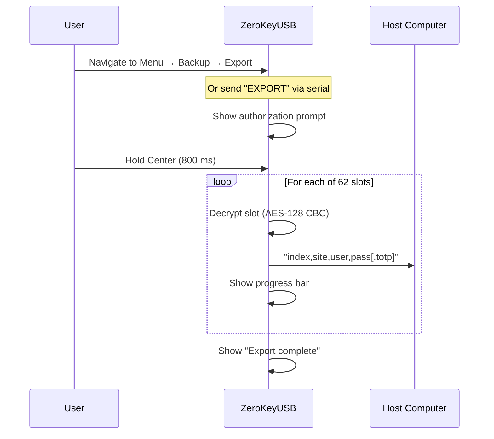
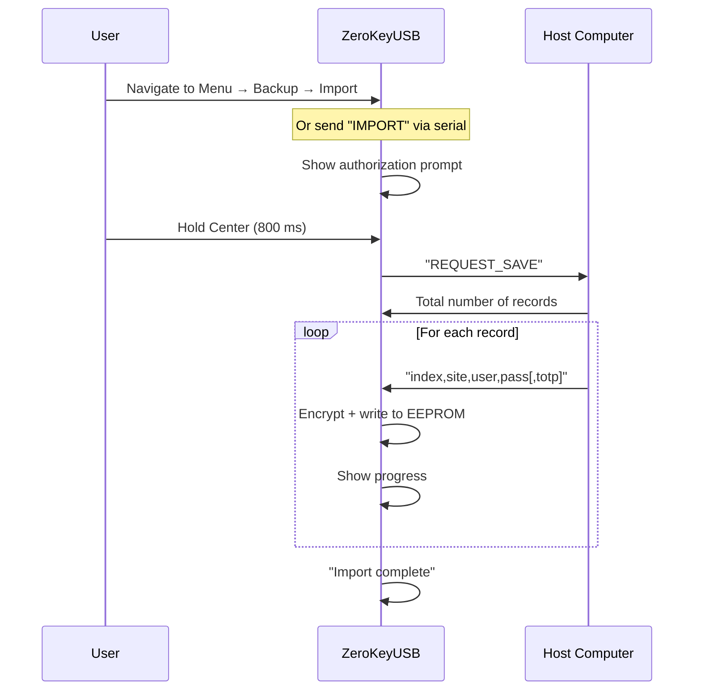

Keeping an offline backup ensures you can recover your passwords if the device is lost or damaged. ZeroKeyUSB makes the process deliberate — no credentials leave the device without explicit authorization.

---

## When to back up

- After importing or adding several credentials
- Before performing a factory reset or firmware update
- Before entering Danger Zone for any destructive action
- Periodically as part of your security routine

---

## Backup format

Backups are transmitted as **plaintext CSV** over the USB serial (CDC) channel.

Each line follows the format:
```
slotIndex,siteName,userName,password[,totpSecret]
```

The first line is the total number of slots (`62`).

<Warning>
Backups contain all credentials in **plain text**. Treat them with extreme care — encrypt immediately after saving and store offline.
</Warning>

---

## Exporting from the device



### Steps

1. **Unlock** the device with your Master PIN.
2. Navigate to **Menu → Backup → Export**, or send `EXPORT` over USB serial.
3. **Hold Center** to authorize the export.
4. Connect a serial terminal or the web manager to capture the output (115200 bps).
5. The device decrypts all 62 slots and streams them as CSV lines.
6. Save the output to a file.

---

## Storing the backup securely

After exporting:

1. **Encrypt immediately** using a tool you trust:
   ```bash
   gpg -c --cipher-algo AES256 backup.csv
   # or
   age -p backup.csv > backup.csv.age
   ```
2. **Delete the unencrypted file** from your downloads folder.
3. Store the encrypted file in **at least two separate locations** (e.g., encrypted USB drive + secure cloud storage).
4. Consider printing a copy and sealing it in a secure location for disaster recovery.
5. Name the file with the date: `2026-04-zerokeyusb.csv.gpg`.

---

## Restoring a backup



### Steps

1. Decrypt your backup file if encrypted.
2. **Unlock** the device and navigate to **Menu → Backup → Import**, or send `IMPORT` over serial.
3. **Hold Center** to authorize.
4. When you see `REQUEST_SAVE`, send the total record count, then each CSV line.
5. Wait for the device to confirm each record: `"Record N stored correctly."`.

---

## Verifying the restore

After restoring:

- Browse a few credentials to confirm they match the backup.
- Test TOTP codes if applicable — time may need re-syncing.
- Perform a quick login test on a non-critical account.
- Create a fresh backup of the restored state.

---

## Best practices

| Practice | Why |
|----------|-----|
| Back up before any Danger Zone action | Factory reset is irreversible |
| Encrypt backups immediately | CSV is plaintext — anyone who finds it has all your passwords |
| Store in ≥ 2 locations | Protects against single point of failure |
| Test restores periodically | Ensures your backup is usable when you need it |
| Delete old backups when replaced | Reduces exposure window |
