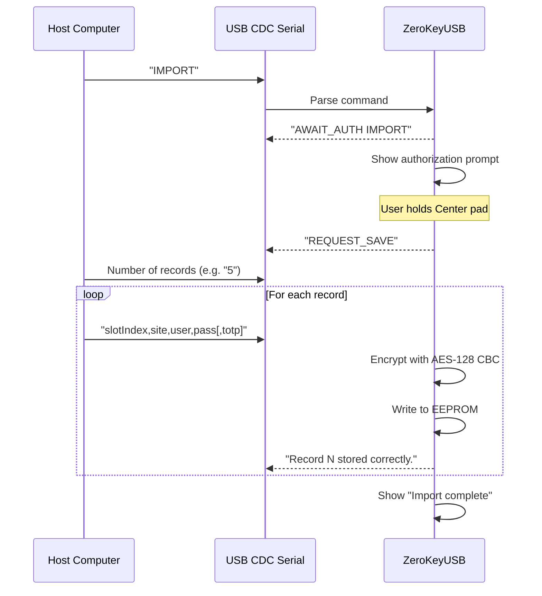

ZeroKeyUSB keeps credentials offline inside encrypted EEPROM, so imports happen **after unlocking the device** and require **physical authorization** via the touch controls.

<Alert>
Only import secrets from sources you trust. Imported records overwrite the destination slot immediately.
</Alert>

---

## What you can import

| Data type | Limit | Notes |
|-----------|-------|-------|
| Site / service name | 16 characters | Long names scroll automatically on the OLED. |
| Username | 16 characters | Stored as-is; padded with `0xFF`. |
| Password | 16 characters | All printable ASCII accepted; encrypted before storing. |
| TOTP secret | Up to 32 raw bytes | Base32 encoded, optionally with `;algo=SHA256` or full `otpauth://` URI. |

Each credential occupies **4 encrypted EEPROM pages** (128 bytes). The device stores up to **62 credentials**.

---

## Import workflow



### Steps

1. **Unlock** the device with your Master PIN.
2. Send `IMPORT` over the USB serial port (115200 bps).
3. The device shows "Save credentials — Hold down the center button to authorize".
4. **Hold Center** for 800 ms to confirm.
5. The device sends `REQUEST_SAVE` and waits.
6. Send the number of records on the first line.
7. Send each record as: `slotIndex,site,username,password[,totpSecret]`.
8. The device encrypts and stores each record, showing progress on screen.

---

## CSV format

```csv
0,github.com,alice,MyP@ss123,JBSWY3DPEHPK3PXP
1,gmail.com,bob@gmail.com,correct horse
2,bank.com,myuser,s3cur3P@ss,JBSWY3DPEHPK3PXP;algo=SHA256
```

| Field | Description |
|-------|-------------|
| `slotIndex` | 0–61 (62 slots total) |
| `site` | Site or service name (max 16 chars) |
| `username` | Username or email |
| `password` | Password (can contain commas if properly handled) |
| `totpSecret` | Optional. Base32 secret, optionally with `;algo=SHA1|SHA256|SHA512`, or full `otpauth://` URI |

---

## TOTP secret formats

The import parser (`parseTotpProvisioningString`) accepts multiple formats:

| Format | Example |
|--------|---------|
| **Bare Base32** | `JBSWY3DPEHPK3PXP` |
| **Base32 + algorithm** | `JBSWY3DPEHPK3PXP;algo=SHA256` |
| **Full otpauth URI** | `otpauth://totp/GitHub:alice?secret=JBSWY3DPEHPK3PXP&algorithm=SHA256` |

Default algorithm is **SHA-1** if not specified.

---

## Validation

- Slot indices outside 0–61 are rejected and logged: `"Index out of range"`.
- Invalid Base32 secrets are rejected: `"TOTP invalid"` error shown on screen.
- Empty lines terminate the import early.
- Lines with fewer than 3 comma-separated fields are skipped with an error log.

---

## After importing

1. Browse the credential list on the device to verify entries.
2. Optionally export a backup via **Menu → Backup → Export** to capture the new state.
3. Test a login with a non-critical account.

<Alert type="warning">
Imports overwrite existing slots without asking. Always export a backup before running a bulk import.
</Alert>
