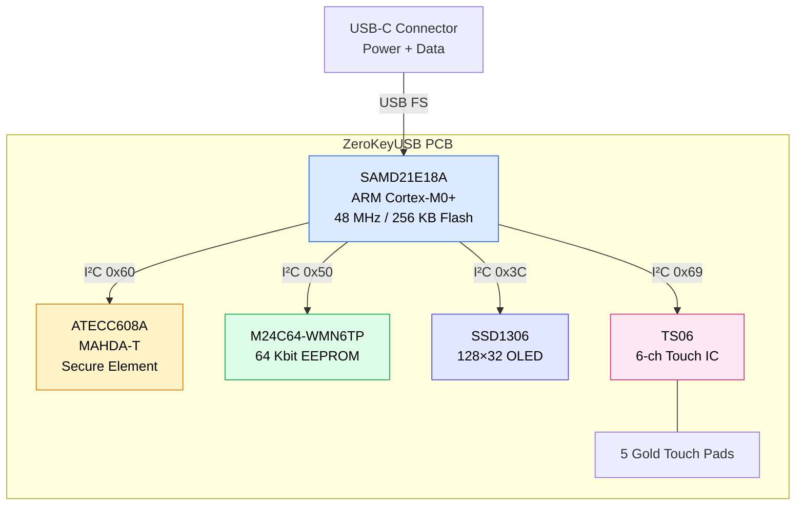

## Built for trust

ZeroKeyUSB is a self-contained, hardware-based password manager.  
Engineered with a single goal: **protect your credentials without ever connecting to the Internet**.

Each unit is assembled, tested, and encapsulated in **industrial-grade epoxy resin** to prevent external tampering — making it waterproof, dust-proof, and maintenance-free.

---

## System architecture

---

## Component list

| Component | Model | I²C Addr | Purpose |
|-----------|-------|----------|---------|
| **MCU** | Microchip SAMD21E18A | — | ARM Cortex-M0+ @ 48 MHz. Runs firmware, AES-128 CBC encryption, USB HID keyboard + CDC serial. |
| **Secure Element** | Microchip ATECC608A (MAHDA-T) | `0x60` | Hardware TRNG for key/IV generation, monotonic Counter0 for PIN rate-limiting, 9-byte chip serial as PIN salt. |
| **EEPROM** | ST M24C64-WMN6TP | `0x50` | 64 Kbit (8 KB) non-volatile storage. Holds encrypted credentials, AES key, IV, PIN hash, TOTP metadata. >1M write cycles. |
| **Display** | SSD1306 OLED | `0x3C` | 128×32 pixel monochrome white OLED. Shows credentials, menus, PIN entry, TOTP codes, progress bars. |
| **Touch Controller** | TS06 | `0x69` | 6-channel capacitive touch IC (5 channels used). Gold-plated PCB pads for Up/Down/Left/Right/Center. |
| **USB** | USB-C connector | — | USB Full-Speed. Powers the device (~20 mA) and provides HID keyboard + CDC serial interfaces. |
| **Write Protect** | GPIO PA01 | — | EEPROM write-protect pin. Can be driven high to hardware-lock EEPROM writes. |

---

## Why these components

### 🧠 SAMD21E18A microcontroller

The ARM Cortex-M0+ processor balances performance, size, and power efficiency:
- **256 KB Flash** — room for firmware, fonts, 9 keyboard layouts, and PROGMEM icon bitmaps.
- **32 KB SRAM** — enough for display buffer, credential cache, and TOTP workspace without dynamic allocation.
- **Native USB** — hardware USB Full-Speed peripheral eliminates the need for external USB bridge chips.
- **Hardware DSU** — Data Scrambling Unit provides hardware CRC32 for fast boot-time firmware integrity checks.
- **BOOTPROT fuse** — `BOOTPROT=7` locks the first 16 KB of Flash, preventing application code from modifying the bootloader.

### 🔐 ATECC608A secure element

The ATECC608A provides four capabilities that software alone cannot guarantee:

| Capability | Why it matters |
|-----------|---------------|
| **Hardware TRNG** | Generates the AES master key (16 B, inside the chip) and IV (16 B) with true hardware entropy — not pseudo-random. |
| **AES-128 engine** | Every credential block is encrypted and decrypted by the chip's hardware AES. The key lives in slot 8 with `IsSecret=1` and never crosses the I²C bus. |
| **Monotonic Counter0** | Irreversible hardware counter for PIN attempts. Cannot be reset by software, power cycling, or chip erasing. After 50 consecutive wrong PINs, credentials are wiped. |
| **Chip serial (9 B)** | Factory-programmed unique identifier used as salt in PIN hashing: `SHA-256(PIN ∥ serial)`. Same PIN on a different device produces a completely different hash. |

> The MAHDA-T SKU ships with the hardware AES command disabled. The first-boot provisioning routine enables it, configures slot 8 as an AES key holder, generates the key with the on-chip TRNG, and irreversibly locks both Config and Data zones.

### 💾 M24C64-WMN6TP EEPROM

- **8 KB** of non-volatile storage organized in 32-byte pages.
- **>1 million write cycles per page** — decades of normal use.
- All credential data is **AES-128 CBC encrypted before writing** — the I²C bus only sees ciphertext.
- Page boundary awareness: the firmware splits writes that cross 32-byte page boundaries to avoid the M24C64's address wrap-around behavior.

### 🖐️ TS06 touch controller

- **Sealed, six-channel capacitive touch IC** (five channels actively used).
- Internal baseline calibration — no analog tuning required.
- Minimum sensitivity (`0x3F`) set at boot to prevent false triggers through the epoxy encapsulation.
- 80 ms debounce, 800 ms long-press threshold, 150 ms channel lockout — all handled in firmware.

### 💡 SSD1306 OLED

- **128×32 pixels**, white-on-black, high contrast.
- Driven via I²C at address `0x3C`.
- Full-frame refresh (~512 bytes per frame) through `Adafruit_SSD1306` library.
- Excellent visibility in both daylight and darkness.
- Protected behind the sealed epoxy window.

### ⚡ USB-C connection

- Draws approximately **20 mA** — similar to a wireless mouse.
- **No battery** — fully powered from the host USB port.
- **No wireless** — no Wi-Fi, Bluetooth, or NFC hardware exists on the PCB.
- Works with Windows, macOS, Linux, Android, and iPadOS.

---

## I²C bus

All peripherals share a single I²C bus at **100 kHz**:

| Device | Address | Role |
|--------|---------|------|
| SSD1306 OLED | `0x3C` | Display |
| M24C64 EEPROM | `0x50` | Credential storage |
| ATECC608A | `0x60` | Secure element |
| TS06 | `0x69` | Touch controller |

SDA and SCL are on **PA08** and **PA09** respectively. External pull-up resistors are present on the PCB.

---

## Physical design

- **Encapsulated in epoxy resin** — prevents corrosion, dust, moisture ingress, and physical tampering.
- **No wireless interfaces** — eliminates remote attack surfaces entirely.
- **No external screws or seams** — the device cannot be non-destructively opened.
- **Gold-plated touch pads** — durable, corrosion-resistant, and visible through the resin.

---

## Transparency, not exposure

ZeroKeyUSB is **fully open source**. The firmware and hardware schematics are publicly available on  
[GitHub → Depbit-lab/zerokeyusb](https://github.com/Depbit-lab/zerokeyusb).  
Anyone can verify exactly what code runs on their device.

Firmware updates require **physical access** — either via SWD pogo pins or the USB bootloader with signed firmware. There is no remote update mechanism.

<Note>
ZeroKeyUSB is a sealed product — opening or reprogramming the device voids the warranty and destroys the epoxy encapsulation.
</Note>
