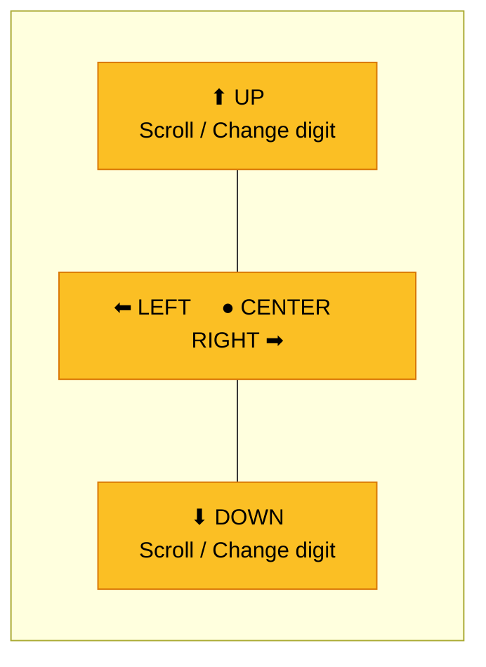
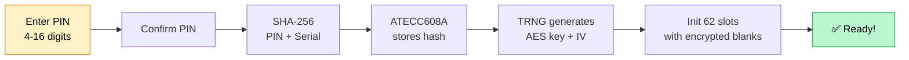
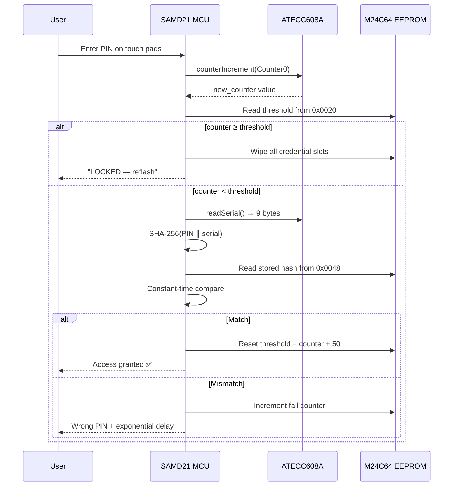

## Welcome to ZeroKeyUSB

Congratulations on your new **ZeroKeyUSB** — a fully offline, hardware-encrypted password manager.  
No apps to install, no accounts to create, no cloud to trust. Just plug it in.


---

## What's in the box

| Item | Description |
|------|-------------|
| **ZeroKeyUSB device** | Epoxy-sealed hardware key with OLED screen and 5 capacitive touch pads |
| **USB-C cable** | For connecting to your computer, tablet, or phone |

That's it. No software disc, no activation card — because ZeroKeyUSB needs none of that.

---

## Know your device

ZeroKeyUSB has **five golden touch pads** arranged in a cross pattern. These are your only controls:



| Pad | Short tap | Long press |
|-----|-----------|------------|
| **⬆ Up** | Change digit / Scroll up | — |
| **⬇ Down** | Change digit / Scroll down | — |
| **⬅ Left** | Go back / Delete digit | Jump 10 slots back |
| **➡ Right** | Go forward / Add digit | Jump 10 slots forward |
| **● Center** | Confirm / Select | Edit field / Type to host |

---

## Step 1 — Plug in & power up

<Steps>
  <Step title="Connect the USB-C cable">
    Plug ZeroKeyUSB into any USB-C port on your computer, tablet, or phone.  
    The device draws about **20 mA** — less than a wireless mouse — and needs no battery.
  </Step>
  <Step title="Wait for the splash screen">
    The OLED screen lights up showing:
    ```
    ZeroKeyUSB
    ```
    This confirms all hardware is working: the display, the touch controller (TS06), the EEPROM memory, and the ATECC608A secure element.
  </Step>
  <Step title="First-time setup wizard">
    On a brand-new device, the **setup wizard** starts automatically.  
    It walks you through screen orientation, keyboard layout, and PIN creation — one step at a time.  
    Use **Right** to advance and **Left** to go back.
  </Step>
</Steps>

---

## Step 2 — Choose your screen orientation

The wizard asks if the screen and controls feel right-side-up.

- Press **Center** to flip the display 180°.
- Press **Right** when it looks correct.

This setting is saved in EEPROM and persists across power cycles.

---

## Step 3 — Select your keyboard layout

ZeroKeyUSB emulates a USB keyboard. To type special characters correctly (`@`, `!`, `#`, etc.), it needs to match **your computer's keyboard layout**.

Available layouts:

| Code | Language |
|------|----------|
| `EN-US` | English (United States) — **default** |
| `ES-ES` | Spanish |
| `FR-FR` | French |
| `DE-DE` | German |
| `IT-IT` | Italian |
| `PT-PT` | Portuguese |
| `DA-DK` | Danish |
| `SV-SE` | Swedish |
| `HU-HU` | Hungarian |

Press **Center** to cycle through layouts, then **Right** to confirm.

<Tip>You can change the layout later from **Menu → Settings → Keyboard**.</Tip>

---

## Step 4 — Create your Master PIN

This is the most important step. Your PIN protects everything on the device.

<Steps>
  <Step title="Choose 4–16 digits">
    Use **Up/Down** to change the current digit (0–9).  
    Press **Right** to add a digit.  
    Press **Left** to delete the last digit.
  </Step>
  <Step title="Confirm your PIN">
    Type the same PIN again for confirmation.  
    If they don't match, you'll be asked to start over.
  </Step>
  <Step title="Wait for security setup">
    The device shows a progress bar while it:

    1. Derives your PIN hash: `SHA-256(PIN ∥ chip_serial)`
    2. Stores the hash in the ATECC608A secure element (slot 9) and in EEPROM
    3. Reads the **128-bit AES master key** already provisioned in ATECC slot 8 — the key was generated by the chip's TRNG the very first time the device was powered on and is not touched during PIN setup
    4. Generates a **128-bit IV** (Initialization Vector) from the TRNG
    5. Sets the hardware PIN attempt counter (Counter0)
    6. Initializes all 62 credential slots with encrypted blanks

    This takes about 30–60 seconds.
  </Step>
</Steps>



<Warning>
**There is no PIN recovery.** If you forget your PIN, the only option is a factory reset that **permanently erases all stored credentials**. Choose a PIN you will remember.
</Warning>

---

## Step 5 — Understanding the security

Here's what happens behind the scenes when you enter your PIN:



**Key security features:**

- **Hardware counter (Counter0):** Every PIN attempt — right or wrong — increments an irreversible hardware counter in the ATECC608A. After **50 consecutive wrong attempts**, the device permanently wipes all data.
- **Exponential delay:** Wrong PIN? Wait 5 seconds. Wrong again? 10 seconds. Then 20, 40, 80… up to **43 minutes** between attempts.
- **Constant-time compare:** The PIN hash comparison uses a timing-safe algorithm that reveals nothing about which digits were correct.

---

## Step 6 — Store your first credential

After unlocking, you see the main screen showing slot 0:

```
🌐 ________________
👤 ________________
🔒 ________________
```

<Steps>
  <Step title="Navigate to a field">
    Use **Up/Down** to switch between the Site, Username, and Password views.
  </Step>
  <Step title="Enter edit mode">
    **Long-press Center** on any field to start editing.
  </Step>
  <Step title="Type characters">
    The editor shows three keyboard pages:
    - **Page 1:** `A-Z` and brackets
    - **Page 2:** `a-z` and symbols
    - **Page 3:** `0-9`, space, and special characters

    Use **Left/Right** to move the cursor, **Up/Down** to switch keyboard pages, and **Center** to insert a character.
  </Step>
  <Step title="Save and return">
    **Long-press Center** again to save and return to the main screen.  
    Your credential is immediately encrypted with AES-128 CBC and written to EEPROM.
  </Step>
</Steps>

<Tip>Use **Left/Right** on the main screen to move between credential slots (0–61). **Long-press Left/Right** to jump 10 slots at a time.</Tip>

---

## Step 7 — Type credentials to your computer

This is where the magic happens:

1. Navigate to the credential slot you want.
2. Press **Center** on the **Site** field → ZeroKeyUSB types the username + Tab + password as a USB keyboard.

The host computer sees ZeroKeyUSB as an ordinary keyboard — no drivers or software needed.  
Works on Windows, macOS, Linux, Android, and iPadOS.

---

## Step 8 — (Optional) Add 2FA / TOTP

ZeroKeyUSB can generate **time-based one-time passwords (TOTP)** — the same codes you'd get from Google Authenticator, but fully offline.

<Steps>
  <Step title="Import your TOTP secret">
    Use the **web manager** or serial CLI to send the Base32-encoded secret (from the `otpauth://` QR code your service provides). The secret is encrypted and stored in page 3 of the credential slot.
  </Step>
  <Step title="Sync the clock">
    Since ZeroKeyUSB has no real-time clock, it needs the current time once.  
    When you see `REQTIME` on screen, the web manager or a terminal sends the Unix epoch over USB serial.  
    The time is saved in EEPROM and tracked using the SAMD21's `millis()` counter.
  </Step>
  <Step title="View your 2FA code">
    Navigate to a credential that has a TOTP secret and scroll to the **2FA** view.  
    A 6-digit code appears with a 30-second countdown. It refreshes automatically.
  </Step>
</Steps>

---

## Step 9 — Back up your data

<Warning>
Backups are transmitted in **plain text** over USB serial. Only perform this on a trusted computer.
</Warning>

1. Navigate to **Menu → Backup → Export**.
2. Hold **Center** to authorize the export.
3. ZeroKeyUSB sends all 62 credential slots as CSV lines over the USB serial port.
4. Save the output file securely — encrypt it with GPG, age, or a password-protected ZIP.

To restore later: **Menu → Backup → Import** → send the CSV file back via the web manager or serial CLI.

---

## Quick reference card

| Action | How |
|--------|-----|
| **Unlock** | Enter PIN on touch pads |
| **Browse credentials** | Left / Right (short press) |
| **Jump 10 slots** | Left / Right (long press) |
| **Switch field** | Up / Down on main screen |
| **Type to computer** | Center on Site field |
| **Edit a field** | Long-press Center |
| **Open menu** | Scroll past last slot |
| **View 2FA code** | Down past Password to 2FA |
| **Export backup** | Menu → Backup → Export |
| **Factory reset** | Menu → Danger Zone → Factory Reset |

---

## Next steps

<CardGroup cols={2}>
  <Card title="Hardware Overview" icon="microchip" href="/hardware/overview">
    Understand the main components: SAMD21 MCU, ATECC608A secure element, EEPROM, and touch controller.
  </Card>
  <Card title="Security Architecture" icon="shield" href="/firmware/security">
    Learn how AES-128 CBC, the ATECC608A TRNG, and Counter0 work together to protect your data.
  </Card>
  <Card title="Menu System" icon="list" href="/firmware/menu">
    Explore every menu option: Backup, Settings, Danger Zone, and device Info.
  </Card>
  <Card title="TOTP Module" icon="clock" href="/firmware/totp">
    Set up offline 2FA codes with time synchronization and automatic code refresh.
  </Card>
</CardGroup>

<Note>
ZeroKeyUSB works on any operating system that supports USB keyboards.  
No drivers, browser extensions, or software installations are required — ever.
</Note>
